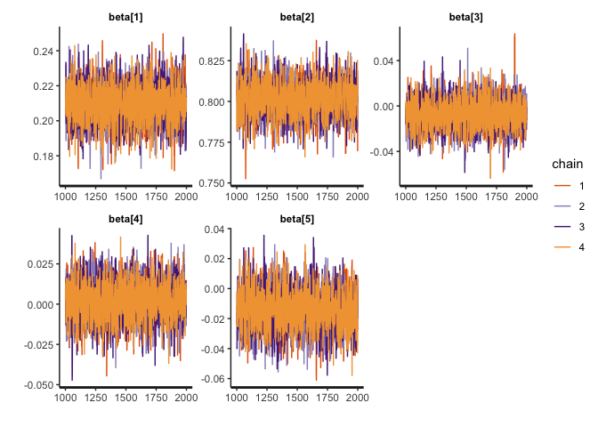
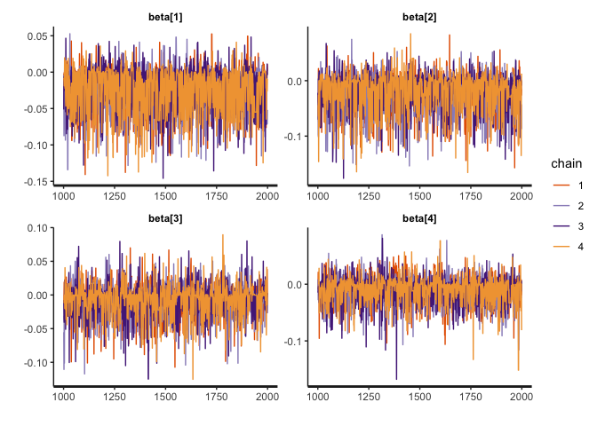
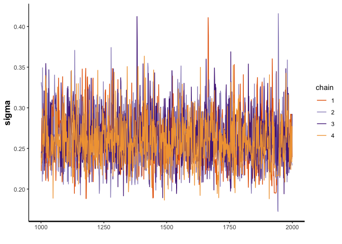
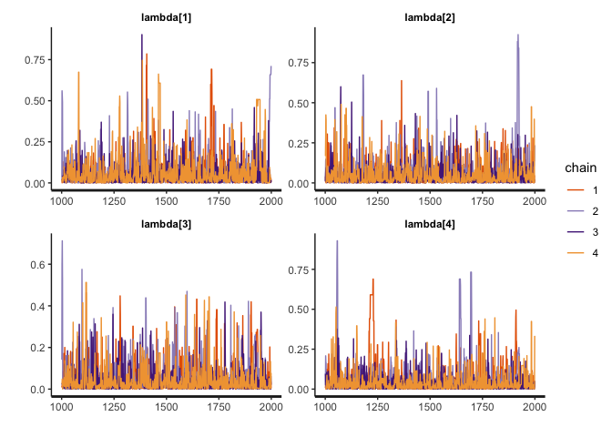
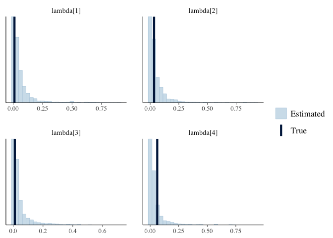
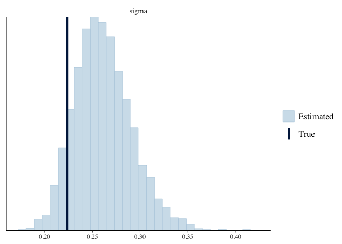
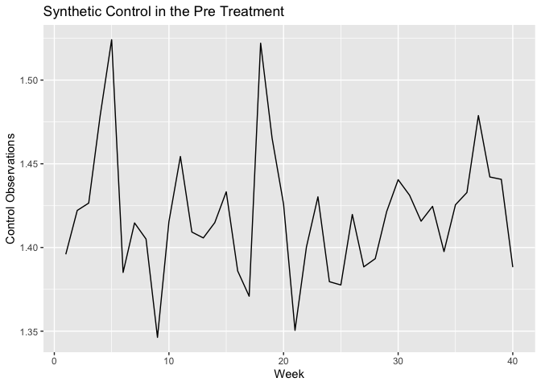
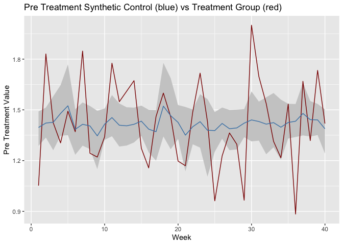
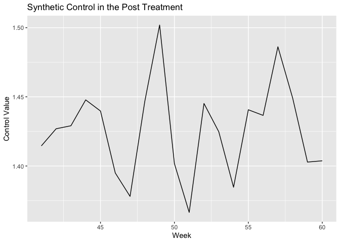
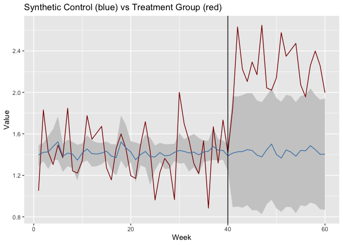

Testing Synthetic Control Method
================
Morgan Bale
8/20/2020

The purpose of this file to use synthetic data to test a bayesian
synthetic control model that we might use. The model comes from the web
index of the Gupta paper, part B.1 BSCM-Horseshoe.

##### DATA

Function for making synthetic data

``` r
gen_b1_data <- function(N_train=40,     #num of obs in pre treatment
                        N_test=20,      #num of obs in post treatment 
                        p=4,            #num of control units
                        beta_0=1.5,     #intercept
                        sigma2=0.05,    #error term variance 
                        tau=0.01        #global shrinkage 
                        ) {

  X_train <- matrix(rnorm(N_train*p), nrow=N_train, ncol=p)          #control unit matrix in pre treatment
  X_test <- matrix(rnorm(N_test*p), nrow=N_test, ncol=p)            #control unit matrix in post treatment 
  lambda_unif <- runif(p, min=0, max=pi/2)         #hyper parameter prior 
  lambda <- tau * tan(lambda_unif)                     #local shrinkage 
  
  beta_raw <- rep(1/p, p)                             #control unit weights before transformation 
  beta <- rnorm(p)                                    #control unit weights
  for(j in 1:p) {
    beta[j] = lambda[j] * beta_raw[j]
  }
  
  #model 
  sigma=sqrt(sigma2)
  X_beta <- beta_0 + X_train*beta 
  
  y_train = rnorm(N_train, mean=X_beta, sd=sigma)
  
  #make a list for stan
  list(N_train=N_train, N_test=N_test, p=p, beta_0=beta_0, sigma2=sigma2, tau=tau, X_train=X_train, X_test=X_test, lambda=lambda, 
       beta_raw=beta_raw, beta=beta, sigma=sigma, X_beta=X_beta, y_train=y_train)
}
```

Create synthetic data

``` r
set.seed(2020)
b1_data <- gen_b1_data()
str(b1_data)
```

    ## List of 14
    ##  $ N_train : num 40
    ##  $ N_test  : num 20
    ##  $ p       : num 4
    ##  $ beta_0  : num 1.5
    ##  $ sigma2  : num 0.05
    ##  $ tau     : num 0.01
    ##  $ X_train : num [1:40, 1:4] 0.377 0.302 -1.098 -1.13 -2.797 ...
    ##  $ X_test  : num [1:20, 1:4] 0.61 -0.513 0.754 0.188 -1.928 ...
    ##  $ lambda  : num [1:4] 0.0106 0.0345 0.0104 0.0621
    ##  $ beta_raw: num [1:4] 0.25 0.25 0.25 0.25
    ##  $ beta    : num [1:4] 0.00264 0.00862 0.0026 0.01552
    ##  $ sigma   : num 0.224
    ##  $ X_beta  : num [1:40, 1:4] 1.5 1.5 1.5 1.48 1.49 ...
    ##  $ y_train : num [1:40] 1.05 1.83 1.42 1.3 1.49 ...

###### MODEL

Run model using `bcsm_b1.stan`

``` r
b1_model <- stan_model(file="bscm_b1.stan")
print(b1_model)
```

    ## S4 class stanmodel 'bscm_b1' coded as follows:
    ## //
    ## // This model comes from Gupta's web index B.1
    ## // Morgan Bale
    ## //
    ## 
    ## // Data
    ## data{
    ##   int N_train; //Number of observations in the pre-treatment periods
    ##   int N_test; //Number of observations in the post-treatment periods
    ##   int p; //Number of control units
    ##   real y_train[N_train]; //Treated unit in the pre-treatment periods
    ##   matrix[N_train, p] X_train; //Control unit matrix in the pre-treatment
    ##   matrix[N_test, p] X_test; //Control unit matrix in the post-treatment
    ## }
    ## 
    ## // The parameters accepted by the model. 
    ## parameters{
    ##   real beta_0; //Intercept
    ##   real<lower=0> sigma2; //Error term variance
    ##   vector[p] beta_raw; //Control unit weights (will be transformed)
    ##   //Hyperparameters prior
    ##   vector<lower=0, upper=pi()/2>[p] lambda_unif;
    ##   real<lower=0> tau; //Global shrinkage
    ## }
    ## 
    ## transformed parameters{
    ##   vector[p] beta; //Control unit weights
    ##   real<lower=0> sigma; //Error term sd
    ##   vector<lower=0>[p] lambda; //Local shrinkage
    ##   vector[N_train] X_beta; //Synthetic control unit prediction in the pre-treatment period
    ##   lambda = tau * tan(lambda_unif); // => lambda ~ cauchy(0, tau)
    ##   for(j in 1:p){
    ##   beta[j] = lambda[j] * beta_raw[j];
    ##     }
    ##   sigma = sqrt(sigma2);
    ##   X_beta = beta_0 + X_train*beta;
    ## }
    ## 
    ## // The model to be estimated. 
    ## model{
    ##   //Pre-treatment estimation
    ##   beta_raw ~ normal(0, 1); //=> beta ~ normal(0, lambda^2)
    ##   tau ~ cauchy(0, sigma);
    ##   sigma ~ cauchy(0,10);
    ##   beta_0 ~ cauchy(0,10);
    ##   y_train ~ normal(X_beta, sigma);
    ## }
    ## 
    ## generated quantities{
    ##   //Post-treatment prediction & Log-likelihood
    ##   vector[N_train] y_fit; //Fitted synthetic control unit in the pre-treatment
    ##   vector[N_test] y_test; //Predicted synthetic control unit in the post-treatment
    ##   vector[N_train] log_lik; //Log-likelihood
    ##   y_fit = beta_0 + X_train * beta;
    ##   for(i in 1:N_test){
    ##   y_test[i] = normal_rng(beta_0 + X_test[i,] * beta, sigma);
    ##     }
    ##   for (t in 1:N_train) {
    ##   log_lik[t] = normal_lpdf(y_train[t] | y_fit[t], sigma);
    ##     }
    ## }
    ## 

``` r
draws <- sampling(b1_model, data=b1_data, seed=2020, cores=3)
```

    ## Warning: There were 99 divergent transitions after warmup. See
    ## http://mc-stan.org/misc/warnings.html#divergent-transitions-after-warmup
    ## to find out why this is a problem and how to eliminate them.

    ## Warning: Examine the pairs() plot to diagnose sampling problems

###### RESULTS

Check results

``` r
#traceplots
traceplot(draws, pars="tau")
```

<!-- -->

``` r
traceplot(draws, pars="beta")
```

<!-- -->

``` r
traceplot(draws, pars="sigma")
```

<!-- -->

``` r
traceplot(draws, pars="lambda")
```

<!-- -->

``` r
mcmc_recover_hist(As.mcmc.list(draws, pars="beta"), true=as.vector(t(b1_data$beta)))
```

    ## `stat_bin()` using `bins = 30`. Pick better value with `binwidth`.

<!-- -->

``` r
mcmc_recover_hist(As.mcmc.list(draws, pars="lambda"), true=as.vector(t(b1_data$lambda)))
```

    ## `stat_bin()` using `bins = 30`. Pick better value with `binwidth`.

<!-- -->

``` r
mcmc_recover_hist(As.mcmc.list(draws, pars="sigma"), true=as.vector(t(b1_data$sigma)))
```

    ## `stat_bin()` using `bins = 30`. Pick better value with `binwidth`.

<!-- --> Fitted
Synthetic Control for pre treatment

``` r
#synthetic control for pre treatment
y_fit <- summary(draws, pars="y_fit")

sc_pre <- tibble(y_fit[[1]][,1])

sc_pre <- sc_pre %>% mutate(week=rep(1:b1_data$N_train))

names(sc_pre) <- c("synthetic_control", "week")

sc_pre %>% ggplot(aes(x=week, y=synthetic_control)) + geom_line() + ggtitle("Synthetic Control in the Pre Treatment") + labs(x="Week", y="Control Observations") 
```

<!-- -->

Treated unit in the pre treatment

``` r
y_train <- b1_data$y_train

sc_data <- sc_pre %>% bind_cols(y_train)
```

    ## New names:
    ## * NA -> ...3

``` r
names(sc_data) <- c("synthetic_control", "week", "treatment_group")

sc_data %>% ggplot(aes(x=week)) + geom_line(aes(y=treatment_group), color="darkred") + geom_line(aes(y=synthetic_control), color="steelblue") + 
  labs(x="Week", y="Pre Treatment Value") + ggtitle("Pre Treatment Synthetic Control (blue) vs Treatment Group (red)") 
```

<!-- -->

Predicted Synthetic Control for post treatment

``` r
y_test <- summary(draws, pars="y_test")

sc_post <- tibble(y_test[[1]][,1])

sc_post <- sc_post %>% mutate(week=rep((b1_data$N_train+1):(b1_data$N_train+b1_data$N_test)))

names(sc_post) <- c("synthetic_control", "week")

sc_post %>% ggplot(aes(x=week, y=synthetic_control)) + geom_line() + ggtitle("Synthetic Control in the Post Treatment") + labs(x="Week", y="Control Value")
```

<!-- -->

Make treatment data for post period

``` r
y_post <- y_train + .8
y_post <- y_post[1:b1_data$N_test]

y_post <- as_tibble(y_post) %>% mutate(week=rep((b1_data$N_train+1):(b1_data$N_train+b1_data$N_test)))

sc_post <- sc_post %>% left_join(y_post, by="week")

names(sc_post) <- c("synthetic_control", "week", "treatment_group")

total_sc_data <- sc_data %>% bind_rows(sc_post)

total_sc_data %>% ggplot(aes(x=week)) + geom_line(aes(y=treatment_group), color="darkred") + geom_line(aes(y=synthetic_control), color="steelblue") +
  labs(x="Week", y="Value") + ggtitle("Synthetic Control (blue) vs Treatment Group (red)") + geom_vline(xintercept=b1_data$N_train) 
```

<!-- -->
