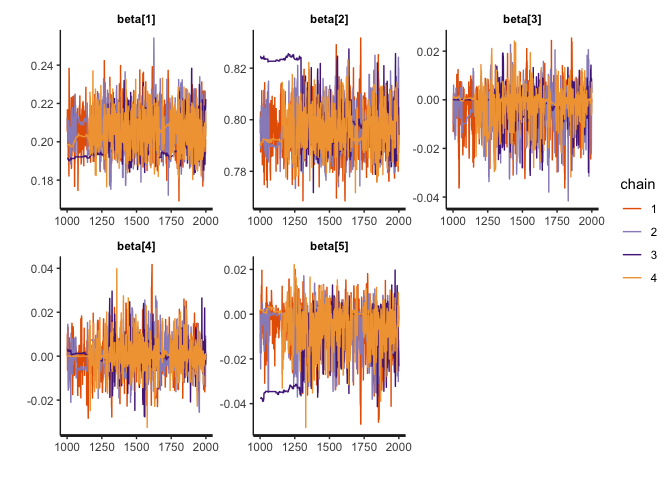
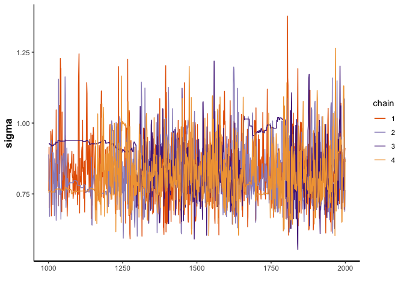
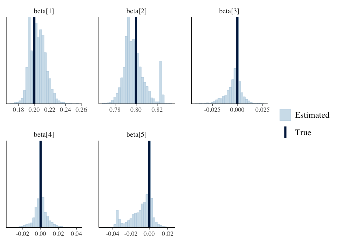
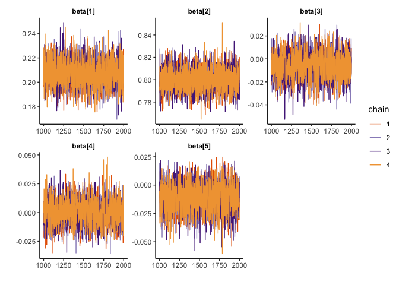
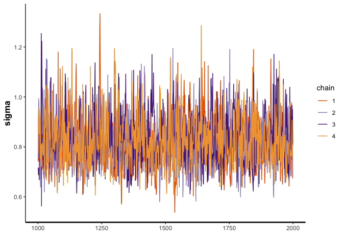
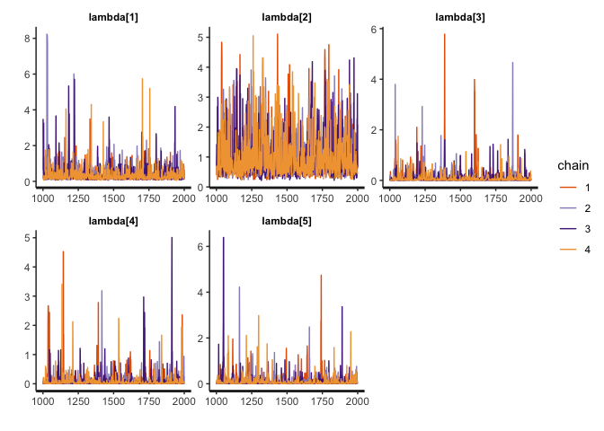
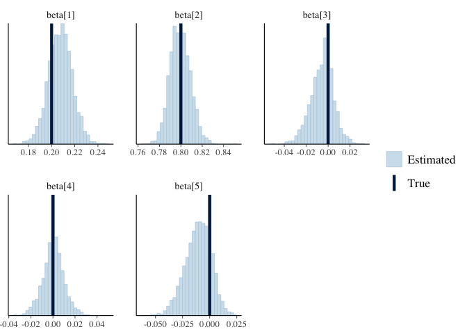
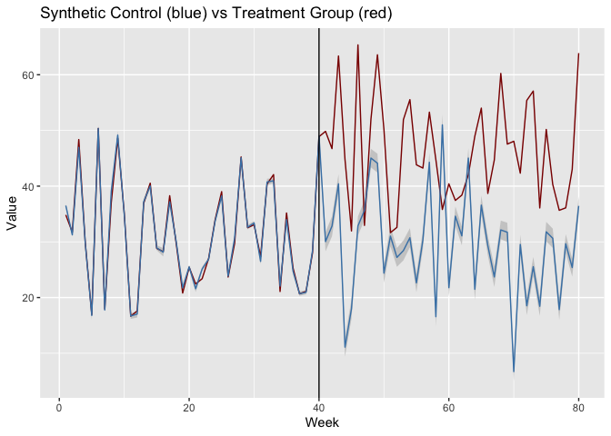

Bayesian Synthetic Control Method with a Horseshoe Prior
================
Morgan Bale

The purpose of this file to simulate data and replicate a Bayesian
synthetic control method that we might use. The model comes from the web
index of the Gupta paper, part B.1 BSCM-Horseshoe. We explore two
parameterizations: (1) a centered parameterization from the paper, and
(2) a non-centered parameterization from their web appendix code.

    ## ── Attaching packages ─────────────────────────────────────── tidyverse 1.3.1 ──

    ## ✓ ggplot2 3.3.5     ✓ purrr   0.3.4
    ## ✓ tibble  3.1.4     ✓ dplyr   1.0.7
    ## ✓ tidyr   1.1.3     ✓ stringr 1.4.0
    ## ✓ readr   2.0.1     ✓ forcats 0.5.1

    ## ── Conflicts ────────────────────────────────────────── tidyverse_conflicts() ──
    ## x dplyr::filter() masks stats::filter()
    ## x dplyr::lag()    masks stats::lag()

    ## Loading required package: StanHeaders

    ## rstan (Version 2.21.2, GitRev: 2e1f913d3ca3)

    ## For execution on a local, multicore CPU with excess RAM we recommend calling
    ## options(mc.cores = parallel::detectCores()).
    ## To avoid recompilation of unchanged Stan programs, we recommend calling
    ## rstan_options(auto_write = TRUE)

    ## 
    ## Attaching package: 'rstan'

    ## The following object is masked from 'package:tidyr':
    ## 
    ##     extract

    ## This is bayesplot version 1.8.1

    ## - Online documentation and vignettes at mc-stan.org/bayesplot

    ## - bayesplot theme set to bayesplot::theme_default()

    ##    * Does _not_ affect other ggplot2 plots

    ##    * See ?bayesplot_theme_set for details on theme setting

##### DATA

Function for making synthetic data.

``` r
gen_b1_data <- function(N_train=40,     #num of obs in pre treatment
                        N_test=40,      #num of obs in post treatment 
                        p=5,            #num of control units
                        tau=0.01,        #global shrinkage 
                        mu=c(15, 35, 10, 20, 30)
                        ) {
  
  # data for control units
  X_train <- matrix(NA, nrow = N_train, ncol = p)
  
  X_test <- matrix(NA, nrow=N_test, ncol=p)            #control unit matrix in post treatment 
  
  for(j in 1:p) {
    X_train[,j] <- rnorm(N_train, mean=mu[j], sd=10)     #control unit matrix in pre treatment
    X_test[, j] <- rnorm(N_test, mean=mu[j], sd=10)
  }
  
  beta <- c(.2, .8, 0, 0, 0) 
  
  #model 
  epsilon <- rnorm(N_train, mean=0, sd=1)
  y_train <- X_train%*%beta + epsilon

  #make a list for stan
  list(N_train=N_train, N_test=N_test, p=p, tau=tau, X_train=X_train, X_test=X_test, beta=beta, y_train=as.vector(y_train))}
```

Now we can simulate data.

``` r
set.seed(2020)
b1_data <- gen_b1_data()
```

###### MODEL: CENTERED PARAMETERIZATION

Run model using `bcsm_b1_p1.stan`

``` r
b1_model_p1 <- stan_model(file = here::here("Code", "Model", "bscm_b1_p1.stan"))
print(b1_model_p1)
```

    ## S4 class stanmodel 'bscm_b1_p1' coded as follows:
    ## //
    ## // This model comes from Gupta's web index B.1
    ## // Morgan Bale
    ## // October 2021
    ## 
    ## // Data
    ## data{
    ##   int N_train; //Number of observations in the pre-treatment periods
    ##   int N_test; //Number of observations in the post-treatment periods
    ##   int p; //Number of control units
    ##   real y_train[N_train]; //Treated unit in the pre-treatment periods
    ##   matrix[N_train, p] X_train; //Control unit matrix in the pre-treatment
    ##   matrix[N_test, p] X_test; //Control unit matrix in the post-treatment
    ## }
    ## 
    ## // The parameters accepted by the model. 
    ## parameters{
    ##   real<lower=0> sigma2; //Error term variance
    ##   vector[p] beta; 
    ##   //Hyperparameters prior
    ##   real<lower=0> tau; //Global shrinkage
    ##   vector<lower=0>[p] lambda; //Local shrinkage
    ## }
    ## 
    ## transformed parameters{
    ##   //vector[p] beta; //Control unit weights
    ##   real<lower=0> sigma; //Error term sd
    ##   vector<lower=0>[p] lambda2; //Local shrinkage squared
    ##   vector[N_train] X_beta; //Synthetic control unit prediction in the pre-treatment period
    ##   sigma = sqrt(sigma2);
    ##   X_beta = X_train*beta;
    ##   lambda2 = lambda .* lambda; 
    ## }
    ## 
    ## // The model to be estimated. 
    ## model{
    ##   //Pre-treatment estimation
    ##   beta ~ normal(0, lambda2);
    ##   lambda ~ cauchy(0, tau); 
    ##   tau ~ cauchy(0, sigma);
    ##   sigma ~ cauchy(0,10);
    ##   y_train ~ normal(X_beta, sigma);
    ## }
    ## 
    ## generated quantities{
    ##   //Post-treatment prediction & Log-likelihood
    ##   vector[N_train] y_fit; //Fitted synthetic control unit in the pre-treatment
    ##   vector[N_test] y_test; //Predicted synthetic control unit in the post-treatment
    ##   vector[N_train] log_lik; //Log-likelihood
    ## 
    ##   y_fit = X_train * beta;
    ##   
    ##   for(i in 1:N_test){
    ##   y_test[i] = normal_rng(X_test[i,] * beta, sigma);
    ##     }
    ## 
    ##   for (t in 1:N_train) {
    ##   log_lik[t] = normal_lpdf(y_train[t] | y_fit[t], sigma);
    ##     }
    ## }
    ## 

``` r
draws <- sampling(b1_model_p1, data=b1_data, seed=2020, cores=3)
```

    ## Warning: There were 811 divergent transitions after warmup. See
    ## http://mc-stan.org/misc/warnings.html#divergent-transitions-after-warmup
    ## to find out why this is a problem and how to eliminate them.

    ## Warning: Examine the pairs() plot to diagnose sampling problems

    ## Warning: The largest R-hat is 1.14, indicating chains have not mixed.
    ## Running the chains for more iterations may help. See
    ## http://mc-stan.org/misc/warnings.html#r-hat

    ## Warning: Bulk Effective Samples Size (ESS) is too low, indicating posterior means and medians may be unreliable.
    ## Running the chains for more iterations may help. See
    ## http://mc-stan.org/misc/warnings.html#bulk-ess

    ## Warning: Tail Effective Samples Size (ESS) is too low, indicating posterior variances and tail quantiles may be unreliable.
    ## Running the chains for more iterations may help. See
    ## http://mc-stan.org/misc/warnings.html#tail-ess

``` r
#try adapt delta
#draws <- stan("bscm_b1.stan", data=b1_data, seed=2020, cores=3, control=list(adapt_delta=.9))
```

###### RESULTS: CENTERED PARAMETERIZATION

Check results: this parameterization results in 811 divergent
transitions, the traceplots do not converge well.

``` r
#traceplots
traceplot(draws, pars="beta")
```

<!-- -->

``` r
traceplot(draws, pars="sigma")
```

<!-- -->

``` r
mcmc_recover_hist(As.mcmc.list(draws, pars="beta"), true=as.vector(t(b1_data$beta)))
```

    ## `stat_bin()` using `bins = 30`. Pick better value with `binwidth`.

<!-- -->

Fitted Synthetic Control for pre-treatment.

``` r
#synthetic control for pre treatment
y_fit <- summary(draws, pars="y_fit")

sc_pre <- tibble(y_fit[[1]][,1])

lower <- y_fit[[1]][,4]
upper <- y_fit[[1]][,8]

sc_pre <- sc_pre %>% bind_cols(lower, upper)
```

    ## New names:
    ## * NA -> ...2
    ## * NA -> ...3

``` r
sc_pre <- sc_pre %>% mutate(week=rep(1:b1_data$N_train))

names(sc_pre) <- c("synthetic_control","lower", "upper", "week")

#sc_pre %>% ggplot(aes(x=week, y=synthetic_control))+ geom_ribbon(aes(ymin=lower, ymax=upper), fill="gray80") + geom_line() + ggtitle("Synthetic Control in the Pre Treatment") + labs(x="Week", y="Control Observations") 
```

Treated unit in the pre treatment

``` r
y_train <- b1_data$y_train

sc_data <- sc_pre %>% bind_cols(y_train)
```

    ## New names:
    ## * NA -> ...5

``` r
names(sc_data)[5] <- "treatment_group"

#sc_data %>% ggplot(aes(x=week))+ geom_ribbon(aes(ymin=lower, ymax=upper), fill="gray80") + geom_line(aes(y=treatment_group), color="darkred") + geom_line(aes(y=synthetic_control), color="steelblue") + 
  #labs(x="Week", y="Pre Treatment Value") + ggtitle("Pre Treatment Synthetic Control (blue) vs Treatment Group (red)") 
```

Predicted Synthetic Control for post treatment

``` r
y_test <- summary(draws, pars="y_test")

sc_post <- tibble(y_test[[1]][,1])

lower <- y_test[[1]][,4]
upper <- y_test[[1]][,8]

sc_post <- sc_post %>% bind_cols(lower, upper)
```

    ## New names:
    ## * NA -> ...2
    ## * NA -> ...3

``` r
sc_post <- sc_post %>% mutate(week=rep((b1_data$N_train+1):(b1_data$N_train+b1_data$N_test)))

names(sc_post) <- c("synthetic_control", "lower", "upper", "week")

#sc_post %>% ggplot(aes(x=week, y=synthetic_control)) + geom_ribbon(aes(ymin=lower, ymax=upper), fill="gray80") + geom_line() + ggtitle("Synthetic Control in the Post Treatment") + labs(x="Week", y="Control Value")
#gray is 95% CI 
```

Make treatment data for post period

``` r
y_post <- y_train + 15
y_post <- y_post[1:b1_data$N_test]

y_post <- as_tibble(y_post) %>% mutate(week=rep((b1_data$N_train+1):(b1_data$N_train+b1_data$N_test)))

sc_post <- sc_post %>% left_join(y_post, by="week")

names(sc_post)[5] <- "treatment_group"

total_sc_data <- sc_data %>% bind_rows(sc_post)

total_sc_data %>% ggplot(aes(x=week)) + geom_ribbon(aes(ymin=lower, ymax=upper), fill="gray80") + geom_line(aes(y=treatment_group), color="darkred") + geom_line(aes(y=synthetic_control), color="steelblue") +
  labs(x="Week", y="Value") + ggtitle("Synthetic Control (blue) vs Treatment Group (red)") + geom_vline(xintercept=b1_data$N_train) 
```

<!-- -->

###### MODEL: NON-CENTERED PARAMETERIZATION

Run model using `bcsm_b1_p2.stan`

``` r
b1_model_p2 <- stan_model(file = here::here("Code", "Model", "bscm_b1_p2.stan"))
print(b1_model_p2)
```

    ## S4 class stanmodel 'bscm_b1_p2' coded as follows:
    ## //
    ## // This model comes from Gupta's web index B.1
    ## // Morgan Bale
    ## // January 2022
    ## 
    ## // Data
    ## data{
    ##   int N_train; //Number of observations in the pre-treatment periods
    ##   int N_test; //Number of observations in the post-treatment periods
    ##   int p; //Number of control units
    ##   real y_train[N_train]; //Treated unit in the pre-treatment periods
    ##   matrix[N_train, p] X_train; //Control unit matrix in the pre-treatment
    ##   matrix[N_test, p] X_test; //Control unit matrix in the post-treatment
    ## }
    ## 
    ## // The parameters accepted by the model. 
    ## parameters{
    ##   real<lower=0> sigma2; //Error term variance
    ##   vector[p] beta_raw; //Control unit weights (will be transformed)
    ##   //Hyperparameters prior
    ##   vector<lower=0, upper=pi()/2>[p] lambda_unif;
    ##   real<lower=0> tau; //Global shrinkage
    ## }
    ## 
    ## transformed parameters{
    ##   vector[p] beta; //Control unit weights
    ##   real<lower=0> sigma; //Error term sd
    ##   vector<lower=0>[p] lambda; //Local shrinkage
    ##   vector[N_train] X_beta; //Synthetic control unit prediction in the pre-treatment period
    ##   lambda = tau * tan(lambda_unif); // => lambda ~ cauchy(0, tau)
    ##   for(j in 1:p){
    ##       beta[j] = lambda[j] * beta_raw[j];
    ##     }
    ##   sigma = sqrt(sigma2);
    ##   X_beta = X_train*beta;
    ## }
    ## 
    ## // The model to be estimated. 
    ## model{
    ##   //Pre-treatment estimation
    ##   beta_raw ~ normal(0, 1); //=> beta ~ normal(0, lambda^2)
    ##   tau ~ cauchy(0, sigma);
    ##   sigma ~ cauchy(0,10);
    ##   y_train ~ normal(X_beta, sigma);
    ## }
    ## 
    ## generated quantities{
    ##   //Post-treatment prediction & Log-likelihood
    ##   vector[N_train] y_fit; //Fitted synthetic control unit in the pre-treatment
    ##   vector[N_test] y_test; //Predicted synthetic control unit in the post-treatment
    ##   vector[N_train] log_lik; //Log-likelihood
    ##   y_fit = X_train * beta;
    ##   
    ##   for(i in 1:N_test){
    ##   y_test[i] = normal_rng(X_test[i,] * beta, sigma);
    ##     }
    ## 
    ##   for (t in 1:N_train) {
    ##   log_lik[t] = normal_lpdf(y_train[t] | y_fit[t], sigma);
    ##     }
    ## }
    ## 

``` r
draws <- sampling(b1_model_p2, data=b1_data, seed=2020, cores=3)
```

    ## Warning: There were 110 divergent transitions after warmup. See
    ## http://mc-stan.org/misc/warnings.html#divergent-transitions-after-warmup
    ## to find out why this is a problem and how to eliminate them.

    ## Warning: There were 3567 transitions after warmup that exceeded the maximum treedepth. Increase max_treedepth above 10. See
    ## http://mc-stan.org/misc/warnings.html#maximum-treedepth-exceeded

    ## Warning: Examine the pairs() plot to diagnose sampling problems

    ## Warning: Bulk Effective Samples Size (ESS) is too low, indicating posterior means and medians may be unreliable.
    ## Running the chains for more iterations may help. See
    ## http://mc-stan.org/misc/warnings.html#bulk-ess

``` r
#try adapt delta
#draws <- stan("bscm_b1.stan", data=b1_data, seed=2020, cores=3, control=list(adapt_delta=.9))
```

###### RESULTS: NON-CENTERED PARAMETERIZATION

Check results: this parameterizations results in 100ish divergent
transitions, the traceplots converge, and the model recovers our
parameters.

``` r
#traceplots
traceplot(draws, pars="beta")
```

<!-- -->

``` r
traceplot(draws, pars="sigma")
```

<!-- -->

``` r
traceplot(draws, pars="lambda")
```

<!-- -->

``` r
mcmc_recover_hist(As.mcmc.list(draws, pars="beta"), true=as.vector(t(b1_data$beta)))
```

    ## `stat_bin()` using `bins = 30`. Pick better value with `binwidth`.

<!-- -->

Fitted Synthetic Control for pre-treatment.

``` r
#synthetic control for pre treatment
y_fit <- summary(draws, pars="y_fit")

sc_pre <- tibble(y_fit[[1]][,1])

lower <- y_fit[[1]][,4]
upper <- y_fit[[1]][,8]

sc_pre <- sc_pre %>% bind_cols(lower, upper)
```

    ## New names:
    ## * NA -> ...2
    ## * NA -> ...3

``` r
sc_pre <- sc_pre %>% mutate(week=rep(1:b1_data$N_train))

names(sc_pre) <- c("synthetic_control","lower", "upper", "week")

#sc_pre %>% ggplot(aes(x=week, y=synthetic_control))+ geom_ribbon(aes(ymin=lower, ymax=upper), fill="gray80") + geom_line() + ggtitle("Synthetic Control in the Pre Treatment") + labs(x="Week", y="Control Observations") 
```

Treated unit in the pre treatment

``` r
y_train <- b1_data$y_train

sc_data <- sc_pre %>% bind_cols(y_train)
```

    ## New names:
    ## * NA -> ...5

``` r
names(sc_data)[5] <- "treatment_group"

#sc_data %>% ggplot(aes(x=week))+ geom_ribbon(aes(ymin=lower, ymax=upper), fill="gray80") + geom_line(aes(y=treatment_group), color="darkred") + geom_line(aes(y=synthetic_control), color="steelblue") + 
  #labs(x="Week", y="Pre Treatment Value") + ggtitle("Pre Treatment Synthetic Control (blue) vs Treatment Group (red)") 
```

Predicted Synthetic Control for post treatment

``` r
y_test <- summary(draws, pars="y_test")

sc_post <- tibble(y_test[[1]][,1])

lower <- y_test[[1]][,4]
upper <- y_test[[1]][,8]

sc_post <- sc_post %>% bind_cols(lower, upper)
```

    ## New names:
    ## * NA -> ...2
    ## * NA -> ...3

``` r
sc_post <- sc_post %>% mutate(week=rep((b1_data$N_train+1):(b1_data$N_train+b1_data$N_test)))

names(sc_post) <- c("synthetic_control", "lower", "upper", "week")

#sc_post %>% ggplot(aes(x=week, y=synthetic_control)) + geom_ribbon(aes(ymin=lower, ymax=upper), fill="gray80") + geom_line() + ggtitle("Synthetic Control in the Post Treatment") + labs(x="Week", y="Control Value")
#gray is 95% CI 
```

Make treatment data for post period

``` r
y_post <- y_train + 15
y_post <- y_post[1:b1_data$N_test]

y_post <- as_tibble(y_post) %>% mutate(week=rep((b1_data$N_train+1):(b1_data$N_train+b1_data$N_test)))

sc_post <- sc_post %>% left_join(y_post, by="week")

names(sc_post)[5] <- "treatment_group"

total_sc_data <- sc_data %>% bind_rows(sc_post)

total_sc_data %>% ggplot(aes(x=week)) + geom_ribbon(aes(ymin=lower, ymax=upper), fill="gray80") + geom_line(aes(y=treatment_group), color="darkred") + geom_line(aes(y=synthetic_control), color="steelblue") +
  labs(x="Week", y="Value") + ggtitle("Synthetic Control (blue) vs Treatment Group (red)") + geom_vline(xintercept=b1_data$N_train) 
```

<!-- -->
