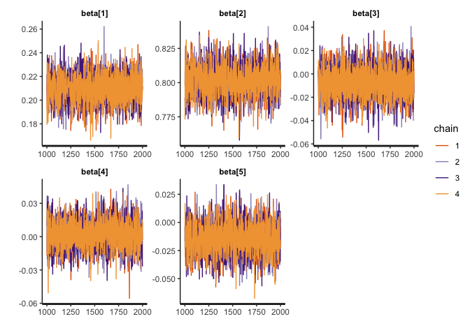
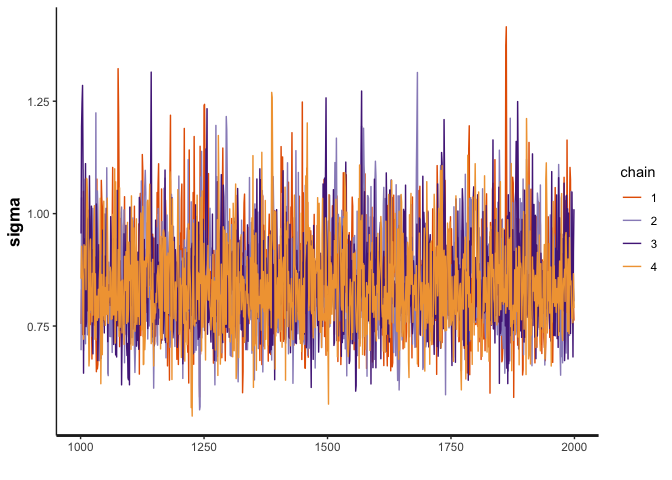
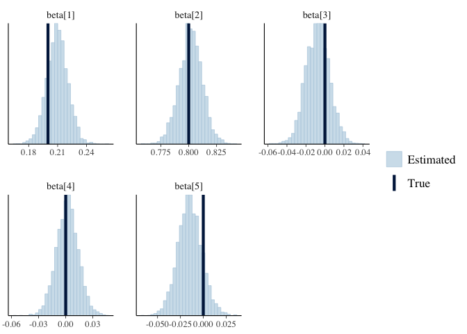
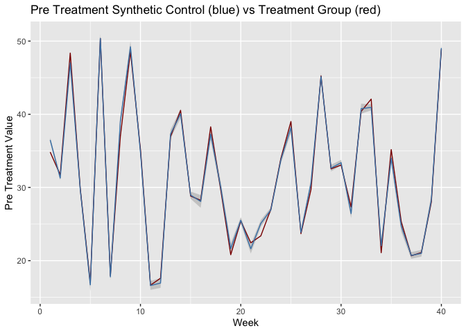
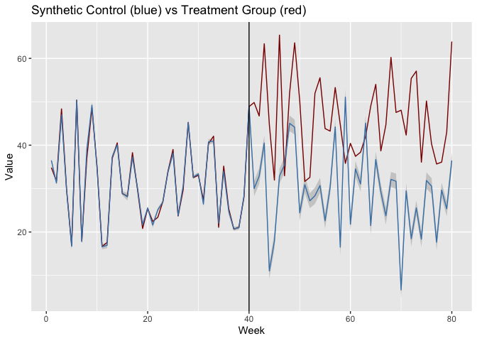

Bayesian Synthetic Control Method with a Horseshoe Prior
================
Morgan Bale

The purpose of this file to simulate data and replicate a Bayesian
synthetic control method that we might use. The model comes from the web
index of the Gupta paper, part B.1 BSCM-Horseshoe.

    ## ── Attaching packages ─────────────────────────────────────── tidyverse 1.3.1 ──

    ## ✓ ggplot2 3.3.5     ✓ purrr   0.3.4
    ## ✓ tibble  3.1.6     ✓ dplyr   1.0.7
    ## ✓ tidyr   1.1.4     ✓ stringr 1.4.0
    ## ✓ readr   2.1.1     ✓ forcats 0.5.1

    ## ── Conflicts ────────────────────────────────────────── tidyverse_conflicts() ──
    ## x dplyr::filter() masks stats::filter()
    ## x dplyr::lag()    masks stats::lag()

    ## Loading required package: StanHeaders

    ## rstan (Version 2.21.3, GitRev: 2e1f913d3ca3)

    ## For execution on a local, multicore CPU with excess RAM we recommend calling
    ## options(mc.cores = parallel::detectCores()).
    ## To avoid recompilation of unchanged Stan programs, we recommend calling
    ## rstan_options(auto_write = TRUE)

    ## 
    ## Attaching package: 'rstan'

    ## The following object is masked from 'package:tidyr':
    ## 
    ##     extract

    ## This is bayesplot version 1.8.1

    ## - Online documentation and vignettes at mc-stan.org/bayesplot

    ## - bayesplot theme set to bayesplot::theme_default()

    ##    * Does _not_ affect other ggplot2 plots

    ##    * See ?bayesplot_theme_set for details on theme setting

##### DATA

Function for making synthetic data.

``` r
gen_b1_data <- function(N_train=40,     #num of obs in pre treatment
                        N_test=40,      #num of obs in post treatment 
                        p=5,            #num of control units
                        tau=0.01,        #global shrinkage 
                        mu=c(15, 35, 10, 20, 30)
                        ) {
  
  # data for control units
  X_train <- matrix(NA, nrow = N_train, ncol = p)
  
  X_test <- matrix(NA, nrow=N_test, ncol=p)            #control unit matrix in post treatment 
  
  for(j in 1:p) {
    X_train[,j] <- rnorm(N_train, mean=mu[j], sd=10)     #control unit matrix in pre treatment
    X_test[, j] <- rnorm(N_test, mean=mu[j], sd=10)
  }
  
  
  
  #lambda_unif <- runif(p, min=0, max=pi/2)         #hyper parameter prior 
  #lambda <- tau * tan(lambda_unif)                     #local shrinkage 
  
  #beta_raw <- c(.2, .8, 0, 0, 0)                            #control unit weights before transformation 
  #beta <- c()                                    #control unit weights
  #for(j in 1:p) {
    #beta[j] = lambda[j] * beta_raw[j]
  #}
  
  beta <- c(.2, .8, 0, 0, 0) 
  
  #model 
  epsilon <- rnorm(N_train, mean=0, sd=1)
  y_train <- X_train%*%beta + epsilon

  #make a list for stan
  list(N_train=N_train, N_test=N_test, p=p, tau=tau, X_train=X_train, X_test=X_test, beta=beta, y_train=as.vector(y_train))}
```

Now we can simulate data.

``` r
set.seed(2020)
b1_data <- gen_b1_data()
#str(b1_data)
```

###### MODEL

Run model using `bcsm_b1.stan`

``` r
b1_model <- stan_model(file = here::here("Code", "Model", "bscm_b1.stan"))
#print(b1_model)

draws <- sampling(b1_model, data=b1_data, seed=2020, cores=3)

#try adapt delta
#draws <- stan("bscm_b1.stan", data=b1_data, seed=2020, cores=3, control=list(adapt_delta=.9))
```

###### RESULTS

Check results.

``` r
#traceplots
traceplot(draws, pars="beta")
```

<!-- -->

``` r
traceplot(draws, pars="sigma")
```

<!-- -->

``` r
mcmc_recover_hist(As.mcmc.list(draws, pars="beta"), true=as.vector(t(b1_data$beta)))
```

    ## `stat_bin()` using `bins = 30`. Pick better value with `binwidth`.

<!-- -->

Fitted Synthetic Control for pre-treatment.

``` r
#synthetic control for pre treatment
y_fit <- summary(draws, pars="y_fit")

sc_pre <- tibble(y_fit[[1]][,1])

lower <- y_fit[[1]][,4]
upper <- y_fit[[1]][,8]

sc_pre <- sc_pre %>% bind_cols(lower, upper)
```

    ## New names:
    ## * NA -> ...2
    ## * NA -> ...3

``` r
sc_pre <- sc_pre %>% mutate(week=rep(1:b1_data$N_train))

names(sc_pre) <- c("synthetic_control","lower", "upper", "week")

#sc_pre %>% ggplot(aes(x=week, y=synthetic_control))+ geom_ribbon(aes(ymin=lower, ymax=upper), fill="gray80") + geom_line() + ggtitle("Synthetic Control in the Pre Treatment") + labs(x="Week", y="Control Observations") 
```

Treated unit in the pre treatment

``` r
y_train <- b1_data$y_train

sc_data <- sc_pre %>% bind_cols(y_train)
```

    ## New names:
    ## * NA -> ...5

``` r
names(sc_data)[5] <- "treatment_group"

sc_data %>% ggplot(aes(x=week))+ geom_ribbon(aes(ymin=lower, ymax=upper), fill="gray80") + geom_line(aes(y=treatment_group), color="darkred") + geom_line(aes(y=synthetic_control), color="steelblue") + 
  labs(x="Week", y="Pre Treatment Value") + ggtitle("Pre Treatment Synthetic Control (blue) vs Treatment Group (red)") 
```

<!-- -->

Predicted Synthetic Control for post treatment

``` r
y_test <- summary(draws, pars="y_test")

sc_post <- tibble(y_test[[1]][,1])

lower <- y_test[[1]][,4]
upper <- y_test[[1]][,8]

sc_post <- sc_post %>% bind_cols(lower, upper)
```

    ## New names:
    ## * NA -> ...2
    ## * NA -> ...3

``` r
sc_post <- sc_post %>% mutate(week=rep((b1_data$N_train+1):(b1_data$N_train+b1_data$N_test)))

names(sc_post) <- c("synthetic_control", "lower", "upper", "week")

#sc_post %>% ggplot(aes(x=week, y=synthetic_control)) + geom_ribbon(aes(ymin=lower, ymax=upper), fill="gray80") + geom_line() + ggtitle("Synthetic Control in the Post Treatment") + labs(x="Week", y="Control Value")
#gray is 95% CI 
```

Make treatment data for post period

``` r
y_post <- y_train + 15
y_post <- y_post[1:b1_data$N_test]

y_post <- as_tibble(y_post) %>% mutate(week=rep((b1_data$N_train+1):(b1_data$N_train+b1_data$N_test)))

sc_post <- sc_post %>% left_join(y_post, by="week")

names(sc_post)[5] <- "treatment_group"

total_sc_data <- sc_data %>% bind_rows(sc_post)

total_sc_data %>% ggplot(aes(x=week)) + geom_ribbon(aes(ymin=lower, ymax=upper), fill="gray80") + geom_line(aes(y=treatment_group), color="darkred") + geom_line(aes(y=synthetic_control), color="steelblue") +
  labs(x="Week", y="Value") + ggtitle("Synthetic Control (blue) vs Treatment Group (red)") + geom_vline(xintercept=b1_data$N_train) 
```

<!-- -->
