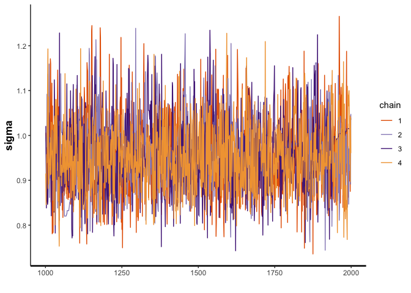
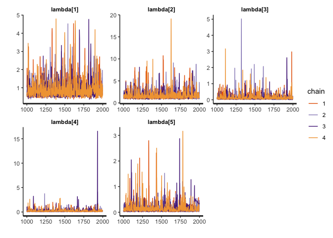
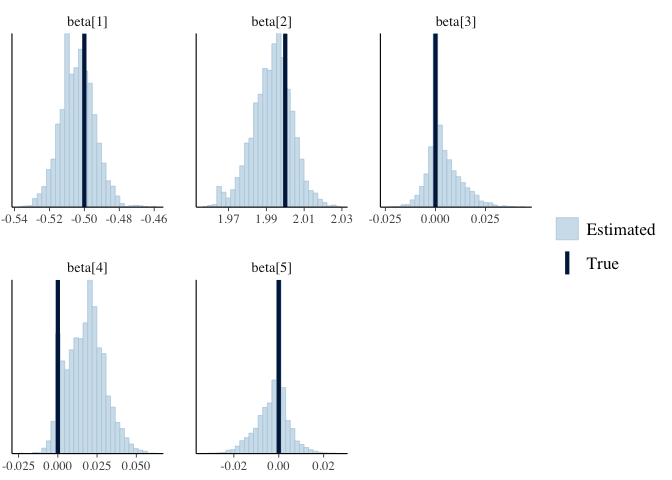
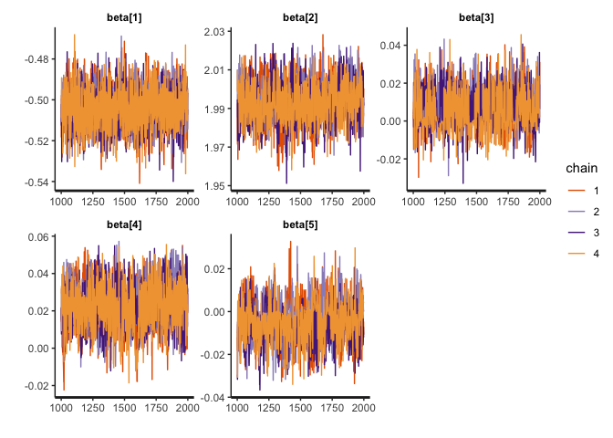
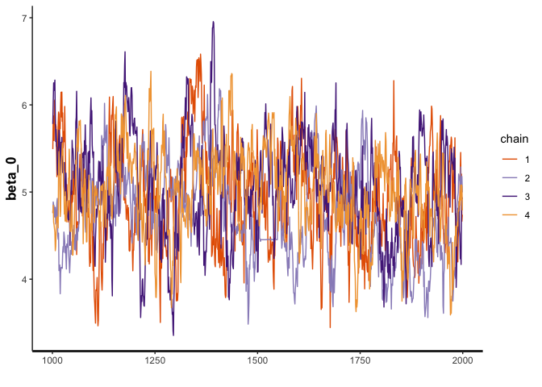
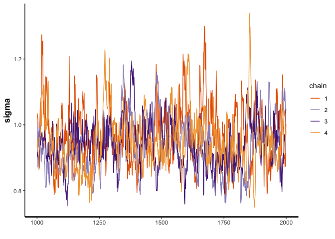
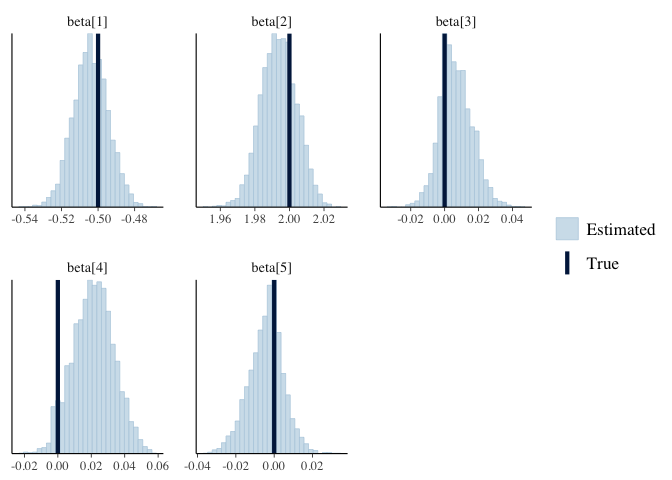
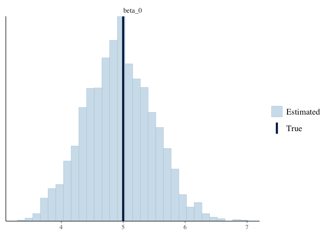

Bayesian Synthetic Control Method with a Horseshoe Prior and Intercept
================
Morgan Bale

The purpose of this file is to add an intercept and horseshoe priors to
the Bayesian synthetic control method tested in `01_bscm-horseshoe`. The
model comes from the web index of the Gupta et al, part B.1
BSCM-Horseshoe, we explore two parameterizations, (1) from the paper
itself (centered), and (2) from the web appendix (non-centered). The
non-centered parameterization works better for this model.

    ## ── Attaching packages ─────────────────────────────────────── tidyverse 1.3.1 ──

    ## ✓ ggplot2 3.3.5     ✓ purrr   0.3.4
    ## ✓ tibble  3.1.4     ✓ dplyr   1.0.7
    ## ✓ tidyr   1.1.3     ✓ stringr 1.4.0
    ## ✓ readr   2.0.1     ✓ forcats 0.5.1

    ## ── Conflicts ────────────────────────────────────────── tidyverse_conflicts() ──
    ## x dplyr::filter() masks stats::filter()
    ## x dplyr::lag()    masks stats::lag()

    ## Loading required package: StanHeaders

    ## rstan (Version 2.21.2, GitRev: 2e1f913d3ca3)

    ## For execution on a local, multicore CPU with excess RAM we recommend calling
    ## options(mc.cores = parallel::detectCores()).
    ## To avoid recompilation of unchanged Stan programs, we recommend calling
    ## rstan_options(auto_write = TRUE)

    ## 
    ## Attaching package: 'rstan'

    ## The following object is masked from 'package:tidyr':
    ## 
    ##     extract

    ## This is bayesplot version 1.8.1

    ## - Online documentation and vignettes at mc-stan.org/bayesplot

    ## - bayesplot theme set to bayesplot::theme_default()

    ##    * Does _not_ affect other ggplot2 plots

    ##    * See ?bayesplot_theme_set for details on theme setting

##### DATA

Function for making synthetic data: values picked from simulation
studies done in Gupta et al.

``` r
gen_b1_data <- function(N_train=80,     #num of obs in pre treatment
                        N_test=80,      #num of obs in post treatment 
                        p=5,            #num of control units
                        tau=0.01,        #global shrinkage 
                        mu=c(15, 35, 10, 20, 30), 
                        beta_0=5
                        ) {
  
  # data for control units
  X_train <- matrix(NA, nrow = N_train, ncol = p)
  
  X_test <- matrix(NA, nrow=N_test, ncol=p)            #control unit matrix in post treatment 
  
  for(j in 1:p) {
    X_train[,j] <- rnorm(N_train, mean=mu[j], sd=10)     #control unit matrix in pre treatment
    X_test[, j] <- rnorm(N_test, mean=mu[j], sd=10)
  }
  
  
  
  #lambda_unif <- runif(p, min=0, max=pi/2)         #hyper parameter prior 
  #lambda <- tau * tan(lambda_unif)                     #local shrinkage 
  
  #beta_raw <- c(.2, .8, 0, 0, 0)                            #control unit weights before transformation 
  #beta <- c()                                    #control unit weights
  #for(j in 1:p) {
    #beta[j] = lambda[j] * beta_raw[j]
  #}
  
  beta <- c(-.5, 2, 0, 0, 0) 
  
  #model 
  epsilon <- rnorm(N_train, mean=0, sd=1)
  y_train <- beta_0 + X_train%*%beta + epsilon

  #make a list for stan
  list(N_train=N_train, N_test=N_test, p=p, tau=tau, X_train=X_train, X_test=X_test, beta=beta, y_train=as.vector(y_train), beta_0=beta_0)}
```

Create synthetic data

``` r
set.seed(2020)
b1_data <- gen_b1_data()
#str(b1_data)
```

###### MODEL: CENTERED PARAMETERIZATION

Run model using `bcsm_b1_intercept_p1.stan`. This model tries to
recreate the model according to the syntax in the paper and the
commented out code in the web appendix. This version creates divergent
transitions.

``` r
b1_model <- stan_model(file = here::here("Code", "Model", "bscm_b1_intercept_p1.stan"))
print(b1_model)
```

    ## S4 class stanmodel 'bscm_b1_intercept_p1' coded as follows:
    ## //
    ## // This model comes from Gupta's paper
    ## // Morgan Bale
    ## // October 2021
    ## 
    ## // Data
    ## data{
    ##   int N_train; //Number of observations in the pre-treatment periods
    ##   int N_test; //Number of observations in the post-treatment periods
    ##   int p; //Number of control units
    ##   real y_train[N_train]; //Treated unit in the pre-treatment periods
    ##   matrix[N_train, p] X_train; //Control unit matrix in the pre-treatment
    ##   matrix[N_test, p] X_test; //Control unit matrix in the post-treatment
    ## }
    ## 
    ## // The parameters accepted by the model. 
    ## parameters{
    ##   real<lower=0> sigma2; //Error term variance
    ##   vector[p] beta; 
    ##   //Hyperparameters prior
    ##   real<lower=0> tau; //Global shrinkage
    ##   real beta_0; //intercept 
    ##   vector<lower=0>[p] lambda; //Local shrinkage
    ## }
    ## 
    ## transformed parameters{
    ##   real<lower=0> sigma; //Error term sd
    ##   vector<lower=0>[p] lambda2; 
    ##   vector[N_train] X_beta; //Synthetic control unit prediction in the pre-treatment period
    ##   sigma = sqrt(sigma2);
    ##   X_beta = beta_0 + X_train*beta;
    ##   lambda2 = lambda .* lambda; 
    ## }
    ## 
    ## // The model to be estimated. 
    ## model{
    ##   //Pre-treatment estimation
    ##   beta ~ normal(0, lambda2);
    ##   lambda ~ cauchy(0, tau); 
    ##   tau ~ cauchy(0, sigma);
    ##   sigma ~ cauchy(0,10);
    ##   beta_0 ~ cauchy(0,10);
    ##   y_train ~ normal(X_beta, sigma);
    ## }
    ## 
    ## generated quantities{
    ##   //Post-treatment prediction & Log-likelihood
    ##   vector[N_train] y_fit; //Fitted synthetic control unit in the pre-treatment
    ##   vector[N_test] y_test; //Predicted synthetic control unit in the post-treatment
    ##   vector[N_train] log_lik; //Log-likelihood
    ##   y_fit = beta_0 + X_train * beta;
    ## 
    ##   for(i in 1:N_test){
    ##   y_test[i] = normal_rng(beta_0 + X_test[i,] * beta, sigma);
    ##     }
    ## 
    ##   for (t in 1:N_train) {
    ##   log_lik[t] = normal_lpdf(y_train[t] | y_fit[t], sigma);
    ##     }
    ## }
    ## 

``` r
draws <- sampling(b1_model, data=b1_data, seed=2020, cores=3)
```

    ## Warning: There were 431 divergent transitions after warmup. See
    ## http://mc-stan.org/misc/warnings.html#divergent-transitions-after-warmup
    ## to find out why this is a problem and how to eliminate them.

    ## Warning: Examine the pairs() plot to diagnose sampling problems

    ## Warning: Bulk Effective Samples Size (ESS) is too low, indicating posterior means and medians may be unreliable.
    ## Running the chains for more iterations may help. See
    ## http://mc-stan.org/misc/warnings.html#bulk-ess

    ## Warning: Tail Effective Samples Size (ESS) is too low, indicating posterior variances and tail quantiles may be unreliable.
    ## Running the chains for more iterations may help. See
    ## http://mc-stan.org/misc/warnings.html#tail-ess

###### RESULTS: CENTERED PARAMETERIZATION

Check results: the traceplots look good (with sufficient time periods),
but the sampler recovers the beta parameters. The synthetic control
matches the treatment group in the pre period.

``` r
#traceplots
traceplot(draws, pars="beta")
```

<!-- -->

``` r
traceplot(draws, pars="beta_0")
```

<!-- -->

``` r
traceplot(draws, pars="sigma")
```

<!-- -->

``` r
traceplot(draws, pars="lambda")
```

<!-- -->

``` r
mcmc_recover_hist(As.mcmc.list(draws, pars="beta"), true=as.vector(t(b1_data$beta)))
```

    ## `stat_bin()` using `bins = 30`. Pick better value with `binwidth`.

<!-- -->

``` r
mcmc_recover_hist(As.mcmc.list(draws, pars="beta_0"), true=as.vector(t(b1_data$beta_0)))
```

    ## `stat_bin()` using `bins = 30`. Pick better value with `binwidth`.

<!-- -->

Fitted Synthetic Control for pre treatment

``` r
#synthetic control for pre treatment
y_fit <- summary(draws, pars="y_fit")

sc_pre <- tibble(y_fit[[1]][,1])

lower <- y_fit[[1]][,4]
upper <- y_fit[[1]][,8]

sc_pre <- sc_pre %>% bind_cols(lower, upper)
```

    ## New names:
    ## * NA -> ...2
    ## * NA -> ...3

``` r
sc_pre <- sc_pre %>% mutate(week=rep(1:b1_data$N_train))

names(sc_pre) <- c("synthetic_control","lower", "upper", "week")

#sc_pre %>% ggplot(aes(x=week, y=synthetic_control))+ geom_ribbon(aes(ymin=lower, ymax=upper), fill="gray80") + geom_line() + ggtitle("Synthetic Control in the Pre Treatment") + labs(x="Week", y="Control Observations") 
```

Treated unit in the pre treatment

``` r
y_train <- b1_data$y_train

sc_data <- sc_pre %>% bind_cols(y_train)
```

    ## New names:
    ## * NA -> ...5

``` r
names(sc_data)[5] <- "treatment_group"

#sc_data %>% ggplot(aes(x=week))+ geom_ribbon(aes(ymin=lower, ymax=upper), fill="gray80") + geom_line(aes(y=treatment_group), color="darkred") + geom_line(aes(y=synthetic_control), color="steelblue") + 
  #labs(x="Week", y="Pre Treatment Value") + ggtitle("Pre Treatment Synthetic Control (blue) vs Treatment Group (red)") 
```

Predicted Synthetic Control for post treatment

``` r
y_test <- summary(draws, pars="y_test")

sc_post <- tibble(y_test[[1]][,1])

lower <- y_test[[1]][,4]
upper <- y_test[[1]][,8]

sc_post <- sc_post %>% bind_cols(lower, upper)
```

    ## New names:
    ## * NA -> ...2
    ## * NA -> ...3

``` r
sc_post <- sc_post %>% mutate(week=rep((b1_data$N_train+1):(b1_data$N_train+b1_data$N_test)))

names(sc_post) <- c("synthetic_control", "lower", "upper", "week")

#sc_post %>% ggplot(aes(x=week, y=synthetic_control)) + geom_ribbon(aes(ymin=lower, ymax=upper), fill="gray80") + geom_line() + ggtitle("Synthetic Control in the Post Treatment") + labs(x="Week", y="Control Value")
#gray is 95% CI 
```

Make treatment data for post period: this code only works if number of
post treatment periods=number pre treatment periods

``` r
y_post <- y_train + 30
y_post <- y_post[1:b1_data$N_test]

y_post <- as_tibble(y_post) %>% mutate(week=rep((b1_data$N_train+1):(b1_data$N_train+b1_data$N_test)))

sc_post <- sc_post %>% left_join(y_post, by="week")

names(sc_post)[5] <- "treatment_group"

total_sc_data <- sc_data %>% bind_rows(sc_post)

total_sc_data %>% ggplot(aes(x=week)) + geom_ribbon(aes(ymin=lower, ymax=upper), fill="gray80") + geom_line(aes(y=treatment_group), color="darkred") + geom_line(aes(y=synthetic_control), color="steelblue") +
  labs(x="Week", y="Value") + ggtitle("Synthetic Control (blue) vs Treatment Group (red)") + geom_vline(xintercept=b1_data$N_train) 
```

<!-- -->

###### MODEL: NON-CENTERED PARAMETERIZATION

Run model using `bcsm_b1_intercept_p2.stan`. This model tries to
recreate the model according to the syntax in the web appendix. This
version also has divergent transitions, but less than the paper
parameterization.

``` r
b1_model_p2 <- stan_model(file = here::here("Code", "Model", "bscm_b1_intercept_p2.stan"))
print(b1_model_p2)
```

    ## S4 class stanmodel 'bscm_b1_intercept_p2' coded as follows:
    ## //
    ## // This model comes from Gupta's web index B.1
    ## // Morgan Bale
    ## // October 2021
    ## 
    ## // Data
    ## data{
    ##   int N_train; //Number of observations in the pre-treatment periods
    ##   int N_test; //Number of observations in the post-treatment periods
    ##   int p; //Number of control units
    ##   real y_train[N_train]; //Treated unit in the pre-treatment periods
    ##   matrix[N_train, p] X_train; //Control unit matrix in the pre-treatment
    ##   matrix[N_test, p] X_test; //Control unit matrix in the post-treatment
    ## }
    ## 
    ## // The parameters accepted by the model. 
    ## parameters{
    ##   real<lower=0> sigma2; //Error term variance
    ##   vector[p] beta_raw; //Control unit weights (will be transformed)
    ##   //Hyperparameters prior
    ##   vector<lower=0, upper=pi()/2>[p] lambda_unif;
    ##   real<lower=0> tau; //Global shrinkage
    ##   real beta_0; //intercept 
    ## }
    ## 
    ## transformed parameters{
    ##   vector[p] beta; //Control unit weights
    ##   real<lower=0> sigma; //Error term sd
    ##   vector<lower=0>[p] lambda; //Local shrinkage
    ##   vector[N_train] X_beta; //Synthetic control unit prediction in the pre-treatment period
    ##   lambda = tau * tan(lambda_unif); 
    ##   for(j in 1:p){
    ##   beta[j] = lambda[j] * beta_raw[j];
    ##     }
    ##   sigma = sqrt(sigma2);
    ##   X_beta = beta_0 + X_train*beta;
    ## }
    ## 
    ## // The model to be estimated. 
    ## model{
    ##   //Pre-treatment estimation
    ##   beta_raw ~ normal(0, 1); //=> beta ~ normal(0, lambda^2)
    ##   tau ~ cauchy(0, sigma);
    ##   sigma ~ cauchy(0,10);
    ##   beta_0 ~ cauchy(0,10);
    ##   y_train ~ normal(X_beta, sigma);
    ## }
    ## 
    ## generated quantities{
    ##   //Post-treatment prediction & Log-likelihood
    ##   vector[N_train] y_fit; //Fitted synthetic control unit in the pre-treatment
    ##   vector[N_test] y_test; //Predicted synthetic control unit in the post-treatment
    ##   vector[N_train] log_lik; //Log-likelihood
    ##   y_fit = beta_0 + X_train * beta;
    ##   
    ##   for(i in 1:N_test){
    ##   y_test[i] = normal_rng(beta_0 + X_test[i,] * beta, sigma);
    ##     }
    ## 
    ##   for (t in 1:N_train) {
    ##   log_lik[t] = normal_lpdf(y_train[t] | y_fit[t], sigma);
    ##     }
    ## }
    ## 

``` r
draws2 <- sampling(b1_model_p2, data=b1_data, seed=2020, cores=3)
```

    ## Warning: There were 106 divergent transitions after warmup. See
    ## http://mc-stan.org/misc/warnings.html#divergent-transitions-after-warmup
    ## to find out why this is a problem and how to eliminate them.

    ## Warning: There were 3861 transitions after warmup that exceeded the maximum treedepth. Increase max_treedepth above 10. See
    ## http://mc-stan.org/misc/warnings.html#maximum-treedepth-exceeded

    ## Warning: Examine the pairs() plot to diagnose sampling problems

    ## Warning: The largest R-hat is 1.1, indicating chains have not mixed.
    ## Running the chains for more iterations may help. See
    ## http://mc-stan.org/misc/warnings.html#r-hat

    ## Warning: Bulk Effective Samples Size (ESS) is too low, indicating posterior means and medians may be unreliable.
    ## Running the chains for more iterations may help. See
    ## http://mc-stan.org/misc/warnings.html#bulk-ess

    ## Warning: Tail Effective Samples Size (ESS) is too low, indicating posterior variances and tail quantiles may be unreliable.
    ## Running the chains for more iterations may help. See
    ## http://mc-stan.org/misc/warnings.html#tail-ess

###### RESULTS: NON CENTERED PARAMETERIZATION

Check results: The model recovers well, the traceplots look good and the
synthetic control matches the treatment unit in the pre period.

``` r
#traceplots
traceplot(draws2, pars="beta")
```

<!-- -->

``` r
traceplot(draws2, pars="beta_0")
```

<!-- -->

``` r
traceplot(draws2, pars="sigma")
```

<!-- -->

``` r
traceplot(draws2, pars="lambda")
```

<!-- -->

``` r
mcmc_recover_hist(As.mcmc.list(draws2, pars="beta"), true=as.vector(t(b1_data$beta)))
```

    ## `stat_bin()` using `bins = 30`. Pick better value with `binwidth`.

<!-- -->

``` r
mcmc_recover_hist(As.mcmc.list(draws2, pars="beta_0"), true=as.vector(t(b1_data$beta_0)))
```

    ## `stat_bin()` using `bins = 30`. Pick better value with `binwidth`.

<!-- -->

Fitted Synthetic Control for pre treatment

``` r
#synthetic control for pre treatment
y_fit <- summary(draws2, pars="y_fit")

sc_pre <- tibble(y_fit[[1]][,1])

lower <- y_fit[[1]][,4]
upper <- y_fit[[1]][,8]

sc_pre <- sc_pre %>% bind_cols(lower, upper)
```

    ## New names:
    ## * NA -> ...2
    ## * NA -> ...3

``` r
sc_pre <- sc_pre %>% mutate(week=rep(1:b1_data$N_train))

names(sc_pre) <- c("synthetic_control","lower", "upper", "week")

#sc_pre %>% ggplot(aes(x=week, y=synthetic_control))+ geom_ribbon(aes(ymin=lower, ymax=upper), fill="gray80") + geom_line() + ggtitle("Synthetic Control in the Pre Treatment") + labs(x="Week", y="Control Observations") 
```

Treated unit in the pre treatment

``` r
y_train <- b1_data$y_train

sc_data <- sc_pre %>% bind_cols(y_train)
```

    ## New names:
    ## * NA -> ...5

``` r
names(sc_data)[5] <- "treatment_group"

#sc_data %>% ggplot(aes(x=week))+ geom_ribbon(aes(ymin=lower, ymax=upper), fill="gray80") + geom_line(aes(y=treatment_group), color="darkred") + geom_line(aes(y=synthetic_control), color="steelblue") + 
  #labs(x="Week", y="Pre Treatment Value") + ggtitle("Pre Treatment Synthetic Control (blue) vs Treatment Group (red)") 
```

Predicted Synthetic Control for post treatment

``` r
y_test <- summary(draws2, pars="y_test")

sc_post <- tibble(y_test[[1]][,1])

lower <- y_test[[1]][,4]
upper <- y_test[[1]][,8]

sc_post <- sc_post %>% bind_cols(lower, upper)
```

    ## New names:
    ## * NA -> ...2
    ## * NA -> ...3

``` r
sc_post <- sc_post %>% mutate(week=rep((b1_data$N_train+1):(b1_data$N_train+b1_data$N_test)))

names(sc_post) <- c("synthetic_control", "lower", "upper", "week")

#sc_post %>% ggplot(aes(x=week, y=synthetic_control)) + geom_ribbon(aes(ymin=lower, ymax=upper), fill="gray80") + geom_line() + ggtitle("Synthetic Control in the Post Treatment") + labs(x="Week", y="Control Value")
#gray is 95% CI 
```

Make treatment data for post period: this code only works if number of
post treatment periods=number pre treatment periods

``` r
y_post <- y_train + 30
y_post <- y_post[1:b1_data$N_test]

y_post <- as_tibble(y_post) %>% mutate(week=rep((b1_data$N_train+1):(b1_data$N_train+b1_data$N_test)))

sc_post <- sc_post %>% left_join(y_post, by="week")

names(sc_post)[5] <- "treatment_group"

total_sc_data <- sc_data %>% bind_rows(sc_post)

total_sc_data %>% ggplot(aes(x=week)) + geom_ribbon(aes(ymin=lower, ymax=upper), fill="gray80") + geom_line(aes(y=treatment_group), color="darkred") + geom_line(aes(y=synthetic_control), color="steelblue") +
  labs(x="Week", y="Value") + ggtitle("Synthetic Control (blue) vs Treatment Group (red)") + geom_vline(xintercept=b1_data$N_train) 
```

<!-- -->

#### REAL DATA EXAMPLE

Test parameterization 2 with Minnesota Cereal Target reset date: Jan 1st
2012, Data years: 2011-2012, CC: General Mills, Validator: Kellogg,
State: MN, Treated Retailer: 221

Load and clean data: there are 57 control stores and 43 treated stores.

``` r
load("../Data/mn_cereal_clean.RData")
#select columns we want
mn_cereal <- mn_cereal %>% dplyr::select(store_code_uc, upc, week_end, units, price, year, upc_ver_uc, parent_code, retailer_code, sales, manufacturer)
```

Create higher level store characteristics

``` r
#standardized number of UPCs --> num_UPC/max(num_UPC)
num_upc <- mn_cereal %>% dplyr::select(store_code_uc, upc) %>% distinct() %>% group_by(store_code_uc) %>% summarise(n=n()) %>% mutate(num_upcs=n/max(n)) #some variation, not a ton...

mn_cereal <- mn_cereal %>% left_join(num_upc, by="store_code_uc")

#variation in prices --> max(price) - min(price) for each store 
price_variation <- mn_cereal %>% dplyr::select(store_code_uc, price) %>% distinct() %>% group_by(store_code_uc) %>% summarise(max_price=max(price), min_price=min(price)) %>% mutate(price_diff=max_price-min_price)

mn_cereal <- mn_cereal %>% left_join(price_variation, by="store_code_uc")
```

There are 53 weeks in 2011 and 52 weeks in 2012. CC is implemented
around Jan 1st, 2012. We will use 2012-01-07 as the first post treatment
period. Find distinct weeks and order by date. Make treatment and post
variable.

``` r
weeks <- mn_cereal %>% dplyr::select(week_end) %>% distinct()

weeks <- weeks[order(as.Date(weeks$week_end, format="%d/%m/%Y")),]

weeks <- weeks %>% mutate(week_num=rep(1:nrow(weeks)))

mn_cereal <- mn_cereal %>% left_join(weeks, by="week_end")

mn_cereal <- mn_cereal %>% mutate(treat=if_else(retailer_code==221, 1, 0))

#separate data out by CC, validator, PL, other and treated versus control 
cc_treat <- mn_cereal %>% filter(manufacturer=="GM", treat==1)
cc_control <- mn_cereal %>% filter(manufacturer=="GM", treat==0)

pl_treat <- mn_cereal %>% filter(manufacturer=="PL", treat==1)
pl_control <- mn_cereal %>% filter(manufacturer=="PL", treat==0)

#aggregate sales to store level instead of UPC level 
pl_control_sales <- pl_control %>% group_by(store_code_uc, week_num) %>% summarise(total_sales=sum(sales)) #5985 obs, 105 weeks for each of 57 stores
```

    ## `summarise()` has grouped output by 'store_code_uc'. You can override using the `.groups` argument.

``` r
#add store numbers
treat_stores <- unique(pl_treat$store_code_uc)
pl_treat <- pl_treat %>% mutate(store_num=0)
k=1
for(i in treat_stores) {
  pl_treat <- pl_treat %>% mutate(store_num=if_else(store_code_uc==i, k, store_num))
  k=k+1
}

#aggregate sales to store level instead of UPC level 
pl_treat_sales <- pl_treat %>% group_by(store_num, week_num) %>% summarise(total_sales=sum(sales)) #4515 obs, 105 weeks for each of 43 stores
```

    ## `summarise()` has grouped output by 'store_num'. You can override using the `.groups` argument.

``` r
#try sample of treated stores so it will run faster 
pl_treat_sales <- pl_treat_sales %>% filter(store_num %in% c(1:10))
```

Collect data & test with PL first

``` r
N_train <- 53
N_test <- nrow(weeks) - N_train
p <- length(unique(pl_control_sales$store_code_uc))

#treated unit in the pre treatment
y_train  <- pl_treat_sales %>% filter(week_num %in% c(1:N_train), store_num==2) %>% pull(total_sales)  

y_train <- log(y_train)

X <- matrix(NA, nrow=nrow(weeks), ncol=p)
control_stores <- unique(pl_control_sales$store_code_uc)
k=1
for(c in control_stores) {
    X[,k] <- pl_control_sales %>% filter(store_code_uc==c) %>% pull(total_sales)
    k=k+1
}

#try log sales
X=log(X)

X_train <- X[1:N_train,]
X_test <- X[(N_train+1):nrow(weeks),]

b1_data <- list(p=p, N_test=N_test, N_train=N_train, y_train=y_train, X_train=X_train, X_test=X_test) #data list for stan
```

There are many divergent transitions

    ## S4 class stanmodel 'bscm_b1_intercept_p2' coded as follows:
    ## //
    ## // This model comes from Gupta's web index B.1
    ## // Morgan Bale
    ## // October 2021
    ## 
    ## // Data
    ## data{
    ##   int N_train; //Number of observations in the pre-treatment periods
    ##   int N_test; //Number of observations in the post-treatment periods
    ##   int p; //Number of control units
    ##   real y_train[N_train]; //Treated unit in the pre-treatment periods
    ##   matrix[N_train, p] X_train; //Control unit matrix in the pre-treatment
    ##   matrix[N_test, p] X_test; //Control unit matrix in the post-treatment
    ## }
    ## 
    ## // The parameters accepted by the model. 
    ## parameters{
    ##   real<lower=0> sigma2; //Error term variance
    ##   vector[p] beta_raw; //Control unit weights (will be transformed)
    ##   //Hyperparameters prior
    ##   vector<lower=0, upper=pi()/2>[p] lambda_unif;
    ##   real<lower=0> tau; //Global shrinkage
    ##   real beta_0; //intercept 
    ## }
    ## 
    ## transformed parameters{
    ##   vector[p] beta; //Control unit weights
    ##   real<lower=0> sigma; //Error term sd
    ##   vector<lower=0>[p] lambda; //Local shrinkage
    ##   vector[N_train] X_beta; //Synthetic control unit prediction in the pre-treatment period
    ##   lambda = tau * tan(lambda_unif); 
    ##   for(j in 1:p){
    ##   beta[j] = lambda[j] * beta_raw[j];
    ##     }
    ##   sigma = sqrt(sigma2);
    ##   X_beta = beta_0 + X_train*beta;
    ## }
    ## 
    ## // The model to be estimated. 
    ## model{
    ##   //Pre-treatment estimation
    ##   beta_raw ~ normal(0, 1); //=> beta ~ normal(0, lambda^2)
    ##   tau ~ cauchy(0, sigma);
    ##   sigma ~ cauchy(0,10);
    ##   beta_0 ~ cauchy(0,10);
    ##   y_train ~ normal(X_beta, sigma);
    ## }
    ## 
    ## generated quantities{
    ##   //Post-treatment prediction & Log-likelihood
    ##   vector[N_train] y_fit; //Fitted synthetic control unit in the pre-treatment
    ##   vector[N_test] y_test; //Predicted synthetic control unit in the post-treatment
    ##   vector[N_train] log_lik; //Log-likelihood
    ##   y_fit = beta_0 + X_train * beta;
    ##   
    ##   for(i in 1:N_test){
    ##   y_test[i] = normal_rng(beta_0 + X_test[i,] * beta, sigma);
    ##     }
    ## 
    ##   for (t in 1:N_train) {
    ##   log_lik[t] = normal_lpdf(y_train[t] | y_fit[t], sigma);
    ##     }
    ## }
    ## 

    ## Warning: There were 1271 divergent transitions after warmup. See
    ## http://mc-stan.org/misc/warnings.html#divergent-transitions-after-warmup
    ## to find out why this is a problem and how to eliminate them.

    ## Warning: There were 2714 transitions after warmup that exceeded the maximum treedepth. Increase max_treedepth above 10. See
    ## http://mc-stan.org/misc/warnings.html#maximum-treedepth-exceeded

    ## Warning: Examine the pairs() plot to diagnose sampling problems

    ## Warning: The largest R-hat is 1.39, indicating chains have not mixed.
    ## Running the chains for more iterations may help. See
    ## http://mc-stan.org/misc/warnings.html#r-hat

    ## Warning: Bulk Effective Samples Size (ESS) is too low, indicating posterior means and medians may be unreliable.
    ## Running the chains for more iterations may help. See
    ## http://mc-stan.org/misc/warnings.html#bulk-ess

    ## Warning: Tail Effective Samples Size (ESS) is too low, indicating posterior variances and tail quantiles may be unreliable.
    ## Running the chains for more iterations may help. See
    ## http://mc-stan.org/misc/warnings.html#tail-ess

Check results
<!-- --><!-- --><!-- --><!-- --><!-- -->

Look at synthetic control vs Y

``` r
#pre sc
y_fit <- summary(draws, pars="y_fit")
sc_pre <- tibble(y_fit[[1]][,1])
lower <- y_fit[[1]][,4]
upper <- y_fit[[1]][,8]

sc_pre <- sc_pre %>% bind_cols(lower, upper)
```

    ## New names:
    ## * NA -> ...2
    ## * NA -> ...3

``` r
sc_pre <- sc_pre %>% mutate(week=rep(1:b1_data$N_train))
names(sc_pre) <- c("synthetic_control","lower", "upper", "week")

#post sc
y_test <- summary(draws, pars="y_test")
sc_post <- tibble(y_test[[1]][,1])
lower <- y_test[[1]][,4]
upper <- y_test[[1]][,8]

sc_post <- sc_post %>% bind_cols(lower, upper)
```

    ## New names:
    ## * NA -> ...2
    ## * NA -> ...3

``` r
sc_post <- sc_post %>% mutate(week=rep((b1_data$N_train+1):(b1_data$N_train+b1_data$N_test)))
names(sc_post) <- c("synthetic_control", "lower", "upper", "week")

sc_data <- sc_pre %>% bind_rows(sc_post)

y <- pl_treat_sales %>% filter(store_num==2) 
y <- y %>% ungroup() %>% dplyr::select(-store_num)
names(y)[1] <- "week"

sc_data <- sc_data %>% left_join(y, by="week")

sc_data$total_sales <- log(sc_data$total_sales)

sc_data %>% ggplot(aes(x=week)) + geom_ribbon(aes(ymin=lower, ymax=upper), fill="gray80") + geom_line(aes(y=total_sales), color="darkred") + geom_line(aes(y=synthetic_control), color="steelblue") + labs(x="Week", y="Value") + ggtitle("Synthetic Control (blue) vs Treatment Group (red)") + geom_vline(xintercept=b1_data$N_train) 
```

<!-- -->
