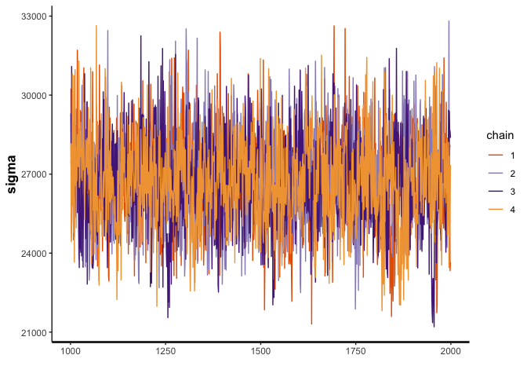

Synthetic Control Model Testing with Cereal Stage 1 and 2
================
Morgan Bale
2023-01-24

- <a href="#mn-cereal-data" id="toc-mn-cereal-data">MN Cereal Data</a>
- <a href="#stage-1-model" id="toc-stage-1-model">Stage 1 Model</a>
- <a href="#stage-1-results" id="toc-stage-1-results">Stage 1 Results</a>
- <a href="#stage-2-model" id="toc-stage-2-model">Stage 2 Model</a>
- <a href="#stage-2-results" id="toc-stage-2-results">Stage 2 Results</a>

The purpose of this file is to test how our hierarchical model works
with real data. The data was cleaned using the cereal cleaning file. We
use MN to test the model, since we are mostly sure which retailer was
treated in MN. The data comes from our Google Drive folder “cleaned data
sets”. We are testing a two stage model with files `bscm_level1_p1.stan`
and `bscm_level1_p1_stage2.stan`.

# MN Cereal Data

Target reset date: Jan 1st 2012, Data years: 2011-2012, CC: General
Mills, Validator: Kellogg, State: MN, Treated Retailer: 221

Load and clean data: there are 57 control stores and 43 treated stores.

``` r
load("../Data/mn_cereal_clean.RData")
#select columns we want
mn_cereal <- mn_cereal %>% dplyr::select(store_code_uc, upc, week_end, units, price, year, upc_ver_uc, parent_code, retailer_code, sales, manufacturer)
```

Create higher level brand characteristics: how I have it set up it can
only use brand characteristics I think? Will need to fix this…

``` r
#standardized number of UPCs --> num_UPC/max(num_UPC)
num_upc <- mn_cereal %>% dplyr::select(store_code_uc, upc) %>% distinct() %>% group_by(store_code_uc) %>% summarise(n=n()) %>% mutate(num_upcs=n/max(n)) #some variation, not a ton...

mn_cereal <- mn_cereal %>% left_join(num_upc, by="store_code_uc")

#variation in prices --> max(price) - min(price) for each store 
price_variation <- mn_cereal %>% dplyr::select(store_code_uc, price) %>% distinct() %>% group_by(store_code_uc) %>% summarise(max_price=max(price), min_price=min(price)) %>% mutate(price_diff=max_price-min_price)

mn_cereal <- mn_cereal %>% left_join(price_variation, by="store_code_uc")

#market share for each brand 
```

There are 53 weeks in 2011 and 52 weeks in 2012. CC is implemented
around Jan 1st, 2012. We will use 2012-01-07 as the first post treatment
period (week_num 54). Find distinct weeks and order by date. Make
treatment and post variable. There are 57 control stores and 43 treated
stores.

``` r
weeks <- mn_cereal %>% dplyr::select(week_end) %>% distinct()

weeks <- weeks[order(as.Date(weeks$week_end, format="%d/%m/%Y")),]

#add week_nums
weeks <- weeks %>% mutate(week_num=rep(1:nrow(weeks)))

mn_cereal <- mn_cereal %>% left_join(weeks, by="week_end")

#make treat variable
mn_cereal <- mn_cereal %>% mutate(treat=if_else(retailer_code==221, 1, 0))

mn_cereal <- mn_cereal %>% arrange(week_num)

#make post variable 
mn_cereal <- mn_cereal %>% mutate(post=if_else(week_num>53, 1, 0))

#add brand nums
mn_cereal <- mn_cereal %>% mutate(brand_num=if_else(manufacturer=="GM", 1, if_else(manufacturer=="K", 2, if_else(manufacturer=="PL", 3, 4))))

#add store_num for control stores
cont_stores <- mn_cereal %>% filter(treat==0) %>% distinct(store_code_uc) %>% pull()
mn_cereal <- mn_cereal %>% mutate(store_num=0)
k=1
for(i in cont_stores) {
  mn_cereal <- mn_cereal %>% mutate(store_num=if_else(store_code_uc==i, k, store_num))
  k=k+1
}
```

Collect data: N_train, N_test, S, B, y_train, X_train, X_test

``` r
control_sales <- mn_cereal %>% filter(treat==0)
S <- length(unique(control_sales$store_code_uc))
B <- length(unique(mn_cereal$manufacturer))
N_train <- 53
N_test <- max(mn_cereal$week_num)-N_train

brand_sales <- mn_cereal %>% group_by(week_num, brand_num) %>% summarise(total_sales=sum(sales))
```

    ## `summarise()` has grouped output by 'week_num'. You can override using the
    ## `.groups` argument.

``` r
#treated unit sales in pre period is y_train[N_train, B]
pre_sales <- brand_sales %>% filter(week_num<54)
y_train <- matrix(pre_sales$total_sales, nrow=N_train, ncol=B, byrow=TRUE)

#X_train is control unit sales in pre treatment 
X_train <- array(NA, dim=c(B, N_train, S))
bs_cont_sales <- control_sales %>% group_by(week_num, brand_num, store_num) %>% summarise(total_sales=sum(sales))
```

    ## `summarise()` has grouped output by 'week_num', 'brand_num'. You can override
    ## using the `.groups` argument.

``` r
for(b in 1:B) {
  for(n in 1:N_train) {
    for(s in 1:S) {
      X_train[b,n,s] <- bs_cont_sales %>% filter(brand_num==b, week_num==n, store_num==s) %>% pull(total_sales)
    }
  }
}

#X_test is control unit sales in post period
X_test <- array(NA, dim=c(B, N_test, S))
bs_cont_sales_post <- control_sales %>% filter(post==1) %>% group_by(week_num, brand_num, store_num) %>% summarise(total_sales=sum(sales)) 
```

    ## `summarise()` has grouped output by 'week_num', 'brand_num'. You can override
    ## using the `.groups` argument.

``` r
post_weeks <- unique(bs_cont_sales_post$week_num) 
for(b in 1:B) {
  for(n in post_weeks) {
    for(s in 1:S) {
      X_test[b,n-53,s] <- bs_cont_sales_post %>% filter(brand_num==b, week_num==n, store_num==s) %>% pull(total_sales)
    }
  }
}

b1_data <- list(S=S, B=B, N_train=N_train, N_test=N_test, X_train=X_train,
                X_test=X_test, y_train=y_train) #data list for stan
```

# Stage 1 Model

This model uses stage 1: the bscm from Gupta et al (see file
`bscm_level1_p1.stan`) and then stage 2: a regression of store/brand
characteristics on the treatment effects found in stage 1.

Run stage 1 Model

    ## S4 class stanmodel 'bscm_level1_p1' coded as follows:
    ## //
    ## // This model comes from Gupta's web index B.1 (adjusted)
    ## // Morgan Bale
    ## // October 2021
    ## 
    ## // Data
    ## data{
    ##   int N_train; //Number of observations in the pre-treatment periods
    ##   int N_test; //Number of observations in the post-treatment periods
    ##   int S;      //Number of control stores
    ##   int B;      //Number of brands 
    ##   matrix[N_train, B] y_train;        //Treated unit in the pre-treatment periods
    ##   matrix[N_train, S] X_train[B];    //Control unit matrix in the pre-treatment
    ##   matrix[N_test, S] X_test[B];       //Control unit matrix in the post-treatment
    ## }
    ## 
    ## // The parameters accepted by the model. 
    ## parameters{
    ##   real beta_0; //Intercept
    ##   real<lower=0> sigma2; //Error term variance
    ##   matrix[S, B] beta; //Control unit weights, move to transformed parameters if using beta_raw
    ##   real<lower=0> tau; //global shrinkage 
    ##   matrix<lower=0>[S, B] lambda; //local shrinkage 
    ## }
    ## 
    ## transformed parameters{
    ##   real<lower=0> sigma; //Error term sd
    ##   matrix<lower=0>[B, B] lambda2; 
    ##   matrix[N_train,B] X_beta; //Synthetic control unit prediction in the pre-treatment period
    ##   sigma = sqrt(sigma2);
    ##   lambda2 = lambda' * lambda; 
    ##   
    ##   for(b in 1:B) {
    ##     //for(s in 1:S) {
    ##     X_beta[,b] = beta_0 + X_train[][b] * beta[,b];
    ##   }//}
    ## }
    ## 
    ## // The model to be estimated. 
    ## model{
    ##   //Pre-treatment estimation
    ##   tau ~ cauchy(0, sigma); 
    ##   sigma ~ cauchy(0,10);
    ##   beta_0 ~ cauchy(0,10);
    ##   for(b in 1:B) {
    ##     lambda[,b] ~ cauchy(0, tau); 
    ##     beta[,b] ~ normal(0, lambda2[b,b]); 
    ##   }
    ##   for(b in 1:B) {
    ##     y_train[,b] ~ normal(X_beta[,b], sigma); 
    ##   }
    ## }
    ## 
    ## generated quantities{
    ##   //Post-treatment prediction & Log-likelihood
    ##   matrix[N_train, B] y_fit; //Fitted synthetic control unit in the pre-treatment
    ##   matrix[N_test, B] y_test; //Predicted synthetic control unit in the post-treatment
    ##   matrix[N_train, B] log_lik; //Log-likelihood
    ##   for(b in 1:B) {
    ##     y_fit[,b] = beta_0 + X_train[][b] * beta[,b]; 
    ##   }
    ## 
    ##   for(i in 1:N_test){
    ##     for(b in 1:B) {
    ##       y_test[i,b] = normal_rng(beta_0 + X_test[,i][b] * beta[,b], sigma);
    ##     }}
    ##     
    ##   for (t in 1:N_train) {
    ##     for(b in 1:B) {
    ##       log_lik[t,b] = normal_lpdf(y_train[t,b] | y_fit[t,b], sigma);
    ##     }}
    ## }
    ## 

    ## Warning: Bulk Effective Samples Size (ESS) is too low, indicating posterior means and medians may be unreliable.
    ## Running the chains for more iterations may help. See
    ## https://mc-stan.org/misc/warnings.html#bulk-ess

    ## Warning: Tail Effective Samples Size (ESS) is too low, indicating posterior variances and tail quantiles may be unreliable.
    ## Running the chains for more iterations may help. See
    ## https://mc-stan.org/misc/warnings.html#tail-ess

# Stage 1 Results

Check Stage 1 worked

``` r
traceplot(draws1, pars="beta_0")
```

<!-- -->

``` r
traceplot(draws1, pars=c("beta[1,1]", "beta[1,2]", "beta[1,3]", "beta[1,4]", 
                         "beta[2,1]", "beta[2,2]", "beta[2,3]", "beta[2,4]")) #(S,B)
```

<!-- -->

``` r
traceplot(draws1, pars="sigma")
```

<!-- -->

``` r
traceplot(draws1, pars=c("lambda[1,1]", "lambda[1,2]", "lambda[1,3]", "lambda[1,4]", 
                         "lambda[2,1]", "lambda[2,2]", "lambda[2,3]", "lambda[2,4]")) #(S,B)
```

<!-- -->

``` r
traceplot(draws1, pars="tau")
```

<!-- -->

``` r
#synthetic control for pre treatment
y_fit <- summary(draws1, pars="y_fit")  #(N_train, B)

sc_pre <- tibble(y_fit[[1]][,1])

lower <- y_fit[[1]][,4]
upper <- y_fit[[1]][,8]

sc_pre <- sc_pre %>% bind_cols(lower, upper)
```

    ## New names:
    ## • `` -> `...2`
    ## • `` -> `...3`

``` r
sc_pre <- sc_pre %>% mutate(week=rep(1:b1_data$N_train, each=b1_data$B), brand=rep(1:b1_data$B, times=b1_data$N_train))

names(sc_pre) <- c("synthetic_control","lower", "upper", "week", "brand")

y_train <- b1_data$y_train

y_train <-y_train %>% melt(id.vars=c("V1", "V2", "V3"), value.name="treated")

names(y_train) <- c("week", "brand", "treated")

sc_data <- sc_pre %>% left_join(y_train, by=c("week", "brand"))

y_test <- summary(draws1, pars="y_test") #(N_test, B)

sc_post <- tibble(y_test[[1]][,1])

lower <- y_test[[1]][,4]
upper <- y_test[[1]][,8]

sc_post <- sc_post %>% bind_cols(lower, upper)
```

    ## New names:
    ## • `` -> `...2`
    ## • `` -> `...3`

``` r
sc_post <- sc_post %>% mutate(week=rep((b1_data$N_train+1):(b1_data$N_train+b1_data$N_test), each=b1_data$B), brand=rep(1:b1_data$B, times=b1_data$N_test))

names(sc_post) <- c("synthetic_control", "lower", "upper", "week", "brand")

y_post <- brand_sales %>% filter(week_num>53)
names(y_post) <- c("week", "brand", "treated")

sc_post <- sc_post %>% left_join(y_post, by=c("week", "brand"))

total_sc_data <- sc_data %>% bind_rows(sc_post)

total_sc_data <- total_sc_data %>% mutate(brand_name=if_else(brand==1, "Captain", if_else(brand==2, "Validator", if_else(brand==3, "PL", "Other"))))

total_sc_data %>% ggplot(aes(x=week)) + geom_ribbon(aes(ymin=lower, ymax=upper, fill=as.factor(brand_name)), linetype=0, alpha=.1) + geom_line(aes(y=treated, color=as.factor(brand_name))) + geom_line(aes(y=synthetic_control,  color=as.factor(brand_name)), linetype="dashed") +
  labs(x="Week", y="Sales", color="Brand") + ggtitle("Synthetic Control (dashed) vs Treatment Group (solid)") + geom_vline(xintercept=b1_data$N_train) + guides(fill=FALSE) #+ scale_color_manual(values=c("navyblue", "darkred", "steelblue", "black"))
```

    ## Warning: The `<scale>` argument of `guides()` cannot be `FALSE`. Use "none" instead as
    ## of ggplot2 3.3.4.

<!-- --> Plot the treatment
effect by brand.

``` r
total_sc_data <- total_sc_data %>% mutate(treat_effect=treated-synthetic_control)

total_sc_data %>% ggplot(aes(x=week, y=treat_effect, color=as.factor(brand_name))) + geom_line() + geom_vline(xintercept=b1_data$N_train) +
  labs(x="Week", y="Sales", color="Brand") + ggtitle("Treatment effect by brand")
```

<!-- -->

# Stage 2 Model

Stage 2 Data: W, B, N, K, treat_effect, Z: dummy for cap, val, and other
(relative to PL)

``` r
W=N_test #num weeks in post period 
B=B #num brands
N=B*W #num treat effects 
K=3 #num characteristics
treat_effect <- total_sc_data %>% filter(week>53) %>% dplyr::select(treat_effect)

brand_sales <- brand_sales %>% dummy_cols(select_columns="brand_num")
Z <- t(as.matrix(brand_sales %>% filter(week_num>53) %>% dplyr::select(brand_num_1, brand_num_2, brand_num_4)))

stage2_data <- list(W=W, B=B, N=N, K=K, treat_effect=treat_effect %>% pull(), Z=Z)
```

Run Stage 2 Model

``` r
#stage 2
stage2_model <- stan_model(file = here::here("Code", "Model", "bscm_level1_p1_stage2.stan"))
print(stage2_model)
```

    ## S4 class stanmodel 'bscm_level1_p1_stage2' coded as follows:
    ## // Stage 2 of bscm level1 p1 
    ## //
    ## 
    ## data {
    ##    int W;    // num weeks in the post period     
    ##    int B;   // num of brands 
    ##    int N;   //num treat effect (B*W)
    ##    int K;   //num of characteristics
    ##    vector[N] treat_effect; // treat-synthetic control 
    ##    matrix[K, N] Z; //store brand characteristics
    ## }
    ## 
    ## 
    ## parameters {
    ##   real theta_0;
    ##   real<lower=0> sigma;
    ##   vector[K] theta; 
    ## }
    ## 
    ## 
    ## model {
    ##   treat_effect ~ normal(theta_0 + theta'*Z, sigma);
    ## }
    ## 

``` r
draws2 <- sampling(stage2_model, data=stage2_data, seed=2020)
```

# Stage 2 Results

theta1=cap dummy; theta2=val dummy; theta3=other dummy;

``` r
traceplot(draws2)
```

<!-- -->

``` r
print(draws2)
```

    ## Inference for Stan model: bscm_level1_p1_stage2.
    ## 4 chains, each with iter=2000; warmup=1000; thin=1; 
    ## post-warmup draws per chain=1000, total post-warmup draws=4000.
    ## 
    ##               mean se_mean      sd      2.5%       25%       50%       75%
    ## theta_0    6618.53  110.39 3928.74   -907.28   3934.81   6532.04   9281.71
    ## sigma     29027.75   28.84 1491.49  26226.55  28020.44  28957.13  29979.04
    ## theta[1] -21846.16  132.97 5597.00 -32796.07 -25634.27 -21911.94 -17898.75
    ## theta[2] -12406.87  132.32 5565.88 -23507.90 -16043.77 -12450.13  -8766.78
    ## theta[3] -20772.00  135.69 5584.90 -31515.67 -24629.76 -20904.43 -16994.89
    ## lp__      -2230.19    0.04    1.58  -2234.11  -2231.01  -2229.86  -2229.03
    ##              97.5% n_eff Rhat
    ## theta_0   14379.42  1267    1
    ## sigma     32200.95  2674    1
    ## theta[1] -11062.35  1772    1
    ## theta[2]  -1268.52  1769    1
    ## theta[3]  -9808.13  1694    1
    ## lp__      -2228.08  1806    1
    ## 
    ## Samples were drawn using NUTS(diag_e) at Tue Jan 24 16:40:08 2023.
    ## For each parameter, n_eff is a crude measure of effective sample size,
    ## and Rhat is the potential scale reduction factor on split chains (at 
    ## convergence, Rhat=1).
