Bayesian Synthetic Control Method with a Horseshoe Prior and Intercept
and Levels
================
Morgan Bale

The purpose of this file to use synthetic data to test the bayesian
synthetic control model with data at the store, brand, and time level.
The model comes from the web index of the Gupta paper, part B.1
BSCM-Horseshoe. This file begins to customize the model to our paper,
e.g. changing index and variable names and is built off of the file
`02_bscm-intercept`. We use two different versions of the model: (1)
centered from their paper, and (2) non-centered from the code in their
web appendix. The centered parameterization works best for this model.

    ## ── Attaching packages ─────────────────────────────────────── tidyverse 1.3.1 ──

    ## ✓ ggplot2 3.3.5     ✓ purrr   0.3.4
    ## ✓ tibble  3.1.4     ✓ dplyr   1.0.7
    ## ✓ tidyr   1.1.3     ✓ stringr 1.4.0
    ## ✓ readr   2.0.1     ✓ forcats 0.5.1

    ## ── Conflicts ────────────────────────────────────────── tidyverse_conflicts() ──
    ## x dplyr::filter() masks stats::filter()
    ## x dplyr::lag()    masks stats::lag()

    ## Loading required package: StanHeaders

    ## rstan (Version 2.21.2, GitRev: 2e1f913d3ca3)

    ## For execution on a local, multicore CPU with excess RAM we recommend calling
    ## options(mc.cores = parallel::detectCores()).
    ## To avoid recompilation of unchanged Stan programs, we recommend calling
    ## rstan_options(auto_write = TRUE)

    ## 
    ## Attaching package: 'rstan'

    ## The following object is masked from 'package:tidyr':
    ## 
    ##     extract

    ## This is bayesplot version 1.8.1

    ## - Online documentation and vignettes at mc-stan.org/bayesplot

    ## - bayesplot theme set to bayesplot::theme_default()

    ##    * Does _not_ affect other ggplot2 plots

    ##    * See ?bayesplot_theme_set for details on theme setting

    ## 
    ## Attaching package: 'reshape2'

    ## The following object is masked from 'package:tidyr':
    ## 
    ##     smiths

##### DATA

Function for making synthetic data: incorporate brand and store level
data across multiple time periods. Assume brands are nested within
stores.

``` r
gen_b1_data <- function(N_train=40,     #num of obs in pre treatment
                        N_test=40,      #num of obs in post treatment 
                        S=2,            #num of control stores
                        B=3,            #num of brands within each store
                        beta_0=5,       #intercept
                        mu=c(15, 35, 10)  #means for X matrices (brands?)
                        ) {


  X_train <- array(NA, dim=c(B, N_train, S))         #control unit matrix pre treatment 

  X_test <- array(NA, dim=c(B, N_test, S))         #control unit matrix post treatment 
  
  for(b in 1:B) {
    X_train[b,,] <- matrix(rnorm(N_train*S, mean=mu[b], sd=10), nrow=N_train, ncol=S)     #control unit matrix in pre treatment
    X_test[b,,] <- matrix(rnorm(N_test*S, mean=mu[b], sd=10), nrow=N_test, ncol=S)
  }
  
  beta <- matrix(c(-.5, 2, 0, -.5, 2, 0), nrow=S, ncol=B)
  
  X_beta <- array(NA, dim=c(N_train, B))
  
  for(b in 1:B) {
    X_beta[,b] <- beta_0 + X_train[b,,] %*% beta[,b]
  }
  
  epsilon <- matrix(rnorm(N_train*B, mean=0, sd=1), nrow=N_train, ncol=B) 
  y_train <- matrix(NA, nrow=N_train, ncol=B)
  for(b in 1:B) {
    y_train[,b] <- X_beta[,b] + epsilon[,b]
  }
  
  #make a list for stan
  list(N_train=N_train, N_test=N_test, S=S, B=B, beta_0=beta_0, X_train=X_train, X_test=X_test,
       beta=beta, X_beta=X_beta, y_train=y_train, epsilon=epsilon)
}
```

Create synthetic data

``` r
set.seed(2020)
b1_data <- gen_b1_data()
```

###### MODEL: CENTERED PARAMETERIZATION

Run model using `bscm_level1_p1.stan`.

``` r
b1_model_p1 <- stan_model(file = here::here("Code", "Model", "bscm_level1_p1.stan"))
print(b1_model_p1)
```

    ## S4 class stanmodel 'bscm_level1_p1' coded as follows:
    ## //
    ## // This model comes from Gupta's web index B.1 (adjusted)
    ## // Morgan Bale
    ## // October 2021
    ## 
    ## // Data
    ## data{
    ##   int N_train; //Number of observations in the pre-treatment periods
    ##   int N_test; //Number of observations in the post-treatment periods
    ##   int S;      //Number of stores
    ##   int B;      //Number of brands 
    ##   matrix[N_train, B] y_train;        //Treated unit in the pre-treatment periods
    ##   matrix[N_train, S] X_train[B];    //Control unit matrix in the pre-treatment
    ##   matrix[N_test, S] X_test[B];       //Control unit matrix in the post-treatment
    ## }
    ## 
    ## // The parameters accepted by the model. 
    ## parameters{
    ##   real beta_0; //Intercept
    ##   real<lower=0> sigma2; //Error term variance
    ##   matrix[S, B] beta; //Control unit weights, move to transformed parameters if using beta_raw
    ##   real<lower=0> tau; //global shrinkage 
    ##   matrix<lower=0>[S, B] lambda; //local shrinkage 
    ## }
    ## 
    ## transformed parameters{
    ##   real<lower=0> sigma; //Error term sd
    ##   matrix<lower=0>[B, B] lambda2; 
    ##   matrix[N_train,B] X_beta; //Synthetic control unit prediction in the pre-treatment period
    ##   sigma = sqrt(sigma2);
    ##   lambda2 = lambda' * lambda; 
    ##   
    ##   for(b in 1:B) {
    ##     //for(s in 1:S) {
    ##     X_beta[,b] = beta_0 + X_train[][b] * beta[,b];
    ##   }//}
    ## }
    ## 
    ## // The model to be estimated. 
    ## model{
    ##   //Pre-treatment estimation
    ##   tau ~ cauchy(0, sigma); 
    ##   sigma ~ cauchy(0,10);
    ##   beta_0 ~ cauchy(0,10);
    ##   for(b in 1:B) {
    ##     lambda[,b] ~ cauchy(0, tau); 
    ##     beta[,b] ~ normal(0, lambda2[b,b]); 
    ##   }
    ##   for(b in 1:B) {
    ##     y_train[,b] ~ normal(X_beta[,b], sigma); 
    ##   }
    ## }
    ## 
    ## generated quantities{
    ##   //Post-treatment prediction & Log-likelihood
    ##   matrix[N_train, B] y_fit; //Fitted synthetic control unit in the pre-treatment
    ##   matrix[N_test, B] y_test; //Predicted synthetic control unit in the post-treatment
    ##   matrix[N_train, B] log_lik; //Log-likelihood
    ##   for(b in 1:B) {
    ##     y_fit[,b] = beta_0 + X_train[][b] * beta[,b]; 
    ##   }
    ## 
    ##   for(i in 1:N_test){
    ##     for(b in 1:B) {
    ##       y_test[i,b] = normal_rng(beta_0 + X_test[,i][b] * beta[,b], sigma);
    ##     }}
    ##     
    ##   for (t in 1:N_train) {
    ##     for(b in 1:B) {
    ##       log_lik[t,b] = normal_lpdf(y_train[t,b] | y_fit[t,b], sigma);
    ##     }}
    ## }
    ## 

``` r
draws <- sampling(b1_model_p1, data=b1_data, seed=2020, cores=3)
```

###### RESULTS: CENTERED PARAMETERIZATION

Check results: there are no divergent transitions, the traceplots
converge, and the model recovers our parameters.

``` r
#traceplots
traceplot(draws, pars="beta_0")
```

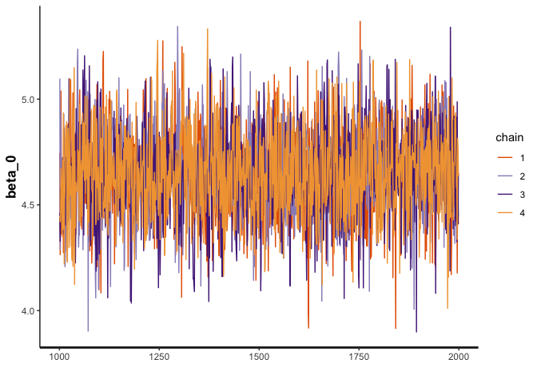<!-- -->

``` r
traceplot(draws, pars="beta") #(S,B)
```

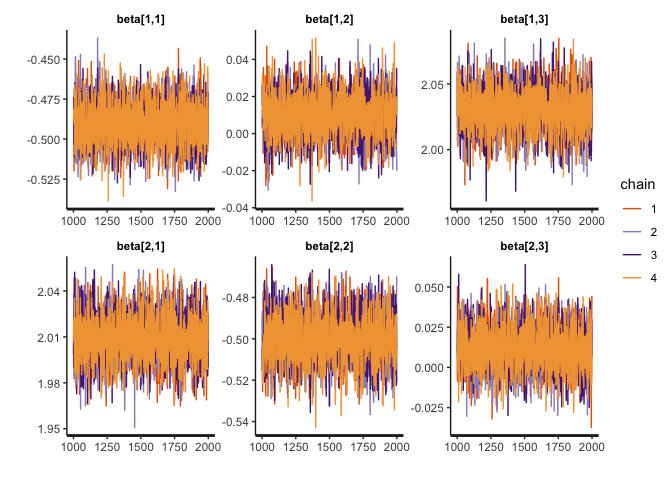<!-- -->

``` r
traceplot(draws, pars="sigma")
```

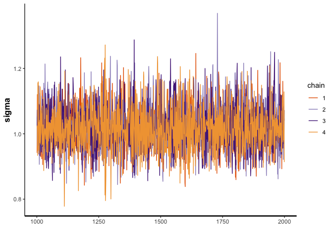<!-- -->

``` r
traceplot(draws, pars="lambda") #(S,B)
```

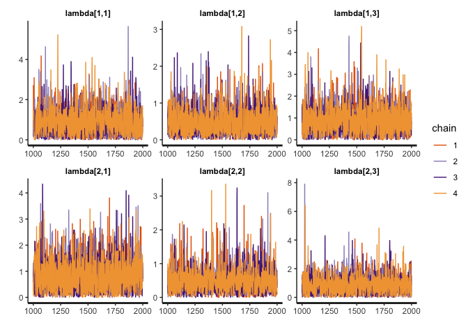<!-- -->

``` r
traceplot(draws, pars="tau")
```

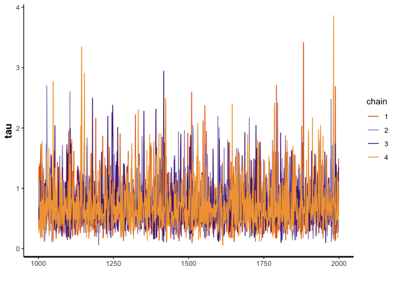<!-- -->

``` r
mcmc_recover_hist(As.mcmc.list(draws, pars="beta"), true=as.vector(t(b1_data$beta)))
```

    ## `stat_bin()` using `bins = 30`. Pick better value with `binwidth`.

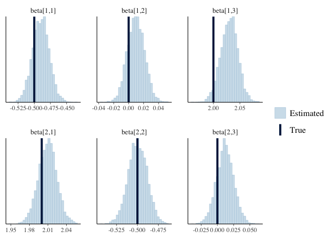<!-- -->

``` r
mcmc_recover_hist(As.mcmc.list(draws, pars="beta_0"), true=as.vector(t(b1_data$beta_0)))
```

    ## `stat_bin()` using `bins = 30`. Pick better value with `binwidth`.

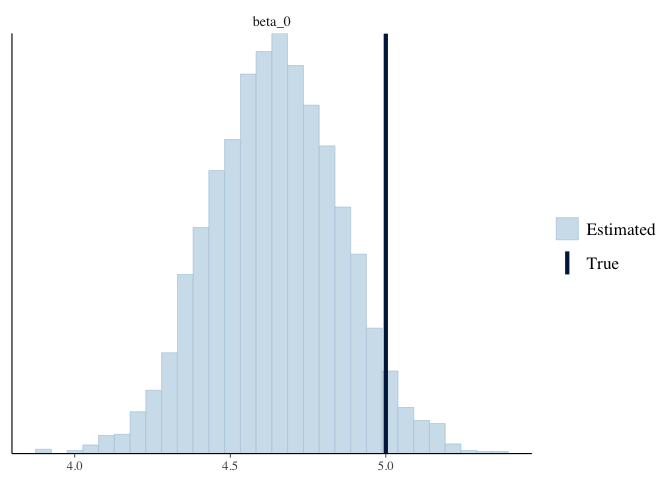<!-- -->

Fitted Synthetic Control for pre treatment

``` r
#synthetic control for pre treatment
y_fit <- summary(draws, pars="y_fit")  #(N_train, B)

sc_pre <- tibble(y_fit[[1]][,1])

lower <- y_fit[[1]][,4]
upper <- y_fit[[1]][,8]

sc_pre <- sc_pre %>% bind_cols(lower, upper)
```

    ## New names:
    ## * NA -> ...2
    ## * NA -> ...3

``` r
sc_pre <- sc_pre %>% mutate(week=rep(1:b1_data$N_train, each=b1_data$B), brand=rep(1:b1_data$B, times=b1_data$N_train))

names(sc_pre) <- c("synthetic_control","lower", "upper", "week", "brand")
```

Treated unit in the pre treatment

``` r
y_train <- b1_data$y_train

y_train <-y_train %>% melt(id.vars=c("V1", "V2", "V3"), value.name="treated")

names(y_train) <- c("week", "brand", "treated")

sc_data <- sc_pre %>% left_join(y_train, by=c("week", "brand"))

#sc_data %>% ggplot(aes(x=week)) + geom_line(aes(y=treated, color=as.factor(brand))) + geom_line(aes(y=synthetic_control, color=as.factor(brand)), linetype="dashed") + scale_color_manual(values=c("navyblue", "darkred", "steelblue")) + 
  #labs(x="Week", y="Pre Treatment Value", color="Brand") + ggtitle("Pre Treatment Synthetic Control (dashed) vs Treatment Group (solid)") 
```

Predicted Synthetic Control for post treatment

``` r
y_test <- summary(draws, pars="y_test") #(N_test, B)

sc_post <- tibble(y_test[[1]][,1])

lower <- y_test[[1]][,4]
upper <- y_test[[1]][,8]

sc_post <- sc_post %>% bind_cols(lower, upper)
```

    ## New names:
    ## * NA -> ...2
    ## * NA -> ...3

``` r
sc_post <- sc_post %>% mutate(week=rep((b1_data$N_train+1):(b1_data$N_train+b1_data$N_test), each=b1_data$B), brand=rep(1:b1_data$B, times=b1_data$N_test))

names(sc_post) <- c("synthetic_control", "lower", "upper", "week", "brand")
```

Make treatment data for post period

``` r
y_post <- y_train %>% mutate(treated=treated+10, week=rep((b1_data$N_train+1):(b1_data$N_train+b1_data$N_test), times=b1_data$B))

sc_post <- sc_post %>% left_join(y_post, by=c("week", "brand"))

total_sc_data <- sc_data %>% bind_rows(sc_post)

total_sc_data %>% ggplot(aes(x=week)) + geom_ribbon(aes(ymin=lower, ymax=upper), fill="gray80") + geom_line(aes(y=treated, color=as.factor(brand))) + geom_line(aes(y=synthetic_control,  color=as.factor(brand)), linetype="dashed") +
  labs(x="Week", y="Value", color="Brand") + ggtitle("Synthetic Control (dashed) vs Treatment Group (solid)") + geom_vline(xintercept=b1_data$N_train) + scale_color_manual(values=c("navyblue", "darkred", "steelblue"))
```

<!-- -->

Plot by brand to be able to see post period better:

BRAND 1

``` r
total_sc_data %>% filter(brand==1) %>% ggplot(aes(x=week)) + geom_ribbon(aes(ymin=lower, ymax=upper), fill="gray80") + geom_line(aes(y=treated), color="navyblue") + geom_line(aes(y=synthetic_control),color="navyblue", linetype="dashed") +
  labs(x="Week", y="Value") + ggtitle("Synthetic Control (dashed) vs Treatment Group (solid): Brand 1") + geom_vline(xintercept=b1_data$N_train)
```

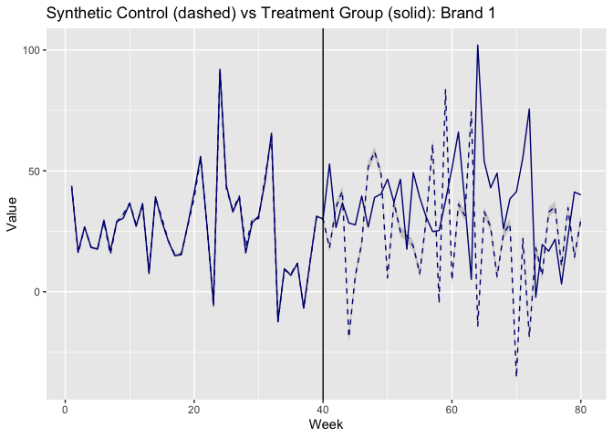<!-- -->

BRAND 2

``` r
total_sc_data %>% filter(brand==2) %>% ggplot(aes(x=week)) + geom_ribbon(aes(ymin=lower, ymax=upper), fill="gray80") + geom_line(aes(y=treated), color="darkred") + geom_line(aes(y=synthetic_control),color="darkred", linetype="dashed") +
  labs(x="Week", y="Value") + ggtitle("Synthetic Control (dashed) vs Treatment Group (solid): Brand 2") + geom_vline(xintercept=b1_data$N_train)
```

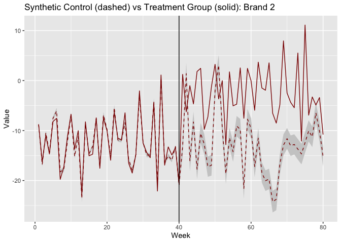<!-- -->

BRAND 3

``` r
total_sc_data %>% filter(brand==3) %>% ggplot(aes(x=week)) + geom_ribbon(aes(ymin=lower, ymax=upper), fill="gray80") + geom_line(aes(y=treated), color="steelblue") + geom_line(aes(y=synthetic_control),color="steelblue", linetype="dashed") +
  labs(x="Week", y="Value") + ggtitle("Synthetic Control (dashed) vs Treatment Group (solid): Brand 3") + geom_vline(xintercept=b1_data$N_train)
```

<!-- -->

###### MODEL: NON-CENTERED PARAMETERIZATION

Run model using `bscm_level1_p2.stan`.

``` r
b1_model_p2 <- stan_model(file = here::here("Code", "Model", "bscm_level1_p2.stan"))
print(b1_model_p2)
```

    ## S4 class stanmodel 'bscm_level1_p2' coded as follows:
    ## //
    ## // This model comes from Gupta's web index B.1 (adjusted)
    ## // Morgan Bale
    ## // October 2021
    ## 
    ## // Data
    ## data{
    ##   int N_train; //Number of observations in the pre-treatment periods
    ##   int N_test; //Number of observations in the post-treatment periods
    ##   int S;      //Number of stores
    ##   int B;      //Number of brands 
    ##   matrix[N_train, B] y_train;        //Treated unit in the pre-treatment periods
    ##   matrix[N_train, S] X_train[B];    //Control unit matrix in the pre-treatment
    ##   matrix[N_test, S] X_test[B];       //Control unit matrix in the post-treatment
    ## }
    ## 
    ## // The parameters accepted by the model. 
    ## parameters{
    ##   real beta_0; //Intercept
    ##   real<lower=0> sigma2; //Error term variance
    ##   matrix[S, B] beta_raw; 
    ##   real<lower=0> tau; //global shrinkage 
    ##   matrix<lower=0, upper=pi()/2>[S, B] lambda_unif; 
    ## }
    ## 
    ## transformed parameters{
    ##   real<lower=0> sigma; //Error term sd
    ##   matrix<lower=0>[S, B] lambda; //local shrinkage 
    ##   matrix[S, B] beta; //Control unit weights, move to transformed parameters if using beta_raw
    ##   matrix[N_train,B] X_beta; //Synthetic control unit prediction in the pre-treatment period
    ##   sigma = sqrt(sigma2);
    ##   lambda=tau*tan(lambda_unif); 
    ##   
    ##   for(b in 1:B) {
    ##     for(s in 1:S) {
    ##       beta[s, b] = lambda[s, b]*beta_raw[s,b]; 
    ##     }
    ##   }
    ## 
    ##   for(b in 1:B) {
    ##     //for(s in 1:S) {
    ##     X_beta[,b] = beta_0 + X_train[][b] * beta[,b];
    ##   }//}
    ## }
    ## 
    ## // The model to be estimated. 
    ## model{
    ##   //Pre-treatment estimation
    ##   tau ~ cauchy(0, sigma); 
    ##   sigma ~ cauchy(0,10);
    ##   beta_0 ~ cauchy(0,10);
    ##   for(b in 1:B) {
    ##     beta_raw[,b] ~ normal(0, 1); 
    ##   }
    ##   for(b in 1:B) {
    ##     y_train[,b] ~ normal(X_beta[,b], sigma); 
    ##   }
    ## }
    ## 
    ## generated quantities{
    ##   //Post-treatment prediction & Log-likelihood
    ##   matrix[N_train, B] y_fit; //Fitted synthetic control unit in the pre-treatment
    ##   matrix[N_test, B] y_test; //Predicted synthetic control unit in the post-treatment
    ##   matrix[N_train, B] log_lik; //Log-likelihood
    ##   for(b in 1:B) {
    ##     y_fit[,b] = beta_0 + X_train[][b] * beta[,b]; 
    ##   }
    ## 
    ##   for(i in 1:N_test){
    ##     for(b in 1:B) {
    ##       y_test[i,b] = normal_rng(beta_0 + X_test[,i][b] * beta[,b], sigma);
    ##     }}
    ##     
    ##   for (t in 1:N_train) {
    ##     for(b in 1:B) {
    ##       log_lik[t,b] = normal_lpdf(y_train[t,b] | y_fit[t,b], sigma);
    ##     }}
    ## }
    ## 

``` r
draws <- sampling(b1_model_p2, data=b1_data, seed=2020, cores=3)
```

    ## Warning: There were 283 divergent transitions after warmup. See
    ## http://mc-stan.org/misc/warnings.html#divergent-transitions-after-warmup
    ## to find out why this is a problem and how to eliminate them.

    ## Warning: There were 3284 transitions after warmup that exceeded the maximum treedepth. Increase max_treedepth above 10. See
    ## http://mc-stan.org/misc/warnings.html#maximum-treedepth-exceeded

    ## Warning: Examine the pairs() plot to diagnose sampling problems

###### RESULTS

Check results: there are divergent transitions and the traceplots look
okay.

``` r
#traceplots
traceplot(draws, pars="beta_0")
```

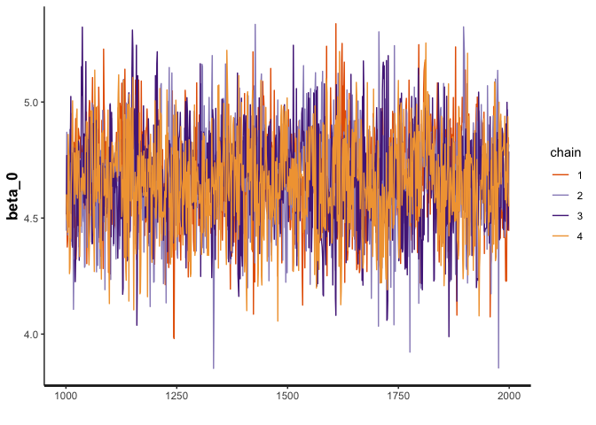<!-- -->

``` r
traceplot(draws, pars="beta") #(S,B)
```

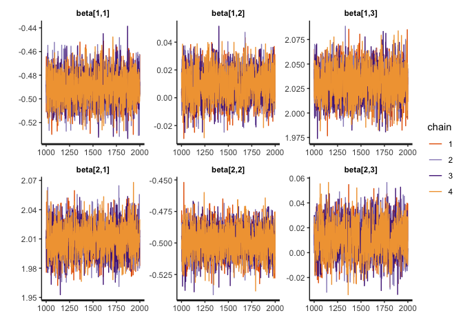<!-- -->

``` r
traceplot(draws, pars="sigma")
```

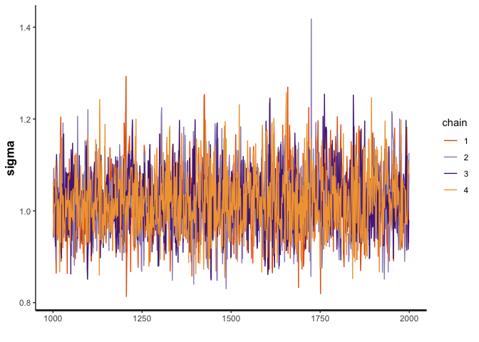<!-- -->

``` r
traceplot(draws, pars="lambda") #(S,B)
```

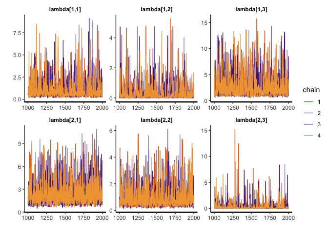<!-- -->

``` r
traceplot(draws, pars="tau")
```

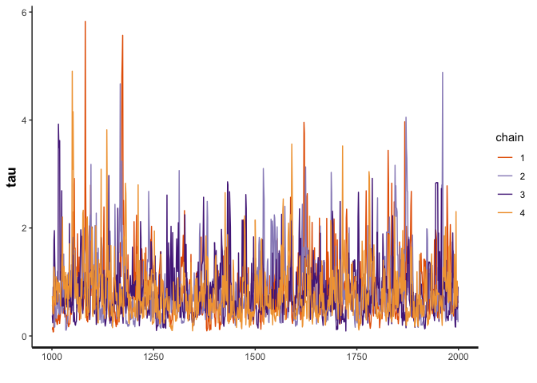<!-- -->

``` r
mcmc_recover_hist(As.mcmc.list(draws, pars="beta"), true=as.vector(t(b1_data$beta)))
```

    ## `stat_bin()` using `bins = 30`. Pick better value with `binwidth`.

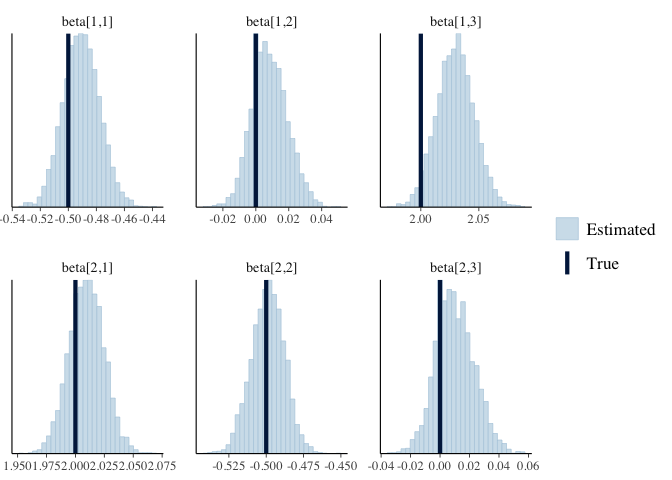<!-- -->

``` r
mcmc_recover_hist(As.mcmc.list(draws, pars="beta_0"), true=as.vector(t(b1_data$beta_0)))
```

    ## `stat_bin()` using `bins = 30`. Pick better value with `binwidth`.

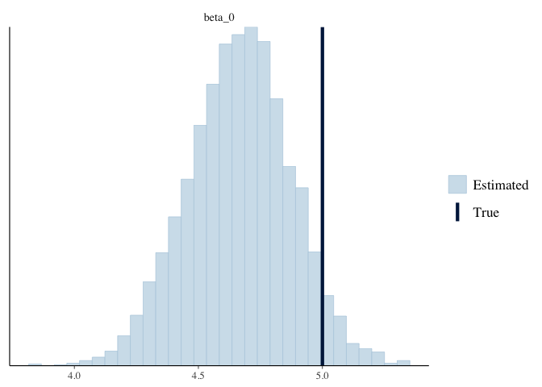<!-- -->

Fitted Synthetic Control for pre treatment

``` r
#synthetic control for pre treatment
y_fit <- summary(draws, pars="y_fit")  #(N_train, B)

sc_pre <- tibble(y_fit[[1]][,1])

lower <- y_fit[[1]][,4]
upper <- y_fit[[1]][,8]

sc_pre <- sc_pre %>% bind_cols(lower, upper)
```

    ## New names:
    ## * NA -> ...2
    ## * NA -> ...3

``` r
sc_pre <- sc_pre %>% mutate(week=rep(1:b1_data$N_train, each=b1_data$B), brand=rep(1:b1_data$B, times=b1_data$N_train))

names(sc_pre) <- c("synthetic_control","lower", "upper", "week", "brand")
```

Treated unit in the pre treatment

``` r
y_train <- b1_data$y_train

y_train <-y_train %>% melt(id.vars=c("V1", "V2", "V3"), value.name="treated")

names(y_train) <- c("week", "brand", "treated")

sc_data <- sc_pre %>% left_join(y_train, by=c("week", "brand"))

#sc_data %>% ggplot(aes(x=week)) + geom_line(aes(y=treated, color=as.factor(brand))) + geom_line(aes(y=synthetic_control, color=as.factor(brand)), linetype="dashed") + scale_color_manual(values=c("navyblue", "darkred", "steelblue")) + 
  #labs(x="Week", y="Pre Treatment Value", color="Brand") + ggtitle("Pre Treatment Synthetic Control (dashed) vs Treatment Group (solid)") 
```

Predicted Synthetic Control for post treatment

``` r
y_test <- summary(draws, pars="y_test") #(N_test, B)

sc_post <- tibble(y_test[[1]][,1])

lower <- y_test[[1]][,4]
upper <- y_test[[1]][,8]

sc_post <- sc_post %>% bind_cols(lower, upper)
```

    ## New names:
    ## * NA -> ...2
    ## * NA -> ...3

``` r
sc_post <- sc_post %>% mutate(week=rep((b1_data$N_train+1):(b1_data$N_train+b1_data$N_test), each=b1_data$B), brand=rep(1:b1_data$B, times=b1_data$N_test))

names(sc_post) <- c("synthetic_control", "lower", "upper", "week", "brand")
```

Make treatment data for post period

``` r
y_post <- y_train %>% mutate(treated=treated+10, week=rep((b1_data$N_train+1):(b1_data$N_train+b1_data$N_test), times=b1_data$B))

sc_post <- sc_post %>% left_join(y_post, by=c("week", "brand"))

total_sc_data <- sc_data %>% bind_rows(sc_post)

total_sc_data %>% ggplot(aes(x=week)) + geom_ribbon(aes(ymin=lower, ymax=upper), fill="gray80") + geom_line(aes(y=treated, color=as.factor(brand))) + geom_line(aes(y=synthetic_control,  color=as.factor(brand)), linetype="dashed") +
  labs(x="Week", y="Value", color="Brand") + ggtitle("Synthetic Control (dashed) vs Treatment Group (solid)") + geom_vline(xintercept=b1_data$N_train) + scale_color_manual(values=c("navyblue", "darkred", "steelblue"))
```

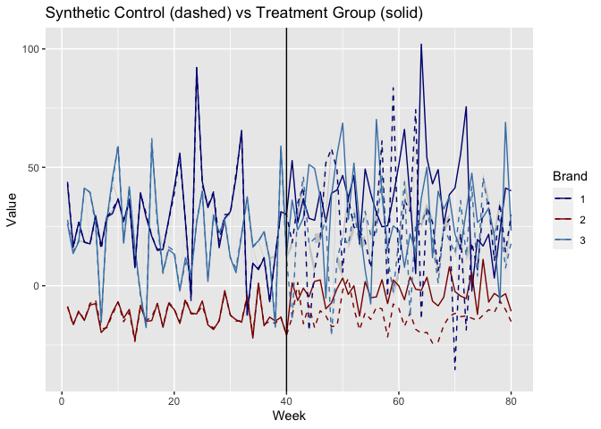<!-- -->

Plot by brand to be able to see post period better:

BRAND 1

``` r
total_sc_data %>% filter(brand==1) %>% ggplot(aes(x=week)) + geom_ribbon(aes(ymin=lower, ymax=upper), fill="gray80") + geom_line(aes(y=treated), color="navyblue") + geom_line(aes(y=synthetic_control),color="navyblue", linetype="dashed") +
  labs(x="Week", y="Value") + ggtitle("Synthetic Control (dashed) vs Treatment Group (solid): Brand 1") + geom_vline(xintercept=b1_data$N_train)
```

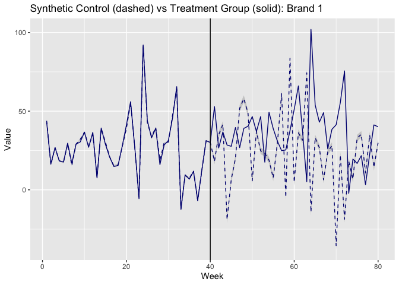<!-- -->

BRAND 2

``` r
total_sc_data %>% filter(brand==2) %>% ggplot(aes(x=week)) + geom_ribbon(aes(ymin=lower, ymax=upper), fill="gray80") + geom_line(aes(y=treated), color="darkred") + geom_line(aes(y=synthetic_control),color="darkred", linetype="dashed") +
  labs(x="Week", y="Value") + ggtitle("Synthetic Control (dashed) vs Treatment Group (solid): Brand 2") + geom_vline(xintercept=b1_data$N_train)
```

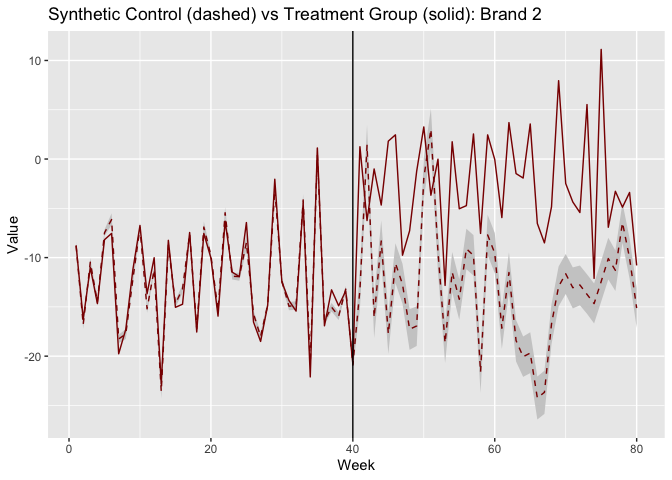<!-- -->

BRAND 3

``` r
total_sc_data %>% filter(brand==3) %>% ggplot(aes(x=week)) + geom_ribbon(aes(ymin=lower, ymax=upper), fill="gray80") + geom_line(aes(y=treated), color="steelblue") + geom_line(aes(y=synthetic_control),color="steelblue", linetype="dashed") +
  labs(x="Week", y="Value") + ggtitle("Synthetic Control (dashed) vs Treatment Group (solid): Brand 3") + geom_vline(xintercept=b1_data$N_train)
```

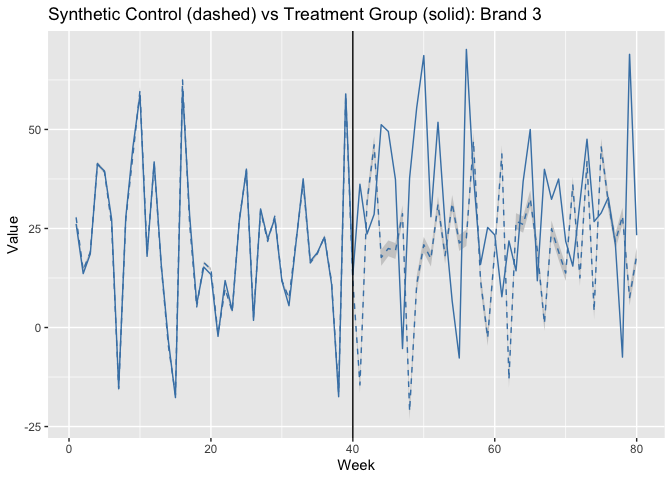<!-- -->
