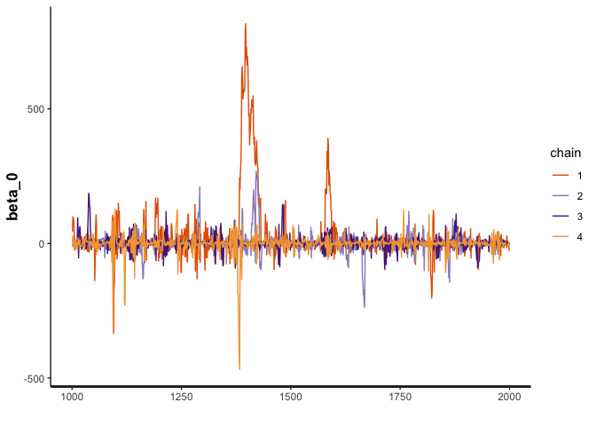

Bayesian Synthetic Control Method with a Hierarchical Weights
================
Morgan Bale
2/11/2022

The purpose of this file is to build off of `02_bscm-intercept`, by
adding a hierarchy to the Betas. NO HORESHOE PRIOR AS OF 3/11/22

    ## ── Attaching packages ─────────────────────────────────────── tidyverse 1.3.1 ──

    ## ✓ ggplot2 3.3.5     ✓ purrr   0.3.4
    ## ✓ tibble  3.1.4     ✓ dplyr   1.0.7
    ## ✓ tidyr   1.1.3     ✓ stringr 1.4.0
    ## ✓ readr   2.0.1     ✓ forcats 0.5.1

    ## ── Conflicts ────────────────────────────────────────── tidyverse_conflicts() ──
    ## x dplyr::filter() masks stats::filter()
    ## x dplyr::lag()    masks stats::lag()

    ## Loading required package: StanHeaders

    ## rstan (Version 2.21.2, GitRev: 2e1f913d3ca3)

    ## For execution on a local, multicore CPU with excess RAM we recommend calling
    ## options(mc.cores = parallel::detectCores()).
    ## To avoid recompilation of unchanged Stan programs, we recommend calling
    ## rstan_options(auto_write = TRUE)

    ## 
    ## Attaching package: 'rstan'

    ## The following object is masked from 'package:tidyr':
    ## 
    ##     extract

    ## This is bayesplot version 1.8.1

    ## - Online documentation and vignettes at mc-stan.org/bayesplot

    ## - bayesplot theme set to bayesplot::theme_default()

    ##    * Does _not_ affect other ggplot2 plots

    ##    * See ?bayesplot_theme_set for details on theme setting

##### DATA

Make synthetic data: values picked from simulation studies done in Gupta
et al.

``` r
N_train=N_test=80
p=5                     #num control stores
K=3                     #num of store covariates in beta equation 
mu=c(15, 35, 10, 20, 30) #must be same length as p, mean sales for each store

#X_train, X_test, Z and stan will make the rest
X_train <- matrix(NA, nrow = N_train, ncol = p)       #control unit matrix in pre treatment
  
X_test <- matrix(NA, nrow=N_test, ncol=p)            #control unit matrix in post treatment 
  
for(pp in 1:p) {
  X_train[,pp] <- rnorm(N_train, mean=mu[pp], sd=10)     
  X_test[,pp] <- rnorm(N_test, mean=mu[pp], sd=10)
}
  
  
Z <- matrix(rnorm(K*p), nrow=K, ncol=p)

#put in list for stan
sim_values <- list(N_train=N_train, N_test=N_test, p=p, K=K, X_train=X_train, X_test=X_test, Z=Z)
```

Generate data in stan

``` r
sim_data <- stan(
  file = here::here("Code", "Model", "gen_hierarchy_data.stan"),
  data = sim_values,
  iter = 1,
  chains = 1,
  seed = 2020,
  algorithm = "Fixed_param"
)
```

    ## recompiling to avoid crashing R session

    ## Trying to compile a simple C file

    ## Running /Library/Frameworks/R.framework/Resources/bin/R CMD SHLIB foo.c
    ## clang -mmacosx-version-min=10.13 -I"/Library/Frameworks/R.framework/Resources/include" -DNDEBUG   -I"/Library/Frameworks/R.framework/Versions/4.1/Resources/library/Rcpp/include/"  -I"/Library/Frameworks/R.framework/Versions/4.1/Resources/library/RcppEigen/include/"  -I"/Library/Frameworks/R.framework/Versions/4.1/Resources/library/RcppEigen/include/unsupported"  -I"/Library/Frameworks/R.framework/Versions/4.1/Resources/library/BH/include" -I"/Library/Frameworks/R.framework/Versions/4.1/Resources/library/StanHeaders/include/src/"  -I"/Library/Frameworks/R.framework/Versions/4.1/Resources/library/StanHeaders/include/"  -I"/Library/Frameworks/R.framework/Versions/4.1/Resources/library/RcppParallel/include/"  -I"/Library/Frameworks/R.framework/Versions/4.1/Resources/library/rstan/include" -DEIGEN_NO_DEBUG  -DBOOST_DISABLE_ASSERTS  -DBOOST_PENDING_INTEGER_LOG2_HPP  -DSTAN_THREADS  -DBOOST_NO_AUTO_PTR  -include '/Library/Frameworks/R.framework/Versions/4.1/Resources/library/StanHeaders/include/stan/math/prim/mat/fun/Eigen.hpp'  -D_REENTRANT -DRCPP_PARALLEL_USE_TBB=1   -I/usr/local/include   -fPIC  -Wall -g -O2  -c foo.c -o foo.o
    ## In file included from <built-in>:1:
    ## In file included from /Library/Frameworks/R.framework/Versions/4.1/Resources/library/StanHeaders/include/stan/math/prim/mat/fun/Eigen.hpp:13:
    ## In file included from /Library/Frameworks/R.framework/Versions/4.1/Resources/library/RcppEigen/include/Eigen/Dense:1:
    ## In file included from /Library/Frameworks/R.framework/Versions/4.1/Resources/library/RcppEigen/include/Eigen/Core:88:
    ## /Library/Frameworks/R.framework/Versions/4.1/Resources/library/RcppEigen/include/Eigen/src/Core/util/Macros.h:628:1: error: unknown type name 'namespace'
    ## namespace Eigen {
    ## ^
    ## /Library/Frameworks/R.framework/Versions/4.1/Resources/library/RcppEigen/include/Eigen/src/Core/util/Macros.h:628:16: error: expected ';' after top level declarator
    ## namespace Eigen {
    ##                ^
    ##                ;
    ## In file included from <built-in>:1:
    ## In file included from /Library/Frameworks/R.framework/Versions/4.1/Resources/library/StanHeaders/include/stan/math/prim/mat/fun/Eigen.hpp:13:
    ## In file included from /Library/Frameworks/R.framework/Versions/4.1/Resources/library/RcppEigen/include/Eigen/Dense:1:
    ## /Library/Frameworks/R.framework/Versions/4.1/Resources/library/RcppEigen/include/Eigen/Core:96:10: fatal error: 'complex' file not found
    ## #include <complex>
    ##          ^~~~~~~~~
    ## 3 errors generated.
    ## make: *** [foo.o] Error 1
    ## 
    ## SAMPLING FOR MODEL 'gen_hierarchy_data' NOW (CHAIN 1).
    ## Chain 1: Iteration: 1 / 1 [100%]  (Sampling)
    ## Chain 1: 
    ## Chain 1:  Elapsed Time: 0 seconds (Warm-up)
    ## Chain 1:                4.2e-05 seconds (Sampling)
    ## Chain 1:                4.2e-05 seconds (Total)
    ## Chain 1:

``` r
#extract values
sim_beta <- extract(sim_data)$beta       #weights for control stores 
sim_theta <- extract(sim_data)$theta     #effect of store covariates on weights (beta)
sim_ytrain <- extract(sim_data)$y_train  #treat unit in per period
sim_beta0 <- extract(sim_data)$beta_0    #intercept in y 
sim_sigma <- extract(sim_data)$sigma
sim_epsilon <- extract(sim_data)$epsilon
sim_ypost <- extract(sim_data)$y_post  #treat unit in post period

#put data in list for stan model 
b1_data <- list(N_train=N_train, N_test=N_test, p=p, K=K, X_train=X_train, X_test=X_test, Z=Z, beta=sim_beta, theta=sim_theta, y_train=as.vector(sim_ytrain), beta_0=sim_beta0, sigma=sim_sigma, epsilon=sim_epsilon, y_post=as.vector(sim_ypost))
```

###### MODEL: CENTERED PARAMETERIZATION

Run model using `bcsm_hierarchy.stan`. This model tries to recreate the
model according to the syntax in the paper and the commented out code in
the web appendix, we add a new hierarchical prior for Beta instead of
horseshoe prior currently. No divergent transitions when horseshoe prior
is not present. The weights (beta) are no a function of store
characteristics (Z). the treatment effect (alpha) is the difference
between Y_treat_post - Y_synth_control.

``` r
b1_model <- stan_model(file = here::here("Code", "Model", "bscm_hierarchy.stan"))
```

    ## recompiling to avoid crashing R session

    ## Trying to compile a simple C file

    ## Running /Library/Frameworks/R.framework/Resources/bin/R CMD SHLIB foo.c
    ## clang -mmacosx-version-min=10.13 -I"/Library/Frameworks/R.framework/Resources/include" -DNDEBUG   -I"/Library/Frameworks/R.framework/Versions/4.1/Resources/library/Rcpp/include/"  -I"/Library/Frameworks/R.framework/Versions/4.1/Resources/library/RcppEigen/include/"  -I"/Library/Frameworks/R.framework/Versions/4.1/Resources/library/RcppEigen/include/unsupported"  -I"/Library/Frameworks/R.framework/Versions/4.1/Resources/library/BH/include" -I"/Library/Frameworks/R.framework/Versions/4.1/Resources/library/StanHeaders/include/src/"  -I"/Library/Frameworks/R.framework/Versions/4.1/Resources/library/StanHeaders/include/"  -I"/Library/Frameworks/R.framework/Versions/4.1/Resources/library/RcppParallel/include/"  -I"/Library/Frameworks/R.framework/Versions/4.1/Resources/library/rstan/include" -DEIGEN_NO_DEBUG  -DBOOST_DISABLE_ASSERTS  -DBOOST_PENDING_INTEGER_LOG2_HPP  -DSTAN_THREADS  -DBOOST_NO_AUTO_PTR  -include '/Library/Frameworks/R.framework/Versions/4.1/Resources/library/StanHeaders/include/stan/math/prim/mat/fun/Eigen.hpp'  -D_REENTRANT -DRCPP_PARALLEL_USE_TBB=1   -I/usr/local/include   -fPIC  -Wall -g -O2  -c foo.c -o foo.o
    ## In file included from <built-in>:1:
    ## In file included from /Library/Frameworks/R.framework/Versions/4.1/Resources/library/StanHeaders/include/stan/math/prim/mat/fun/Eigen.hpp:13:
    ## In file included from /Library/Frameworks/R.framework/Versions/4.1/Resources/library/RcppEigen/include/Eigen/Dense:1:
    ## In file included from /Library/Frameworks/R.framework/Versions/4.1/Resources/library/RcppEigen/include/Eigen/Core:88:
    ## /Library/Frameworks/R.framework/Versions/4.1/Resources/library/RcppEigen/include/Eigen/src/Core/util/Macros.h:628:1: error: unknown type name 'namespace'
    ## namespace Eigen {
    ## ^
    ## /Library/Frameworks/R.framework/Versions/4.1/Resources/library/RcppEigen/include/Eigen/src/Core/util/Macros.h:628:16: error: expected ';' after top level declarator
    ## namespace Eigen {
    ##                ^
    ##                ;
    ## In file included from <built-in>:1:
    ## In file included from /Library/Frameworks/R.framework/Versions/4.1/Resources/library/StanHeaders/include/stan/math/prim/mat/fun/Eigen.hpp:13:
    ## In file included from /Library/Frameworks/R.framework/Versions/4.1/Resources/library/RcppEigen/include/Eigen/Dense:1:
    ## /Library/Frameworks/R.framework/Versions/4.1/Resources/library/RcppEigen/include/Eigen/Core:96:10: fatal error: 'complex' file not found
    ## #include <complex>
    ##          ^~~~~~~~~
    ## 3 errors generated.
    ## make: *** [foo.o] Error 1

``` r
#print(b1_model)

draws <- sampling(b1_model, data=b1_data, seed=2020, cores=3)
```

###### RESULTS: CENTERED PARAMETERIZATION

Check results: the traceplots look good, the sampler recovers the beta
and theta parameters. The synthetic control matches the treatment group
in the pre period.

``` r
#traceplots
traceplot(draws, pars="beta")
```

<!-- -->

``` r
traceplot(draws, pars="beta_0")
```

<!-- -->

``` r
traceplot(draws, pars="sigma")
```

<!-- -->

``` r
traceplot(draws, pars="theta")
```

<!-- -->

``` r
traceplot(draws, pars="epsilon")
```

<!-- -->

``` r
mcmc_recover_hist(As.mcmc.list(draws, pars="beta"), true=as.vector(t(b1_data$beta)))
```

    ## `stat_bin()` using `bins = 30`. Pick better value with `binwidth`.

<!-- -->

``` r
mcmc_recover_hist(As.mcmc.list(draws, pars="beta_0"), true=as.vector(t(b1_data$beta_0)))
```

    ## `stat_bin()` using `bins = 30`. Pick better value with `binwidth`.

<!-- -->

``` r
mcmc_recover_hist(As.mcmc.list(draws, pars="theta"), true=as.vector(t(b1_data$theta)))
```

    ## `stat_bin()` using `bins = 30`. Pick better value with `binwidth`.

<!-- -->

Fitted Synthetic Control for pre treatment

``` r
#synthetic control for pre treatment
y_fit <- summary(draws, pars="y_fit")

sc_pre <- tibble(y_fit[[1]][,1])

lower <- y_fit[[1]][,4]
upper <- y_fit[[1]][,8]

sc_pre <- sc_pre %>% bind_cols(lower, upper)
```

    ## New names:
    ## * NA -> ...2
    ## * NA -> ...3

``` r
sc_pre <- sc_pre %>% mutate(week=rep(1:b1_data$N_train))

names(sc_pre) <- c("synthetic_control","lower", "upper", "week")

#sc_pre %>% ggplot(aes(x=week, y=synthetic_control))+ geom_ribbon(aes(ymin=lower, ymax=upper), fill="gray80") + geom_line() + ggtitle("Synthetic Control in the Pre Treatment") + labs(x="Week", y="Control Observations") 
```

Treated unit in the pre treatment

``` r
y_train <- b1_data$y_train

sc_data <- sc_pre %>% bind_cols(y_train)
```

    ## New names:
    ## * NA -> ...5

``` r
names(sc_data)[5] <- "treatment_group"

#sc_data %>% ggplot(aes(x=week))+ geom_ribbon(aes(ymin=lower, ymax=upper), fill="gray80") + geom_line(aes(y=treatment_group), color="darkred") + geom_line(aes(y=synthetic_control), color="steelblue") + 
  #labs(x="Week", y="Pre Treatment Value") + ggtitle("Pre Treatment Synthetic Control (blue) vs Treatment Group (red)") 
```

Predicted Synthetic Control for post treatment

``` r
y_test <- summary(draws, pars="y_test")

sc_post <- tibble(y_test[[1]][,1])

lower <- y_test[[1]][,4]
upper <- y_test[[1]][,8]

sc_post <- sc_post %>% bind_cols(lower, upper)
```

    ## New names:
    ## * NA -> ...2
    ## * NA -> ...3

``` r
sc_post <- sc_post %>% mutate(week=rep((b1_data$N_train+1):(b1_data$N_train+b1_data$N_test)))

names(sc_post) <- c("synthetic_control", "lower", "upper", "week")

#sc_post %>% ggplot(aes(x=week, y=synthetic_control)) + geom_ribbon(aes(ymin=lower, ymax=upper), fill="gray80") + geom_line() + ggtitle("Synthetic Control in the Post Treatment") + labs(x="Week", y="Control Value")
#gray is 95% CI 
```

Make treatment data for post period: this code only works if number of
post treatment periods=number pre treatment periods

``` r
y_post <- b1_data$y_post

y_post <- as_tibble(y_post) %>% mutate(week=rep((b1_data$N_train+1):(b1_data$N_train+b1_data$N_test)))

sc_post <- sc_post %>% left_join(y_post, by="week")

names(sc_post)[5] <- "treatment_group"

total_sc_data <- sc_data %>% bind_rows(sc_post)

total_sc_data %>% ggplot(aes(x=week)) + geom_ribbon(aes(ymin=lower, ymax=upper), fill="gray80") + geom_line(aes(y=treatment_group), color="darkred") + geom_line(aes(y=synthetic_control), color="steelblue") +
  labs(x="Week", y="Value") + ggtitle("Synthetic Control (blue) vs Treatment Group (red)") + geom_vline(xintercept=b1_data$N_train) 
```

<!-- --> Check treatment
effect: alpha=Y_post_treat - Y_synth_control

``` r
summary(draws, pars="alpha")[1]
```

    ## $summary
    ##                 mean    se_mean       sd       2.5%        25%        50%
    ## alpha[1]   379.62071 0.05824042 3.700033  372.43813  377.40959  379.65244
    ## alpha[2]   841.59802 0.05381618 3.239789  835.11212  839.79541  841.55423
    ## alpha[3]  1845.05320 0.05662000 3.518868 1837.90671 1843.07219 1845.10827
    ## alpha[4]  2060.89140 0.05281796 3.317997 2054.16525 2059.16093 2060.88408
    ## alpha[5]  1923.97623 0.05313318 3.309065 1916.95977 1922.20686 1923.99919
    ## alpha[6]  2398.05170 0.05333232 3.345206 2391.32515 2396.25554 2398.01927
    ## alpha[7]  1466.34900 0.05379257 3.378346 1459.31181 1464.46477 1466.37875
    ## alpha[8]  1522.91098 0.05378703 3.229298 1516.37342 1521.17565 1522.85615
    ## alpha[9]   751.04110 0.05486207 3.413604  743.63711  749.27350  751.13626
    ## alpha[10]  472.92276 0.05433529 3.410349  465.85372  471.11116  472.97356
    ## alpha[11] 1645.20205 0.05364292 3.424187 1638.61352 1643.48063 1645.18373
    ## alpha[12] 1176.65996 0.05206891 3.192229 1170.58924 1174.97864 1176.59679
    ## alpha[13] 1225.37080 0.05782533 3.757983 1218.07863 1223.22679 1225.37243
    ## alpha[14] 1174.46221 0.05194834 3.245482 1167.85170 1172.77741 1174.44909
    ## alpha[15]  973.58157 0.05359015 3.300785  967.19341  971.78428  973.59107
    ## alpha[16]   99.37118 0.05917425 3.540026   92.47153   97.30138   99.34630
    ## alpha[17] 1168.95760 0.05425415 3.158737 1162.73455 1167.23940 1168.93211
    ## alpha[18] 1443.87288 0.04919083 3.059412 1437.53863 1442.29650 1443.89733
    ## alpha[19]  933.15278 0.04736141 2.953796  927.31412  931.64711  933.16674
    ## alpha[20] 1829.36636 0.05563656 3.406803 1822.65423 1827.48633 1829.36923
    ## alpha[21] 1527.40058 0.05193138 3.214202 1520.90595 1525.68406 1527.42283
    ## alpha[22] 1509.36176 0.05081874 3.304489 1502.98809 1507.51538 1509.35612
    ## alpha[23]   98.59139 0.05429656 3.349339   92.00268   96.68257   98.58809
    ## alpha[24] 1726.75357 0.05862766 3.348077 1720.02656 1724.87696 1726.74457
    ## alpha[25]  978.92865 0.04997178 3.205112  972.70569  977.28447  978.92028
    ## alpha[26]  764.90537 0.05814384 3.714066  757.78920  762.74609  764.86275
    ## alpha[27]  458.94948 0.05040286 3.114975  452.56318  457.32758  458.95363
    ## alpha[28]  989.56336 0.05113485 3.265497  982.88353  987.85783  989.60233
    ## alpha[29]  792.06684 0.05367080 3.195474  785.66749  790.31738  792.07844
    ## alpha[30]  380.23431 0.05015517 3.160142  373.73934  378.59548  380.19691
    ## alpha[31]  333.23802 0.05171917 3.289611  326.74570  331.54888  333.26771
    ## alpha[32] 1430.53768 0.05107698 3.249255 1424.11798 1428.81908 1430.56167
    ## alpha[33] 2034.98175 0.05070790 3.251369 2028.16222 2033.25482 2034.98706
    ## alpha[34] 1368.19561 0.05202253 3.060316 1361.87796 1366.76180 1368.19137
    ## alpha[35]  654.50251 0.04960032 3.189491  647.93951  652.91836  654.56959
    ## alpha[36] 1270.53486 0.05580459 3.460618 1263.64517 1268.64715 1270.55852
    ## alpha[37] 1141.68107 0.05093619 3.150774 1135.13956 1140.10936 1141.68756
    ## alpha[38]  502.13387 0.05402570 3.308692  495.48281  500.30793  502.06686
    ## alpha[39] 1186.91517 0.05556449 3.493897 1179.88477 1184.93269 1186.90622
    ## alpha[40] 1109.75505 0.05681165 3.607365 1102.84876 1107.64046 1109.78434
    ## alpha[41]  744.58468 0.05420026 3.447365  737.60264  742.73929  744.64993
    ## alpha[42] 1885.77677 0.05733941 3.568926 1878.43564 1883.76486 1885.83210
    ## alpha[43]  771.90695 0.05388278 3.265907  765.11916  770.24488  771.98546
    ## alpha[44] 1848.72889 0.04464466 2.988184 1842.83251 1847.21770 1848.72674
    ## alpha[45]  515.60010 0.05150473 3.244534  509.14751  513.93771  515.60504
    ## alpha[46] 1253.34186 0.06101943 3.880218 1245.61579 1251.13468 1253.45229
    ## alpha[47]  667.83160 0.06552079 3.608890  660.65868  665.71759  667.76406
    ## alpha[48]  844.50637 0.04716468 3.128170  838.39437  842.88733  844.48518
    ## alpha[49] 1184.43077 0.05720441 3.402339 1177.52101 1182.59997 1184.43229
    ## alpha[50]  -57.70695 0.05703754 3.469898  -64.60608  -59.59751  -57.68124
    ## alpha[51] 2251.54929 0.05049450 3.190317 2245.02372 2249.74112 2251.51272
    ## alpha[52] 1466.20436 0.05538578 3.507318 1459.26143 1464.27992 1466.14735
    ## alpha[53] 2294.98117 0.05347465 3.434893 2288.43822 2293.04390 2295.05172
    ## alpha[54] 1475.25987 0.05345641 3.347522 1468.45482 1473.39427 1475.26343
    ## alpha[55] 1290.72373 0.04832102 3.112994 1284.47395 1289.01747 1290.67558
    ## alpha[56]  372.65728 0.05104687 3.194017  366.42386  370.98499  372.61134
    ## alpha[57] 1687.50541 0.05347549 3.295347 1680.63822 1685.67289 1687.51200
    ## alpha[58] 1878.96520 0.05213560 3.208221 1872.28393 1877.38712 1878.99095
    ## alpha[59] 1460.30212 0.05934503 3.662038 1453.03856 1458.09188 1460.29537
    ## alpha[60]  654.65198 0.05621803 3.433587  648.03527  652.73211  654.62687
    ## alpha[61]  432.32345 0.06807532 4.070508  424.46127  429.83324  432.30593
    ## alpha[62] 2116.19731 0.06230873 3.880759 2108.22642 2113.96682 2116.22045
    ## alpha[63]  564.02414 0.04587141 2.999528  557.91331  562.46572  563.99000
    ## alpha[64]  678.52242 0.04997687 3.030794  672.58175  676.97319  678.55421
    ## alpha[65]  944.35785 0.05233480 3.303747  937.94951  942.59484  944.28537
    ## alpha[66]  191.09030 0.05106504 3.313291  184.69541  189.25485  191.07657
    ## alpha[67] 1708.79886 0.05016226 3.167510 1702.41271 1707.10936 1708.84410
    ## alpha[68] 1522.42776 0.05093173 3.239603 1515.91169 1520.69893 1522.40802
    ## alpha[69] 1686.12230 0.05723441 3.507110 1679.12974 1684.16575 1686.04812
    ## alpha[70] 1014.89887 0.05516858 3.369181 1008.10682 1013.03489 1014.87488
    ## alpha[71] 1651.54733 0.05157101 3.174872 1645.43777 1649.97596 1651.55989
    ## alpha[72] 1146.75726 0.05220024 3.134160 1140.41908 1145.09507 1146.73305
    ## alpha[73]  732.63471 0.05179504 3.241514  726.09428  730.90813  732.66886
    ## alpha[74] 1411.45060 0.04823943 3.056452 1405.18306 1409.93862 1411.49133
    ## alpha[75]  825.33852 0.04868128 3.038016  819.06321  823.73890  825.34688
    ## alpha[76] -597.46642 0.06355688 4.058315 -605.39740 -599.91691 -597.47835
    ## alpha[77] 1237.80013 0.05453556 3.399570 1231.27704 1235.98211 1237.75060
    ## alpha[78] 1465.55988 0.05541319 3.394388 1458.54300 1463.75825 1465.59880
    ## alpha[79] -167.70664 0.05211715 3.338428 -174.27767 -169.58864 -167.65916
    ## alpha[80] 1416.68100 0.05510392 3.423751 1409.96504 1414.79052 1416.70331
    ##                  75%      97.5%    n_eff      Rhat
    ## alpha[1]   381.89833  387.12730 4036.101 1.0000389
    ## alpha[2]   843.37779  848.58760 3624.164 1.0008644
    ## alpha[3]  1847.09180 1851.73207 3862.479 0.9997777
    ## alpha[4]  2062.63174 2067.42663 3946.289 1.0007452
    ## alpha[5]  1925.77585 1930.43359 3878.636 1.0008119
    ## alpha[6]  2399.82669 2405.07248 3934.275 0.9994924
    ## alpha[7]  1468.21864 1472.89775 3944.243 0.9998128
    ## alpha[8]  1524.64695 1529.69072 3604.633 0.9999819
    ## alpha[9]   752.99104  757.70121 3871.524 1.0003600
    ## alpha[10]  474.77964  479.55040 3939.432 1.0001017
    ## alpha[11] 1646.84429 1652.10140 4074.647 1.0003459
    ## alpha[12] 1178.33878 1182.98109 3758.643 0.9993987
    ## alpha[13] 1227.52711 1232.79953 4223.509 0.9999976
    ## alpha[14] 1176.11541 1181.06073 3903.149 0.9999683
    ## alpha[15]  975.37707  980.17325 3793.713 0.9998246
    ## alpha[16]  101.43495  106.45953 3578.882 1.0002522
    ## alpha[17] 1170.63439 1175.46410 3389.699 0.9995275
    ## alpha[18] 1445.51675 1449.95432 3868.189 0.9999061
    ## alpha[19]  934.64897  939.46508 3889.661 0.9999252
    ## alpha[20] 1831.23125 1836.21545 3749.502 0.9999678
    ## alpha[21] 1529.18559 1533.79924 3830.775 1.0004057
    ## alpha[22] 1511.20082 1515.96985 4228.251 0.9997677
    ## alpha[23]  100.49879  105.26661 3805.166 1.0000249
    ## alpha[24] 1728.61853 1733.54911 3261.262 0.9993067
    ## alpha[25]  980.55871  985.25135 4113.739 0.9994755
    ## alpha[26]  767.09368  772.22664 4080.296 1.0002128
    ## alpha[27]  460.49891  465.34762 3819.432 0.9995352
    ## alpha[28]  991.38795  995.90769 4078.164 0.9995075
    ## alpha[29]  793.77389  798.65857 3544.821 0.9996212
    ## alpha[30]  381.87314  386.59833 3969.921 0.9996410
    ## alpha[31]  334.96211  339.67964 4045.628 0.9996654
    ## alpha[32] 1432.26179 1437.16508 4046.850 0.9999144
    ## alpha[33] 2036.76320 2041.71612 4111.321 1.0006586
    ## alpha[34] 1369.64917 1374.65372 3460.585 0.9997589
    ## alpha[35]  656.09589  660.52645 4134.984 0.9993927
    ## alpha[36] 1272.47574 1277.14702 3845.629 1.0012193
    ## alpha[37] 1143.28878 1148.01060 3826.323 1.0000494
    ## alpha[38]  504.00916  508.74340 3750.697 0.9998676
    ## alpha[39] 1188.85607 1193.93918 3953.899 0.9994828
    ## alpha[40] 1111.71906 1116.96197 4031.859 0.9998057
    ## alpha[41]  746.48980  751.19687 4045.496 1.0008921
    ## alpha[42] 1887.89232 1892.68572 3874.080 0.9995510
    ## alpha[43]  773.66633  778.17194 3673.734 0.9997112
    ## alpha[44] 1850.17639 1854.91506 4479.975 0.9995327
    ## alpha[45]  517.26524  522.27229 3968.354 0.9995756
    ## alpha[46] 1255.63221 1260.57125 4043.672 1.0007972
    ## alpha[47]  669.93580  674.91501 3033.816 1.0011616
    ## alpha[48]  846.10409  850.80437 4398.927 1.0000442
    ## alpha[49] 1186.24667 1191.29755 3537.498 1.0011648
    ## alpha[50]  -55.76123  -51.01315 3700.939 1.0005691
    ## alpha[51] 2253.32467 2257.91049 3991.898 0.9996150
    ## alpha[52] 1468.16394 1473.43136 4010.086 1.0003165
    ## alpha[53] 2296.95434 2302.03073 4126.013 0.9996099
    ## alpha[54] 1477.04516 1482.31047 3921.455 0.9992351
    ## alpha[55] 1292.35154 1297.56371 4150.345 0.9995574
    ## alpha[56]  374.34185  379.10340 3915.040 1.0001193
    ## alpha[57] 1689.34297 1694.22739 3797.455 0.9995886
    ## alpha[58] 1880.63253 1885.38507 3786.690 1.0009335
    ## alpha[59] 1462.44634 1467.64457 3807.825 1.0005448
    ## alpha[60]  656.55693  661.13512 3730.309 1.0003986
    ## alpha[61]  434.82214  440.72689 3575.344 0.9996534
    ## alpha[62] 2118.48799 2123.78657 3879.141 0.9997451
    ## alpha[63]  565.50403  570.26518 4275.840 1.0001778
    ## alpha[64]  679.98006  684.92413 3677.687 0.9998932
    ## alpha[65]  946.10596  951.10883 3985.036 0.9998043
    ## alpha[66]  192.88666  197.53542 4209.901 1.0003125
    ## alpha[67] 1710.47393 1715.18338 3987.326 0.9998782
    ## alpha[68] 1524.11620 1529.39904 4045.823 0.9996392
    ## alpha[69] 1688.11314 1693.12093 3754.778 1.0006721
    ## alpha[70] 1016.83869 1021.70262 3729.623 0.9995182
    ## alpha[71] 1653.08427 1657.84976 3790.016 0.9998479
    ## alpha[72] 1148.40325 1153.04977 3604.935 1.0000985
    ## alpha[73]  734.38556  739.17603 3916.691 0.9997230
    ## alpha[74] 1412.99478 1417.53213 4014.493 1.0001803
    ## alpha[75]  826.97704  831.46687 3894.541 1.0006577
    ## alpha[76] -594.99914 -589.47217 4077.241 1.0000086
    ## alpha[77] 1239.56322 1244.83886 3885.872 1.0007401
    ## alpha[78] 1467.42288 1472.20889 3752.292 1.0000060
    ## alpha[79] -165.79117 -161.23065 4103.199 1.0003737
    ## alpha[80] 1418.53708 1423.47649 3860.462 1.0000397

``` r
alpha_mean <- as_tibble(summary(draws, pars="alpha")[[1]][,1])
alpha_lower <- as_tibble(summary(draws, pars="alpha")[[1]][,4])
alpha_upper <- as_tibble(summary(draws, pars="alpha")[[1]][,8])

alpha <- cbind(alpha_mean, alpha_lower, alpha_upper)
names(alpha) <-c("mean", "lower", "upper")

alpha <- alpha %>% mutate(week=rep((b1_data$N_train+1):(b1_data$N_train+b1_data$N_test)))

alpha %>% ggplot(aes(x=week)) + geom_ribbon(aes(ymin=lower, ymax=upper), fill="gray80") + geom_line(aes(y=mean), color="darkred") + labs(x="Week", y="Value") + ggtitle("Treatment effect over time: Y_treat_post - Y_synth_control") + geom_hline(yintercept=0)
```

<!-- -->
