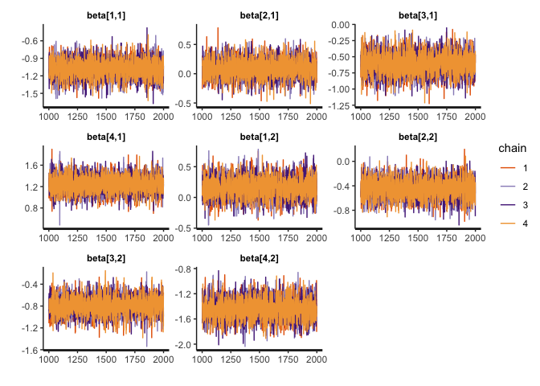
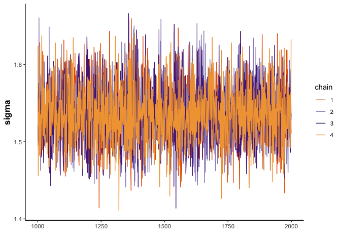
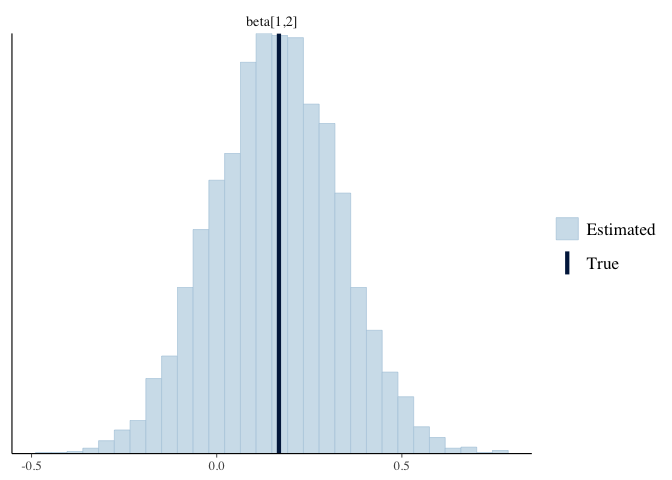

Bayesian Synthetic Control Method with a Hierarchical Weights
================
Morgan Bale
2/11/2022

The purpose of this file is to build off of `02_bscm-intercept`, by
adding a hierarchy to the Betas. NO HORESHOE PRIOR AS OF 2/11/22

    ## ── Attaching packages ─────────────────────────────────────── tidyverse 1.3.1 ──

    ## ✓ ggplot2 3.3.5     ✓ purrr   0.3.4
    ## ✓ tibble  3.1.4     ✓ dplyr   1.0.7
    ## ✓ tidyr   1.1.3     ✓ stringr 1.4.0
    ## ✓ readr   2.0.1     ✓ forcats 0.5.1

    ## ── Conflicts ────────────────────────────────────────── tidyverse_conflicts() ──
    ## x dplyr::filter() masks stats::filter()
    ## x dplyr::lag()    masks stats::lag()

    ## Loading required package: StanHeaders

    ## rstan (Version 2.21.2, GitRev: 2e1f913d3ca3)

    ## For execution on a local, multicore CPU with excess RAM we recommend calling
    ## options(mc.cores = parallel::detectCores()).
    ## To avoid recompilation of unchanged Stan programs, we recommend calling
    ## rstan_options(auto_write = TRUE)

    ## 
    ## Attaching package: 'rstan'

    ## The following object is masked from 'package:tidyr':
    ## 
    ##     extract

    ## This is bayesplot version 1.8.1

    ## - Online documentation and vignettes at mc-stan.org/bayesplot

    ## - bayesplot theme set to bayesplot::theme_default()

    ##    * Does _not_ affect other ggplot2 plots

    ##    * See ?bayesplot_theme_set for details on theme setting

##### DATA

Make synthetic data: values picked from simulation studies done in Gupta
et al.

``` r
N_train=N_test=80
p=5
K=3
mu=c(15, 35, 10, 20, 30) #must be same length as p

#X_train, X_test, Z and stan will make the rest
X_train <- matrix(NA, nrow = N_train, ncol = p)       #control unit matrix in pre treatment
  
X_test <- matrix(NA, nrow=N_test, ncol=p)            #control unit matrix in post treatment 
  
for(pp in 1:p) {
  X_train[,pp] <- rnorm(N_train, mean=mu[pp], sd=10)     
  X_test[,pp] <- rnorm(N_test, mean=mu[pp], sd=10)
}
  
  
Z <- matrix(rnorm(K*p), nrow=K, ncol=p)

#put in list for stan
sim_values <- list(N_train=N_train, N_test=N_test, p=p, K=K, X_train=X_train, X_test=X_test, Z=Z)
```

Generate data in stan

``` r
sim_data <- stan(
  file = here::here("Code", "Model", "gen_hierarchy_data.stan"),
  data = sim_values,
  iter = 1,
  chains = 1,
  seed = 2020,
  algorithm = "Fixed_param"
)
```

    ## 
    ## SAMPLING FOR MODEL 'gen_hierarchy_data' NOW (CHAIN 1).
    ## Chain 1: Iteration: 1 / 1 [100%]  (Sampling)
    ## Chain 1: 
    ## Chain 1:  Elapsed Time: 0 seconds (Warm-up)
    ## Chain 1:                3.8e-05 seconds (Sampling)
    ## Chain 1:                3.8e-05 seconds (Total)
    ## Chain 1:

``` r
#extract values
sim_beta <- extract(sim_data)$beta
sim_theta <- extract(sim_data)$theta
sim_ytrain <- extract(sim_data)$y_train
sim_beta0 <- extract(sim_data)$beta_0
sim_sigma <- extract(sim_data)$sigma
sim_epsilon <- extract(sim_data)$epsilon

#put data in list for stan model 
b1_data <- list(N_train=N_train, N_test=N_test, p=p, K=K, X_train=X_train, X_test=X_test, Z=Z, beta=sim_beta, theta=sim_theta, y_train=as.vector(sim_ytrain), beta_0=sim_beta0, sigma=sim_sigma, epsilon=sim_epsilon)
```

###### MODEL: CENTERED PARAMETERIZATION

Run model using `bcsm_hierarchy.stan`. This model tries to recreate the
model according to the syntax in the paper and the commented out code in
the web appendix, we add a new hierarchical prior for Beta. No divergent
transitions when horsehoe prior is not present.

``` r
b1_model <- stan_model(file = here::here("Code", "Model", "bscm_hierarchy.stan"))
#print(b1_model)

draws <- sampling(b1_model, data=b1_data, seed=2020, cores=3)
```

###### RESULTS: CENTERED PARAMETERIZATION

Check results: the traceplots look good, the sampler recovers the beta
and theta parameters. The synthetic control matches the treatment group
in the pre period.

``` r
#traceplots
traceplot(draws, pars="beta")
```

<!-- -->

``` r
traceplot(draws, pars="beta_0")
```

<!-- -->

``` r
traceplot(draws, pars="sigma")
```

<!-- -->

``` r
traceplot(draws, pars="theta")
```

<!-- -->

``` r
traceplot(draws, pars="epsilon")
```

<!-- -->

``` r
mcmc_recover_hist(As.mcmc.list(draws, pars="beta"), true=as.vector(t(b1_data$beta)))
```

    ## `stat_bin()` using `bins = 30`. Pick better value with `binwidth`.

<!-- -->

``` r
mcmc_recover_hist(As.mcmc.list(draws, pars="beta_0"), true=as.vector(t(b1_data$beta_0)))
```

    ## `stat_bin()` using `bins = 30`. Pick better value with `binwidth`.

<!-- -->

``` r
mcmc_recover_hist(As.mcmc.list(draws, pars="theta"), true=as.vector(t(b1_data$theta)))
```

    ## `stat_bin()` using `bins = 30`. Pick better value with `binwidth`.

<!-- -->

Fitted Synthetic Control for pre treatment

``` r
#synthetic control for pre treatment
y_fit <- summary(draws, pars="y_fit")

sc_pre <- tibble(y_fit[[1]][,1])

lower <- y_fit[[1]][,4]
upper <- y_fit[[1]][,8]

sc_pre <- sc_pre %>% bind_cols(lower, upper)
```

    ## New names:
    ## * NA -> ...2
    ## * NA -> ...3

``` r
sc_pre <- sc_pre %>% mutate(week=rep(1:b1_data$N_train))

names(sc_pre) <- c("synthetic_control","lower", "upper", "week")

#sc_pre %>% ggplot(aes(x=week, y=synthetic_control))+ geom_ribbon(aes(ymin=lower, ymax=upper), fill="gray80") + geom_line() + ggtitle("Synthetic Control in the Pre Treatment") + labs(x="Week", y="Control Observations") 
```

Treated unit in the pre treatment

``` r
y_train <- b1_data$y_train

sc_data <- sc_pre %>% bind_cols(y_train)
```

    ## New names:
    ## * NA -> ...5

``` r
names(sc_data)[5] <- "treatment_group"

#sc_data %>% ggplot(aes(x=week))+ geom_ribbon(aes(ymin=lower, ymax=upper), fill="gray80") + geom_line(aes(y=treatment_group), color="darkred") + geom_line(aes(y=synthetic_control), color="steelblue") + 
  #labs(x="Week", y="Pre Treatment Value") + ggtitle("Pre Treatment Synthetic Control (blue) vs Treatment Group (red)") 
```

Predicted Synthetic Control for post treatment

``` r
y_test <- summary(draws, pars="y_test")

sc_post <- tibble(y_test[[1]][,1])

lower <- y_test[[1]][,4]
upper <- y_test[[1]][,8]

sc_post <- sc_post %>% bind_cols(lower, upper)
```

    ## New names:
    ## * NA -> ...2
    ## * NA -> ...3

``` r
sc_post <- sc_post %>% mutate(week=rep((b1_data$N_train+1):(b1_data$N_train+b1_data$N_test)))

names(sc_post) <- c("synthetic_control", "lower", "upper", "week")

#sc_post %>% ggplot(aes(x=week, y=synthetic_control)) + geom_ribbon(aes(ymin=lower, ymax=upper), fill="gray80") + geom_line() + ggtitle("Synthetic Control in the Post Treatment") + labs(x="Week", y="Control Value")
#gray is 95% CI 
```

Make treatment data for post period: this code only works if number of
post treatment periods=number pre treatment periods

``` r
y_post <- y_train + 800
y_post <- y_post[1:b1_data$N_test]

y_post <- as_tibble(y_post) %>% mutate(week=rep((b1_data$N_train+1):(b1_data$N_train+b1_data$N_test)))

sc_post <- sc_post %>% left_join(y_post, by="week")

names(sc_post)[5] <- "treatment_group"

total_sc_data <- sc_data %>% bind_rows(sc_post)

total_sc_data %>% ggplot(aes(x=week)) + geom_ribbon(aes(ymin=lower, ymax=upper), fill="gray80") + geom_line(aes(y=treatment_group), color="darkred") + geom_line(aes(y=synthetic_control), color="steelblue") +
  labs(x="Week", y="Value") + ggtitle("Synthetic Control (blue) vs Treatment Group (red)") + geom_vline(xintercept=b1_data$N_train) 
```

<!-- -->
