Synthetic Control Model Testing
================
Morgan and Cameron Bale
4/29/2022

The purpose of this file is to test how including the treatment effect
(alpha) influences the model

##### DATA

Make synthetic data

``` r
TT=105
C=20                   #num control stores --> assuming all treated stores use same control store pool 
K=3                   #num of store covariates in alpha equation 
N=15                   #num of treated stores 
I=53       #week of intervention for each treated store

#X is the sales for the control stores in all time periods
X <- matrix(rnorm(TT*C), nrow = C, ncol = TT)  

D <- matrix(NA, nrow=N, ncol=TT)
for(n in 1:N) {
  zero <- rep(0, times=I)
  one <- rep(1, times=(TT-I))
  D[n,] <- c(zero, one)
}
  
Z <- matrix(rbinom(K*N, 1, .3), nrow=K, ncol=N)

#put in list for stan
sim_values <- list(TT=TT, C=C, N=N, K=K, X=X, D=D, Z=Z)
```

Generate data in stan: the first stan model printed here is to generate
synthetic data using stan to test our actual model

    ## hash mismatch so recompiling; make sure Stan code ends with a blank line

    ## S4 class stanmodel 'gen_hierarchy_data_test' coded as follows:
    ## //
    ## // This file creates synthetic data to use with bscm_hierarchy_testing model
    ## // Morgan Bale
    ## // May 2022
    ## 
    ## // Data
    ## data{
    ##   int TT; //Number of total time periods
    ##   int C; //Number of control stores
    ##   int N; //number of treated stores 
    ##   int K; //number of treated store covariates
    ##   matrix[N, TT] D; //treatment indicator for every time period for every treated store 
    ##   matrix[C, TT] X; //Control unit store observations in every time period
    ##   matrix[K, N] Z;  //treated store covariates 
    ## }
    ## 
    ## //gen simluated data
    ## generated quantities {
    ##   vector[N] alpha;          //treatment effect for each treated store
    ##   vector[K] theta;         //effect of store level covariates
    ##   vector[N] theta_0;            //intercept for alpha equation 
    ##   matrix[N,C] beta;          //vector of weights for control stores for each treated store
    ##   matrix[N, TT] Y;            //Treated unit sales in every time period
    ##   real beta_0;              //intercept 
    ##   real<lower=0> nu;     //variance of the beta equation
    ##   real<lower=0> sigma;     //variance of the likelihood equation
    ##   
    ##   for (k in 1:K) {
    ##     //theta[k] = normal_rng(0, 3);
    ##     theta[k] =0;
    ##   }
    ##   //theta_0=normal_rng(0, 3);
    ##   sigma=inv_gamma_rng(2,1); 
    ##   nu = inv_gamma_rng(2,1);
    ##   beta_0 = cauchy_rng(0, 3);
    ##   for(n in 1:N) {
    ##     theta_0[n] = normal_rng(0, 3);
    ##     alpha[n]=normal_rng(theta_0[n] + theta'*Z[,n], nu);
    ##     for(c in 1:C) {
    ##       beta[n,c]=normal_rng(0,1);
    ##     }
    ##   }
    ##   for (n in 1:N) {
    ##     for(t in 1:TT) {
    ##     Y[n,t] = normal_rng(beta_0 + beta[n,]*X[,t] + alpha[n]*D[n,t], sigma); //create treated unit in all time periods
    ##     }}
    ## }
    ## 
    ## 
    ## 

    ## 
    ## SAMPLING FOR MODEL 'gen_hierarchy_data_test' NOW (CHAIN 1).
    ## Chain 1: Iteration: 1 / 1 [100%]  (Sampling)
    ## Chain 1: 
    ## Chain 1:  Elapsed Time: 0 seconds (Warm-up)
    ## Chain 1:                0.000564 seconds (Sampling)
    ## Chain 1:                0.000564 seconds (Total)
    ## Chain 1:

##### MODEL

This model uses a synthetic control combined with heterogeneous
treatment effects to estimate sales for treated stores. The model is
restricted to meet the synthetic control requirements in the pre period,
so that the difference between the synthetic control and actual sales in
the post period can be attributed to alpha, our treatment effect. alpha
is described by store/category characteristics making theta our effect
of those characteristics on the average treatment effect alpha. Note:
alpha is an average treatment effect across all post period weeks. Each
treated store gets its own weights determined from the same sample of
control stores. In this example, we have 15 treated stores and 20
control stores. So each treated store gets its own synthetic control
from the 20 control stores. This form of the model would allow us to
still use horseshoe priors on beta, but those are not implemented here
yet (horeshoe prior worked for simulation but not real data)

    ## S4 class stanmodel 'bscm_hierarchy_testing' coded as follows:
    ## //
    ## // This model is adapted from Gupta's paper
    ## // Morgan Bale
    ## // May 2022
    ## 
    ## // Data
    ## data{
    ##   int TT; //Number of total time periods
    ##   int C; //Number of control stores
    ##   int N; //number of treated stores 
    ##   int K; //number of treated store covariates
    ##   matrix[N,TT] D; //treatment indicator for every time period for every treated store 
    ##   matrix[C, TT] X; //Control unit store observations in every time period
    ##   matrix[K, N] Z;  //treated store covariates 
    ##   matrix[N, TT] Y; //Treated unit sales in every time period
    ## }
    ## 
    ## // The parameters accepted by the model. 
    ## parameters{
    ##   //real<lower=0> sigma2;      //variance for likelihood and beta prior
    ##   real<lower=0> sigma;   //variance for likelihood
    ##   real<lower=0> nu;        //variance for alpha equation
    ##   //real<lower=0> tau;      //globl shrinkage 
    ##   //vector<lower=0>[C] lambda;  //local shrinkage 
    ##   vector[N] alpha;     //treatment effect 
    ##   vector[K] theta;      //hierarchical effect
    ##   vector[N] theta_0;      //intercept for higher level alpha equation
    ##   matrix[N,C] beta;          //vector of weights for control stores for each treated store
    ##   real beta_0;        //intercept for Y equation
    ## }
    ## 
    ## //transformed parameters {
    ##   //real<lower=0> sigma;  //error term sd 
    ##   //vector<lower=0>[C] lambda2;  //lambda^2 
    ##   //sigma=sqrt(sigma2); 
    ##   //lambda2=lambda .* lambda; 
    ## //}
    ## 
    ## // The model to be estimated. 
    ## model{
    ##   //Pre-treatment estimation
    ##   nu ~ inv_gamma(3,1);
    ##   sigma ~ inv_gamma(3,1); 
    ##   theta ~ normal(0, 3); 
    ##   beta_0 ~ cauchy(0,3);
    ##   //lambda ~ cauchy(0, tau); //horseshoe prior stuff 
    ##   //tau ~ cauchy(0, sigma); 
    ##   //sigma ~ cauchy(0, 3); 
    ##   theta_0 ~ normal(0,2);
    ##   for (n in 1:N) {
    ##     beta[n,] ~ normal(0, 1);
    ##     alpha[n] ~ normal(theta_0[n] + theta'*Z[,n], nu);
    ##     for(t in 1:TT) {
    ##     Y[n,t] ~ normal(beta_0 + beta[n,]*X[,t] + alpha[n]*D[n,t], sigma); //likelihood
    ##     }}
    ## }
    ## 
    ## generated quantities {
    ##   matrix[N,TT] Y_hat; //predicted values
    ##   for (n in 1:N) {
    ##     for(t in 1:TT) {
    ##     Y_hat[n,t] = normal_rng(beta_0 +  beta[n,]*X[,t] + alpha[n]*D[n,t], sigma); //create treated unit in all time periods
    ##     }}
    ## }
    ## 
    ## // generated quantities{
    ## //   //Post-treatment prediction & Log-likelihood
    ## //   vector[N_train] y_fit; //Fitted synthetic control unit in the pre-treatment
    ## //   vector[N_test] y_test; //Predicted synthetic control unit in the post-treatment
    ## //   vector[N_train] log_lik; //Log-likelihood
    ## //   vector[N_test] alpha;
    ## //   y_fit = beta_0 + X_train * beta;
    ## // 
    ## //   for(i in 1:N_test){
    ## //   y_test[i] = normal_rng(beta_0 + X_test[i,] * beta, sigma); //create predicted SC in post treatment period 
    ## //     }
    ## // 
    ## //   for (t in 1:N_train) {
    ## //   log_lik[t] = normal_lpdf(y_train[t] | y_fit[t], sigma); //how well does the SC match actual data pre treatment 
    ## //     }
    ## //     
    ## //   //find treatment effect: alpha for each post period unit (weeks)
    ## //   for (i in 1:N_test) {
    ## //     alpha[i] = y_post[i] - y_test[i]; 
    ## //   }
    ## //   
    ## // }

    ## Warning: There were 290 divergent transitions after warmup. See
    ## http://mc-stan.org/misc/warnings.html#divergent-transitions-after-warmup
    ## to find out why this is a problem and how to eliminate them.

    ## Warning: Examine the pairs() plot to diagnose sampling problems

    ## Warning: The largest R-hat is 1.08, indicating chains have not mixed.
    ## Running the chains for more iterations may help. See
    ## http://mc-stan.org/misc/warnings.html#r-hat

    ## Warning: Bulk Effective Samples Size (ESS) is too low, indicating posterior means and medians may be unreliable.
    ## Running the chains for more iterations may help. See
    ## http://mc-stan.org/misc/warnings.html#bulk-ess

    ## Warning: Tail Effective Samples Size (ESS) is too low, indicating posterior variances and tail quantiles may be unreliable.
    ## Running the chains for more iterations may help. See
    ## http://mc-stan.org/misc/warnings.html#tail-ess

###### RESULTS

Check results: the traceplots look good, the sampler recovers the beta
and theta parameters. The synthetic control matches the treatment group
in the pre period.
<!-- -->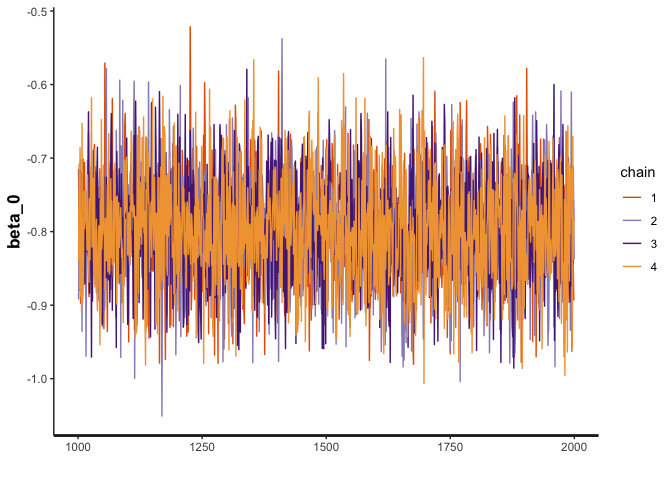<!-- --><!-- --><!-- --><!-- --><!-- -->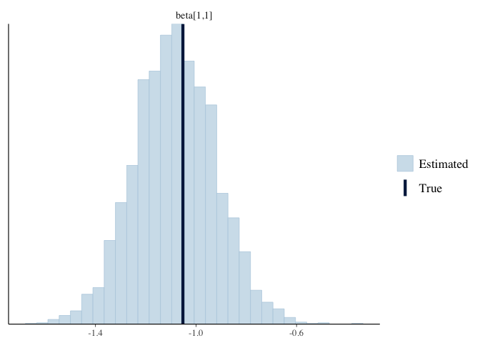<!-- --><!-- -->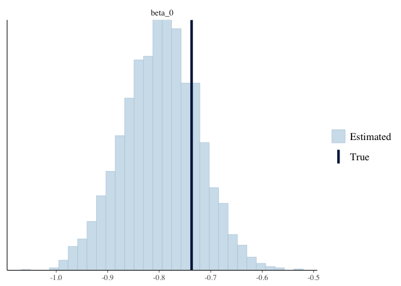<!-- -->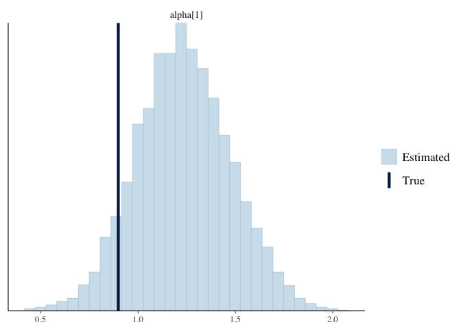<!-- -->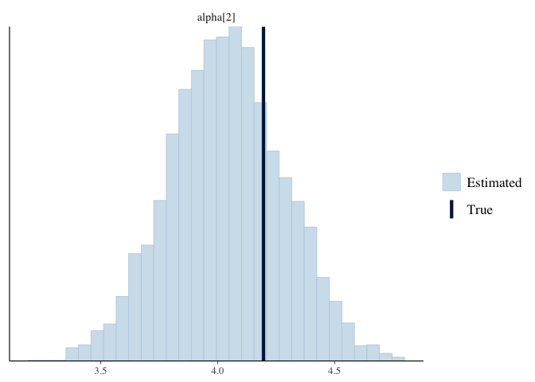<!-- -->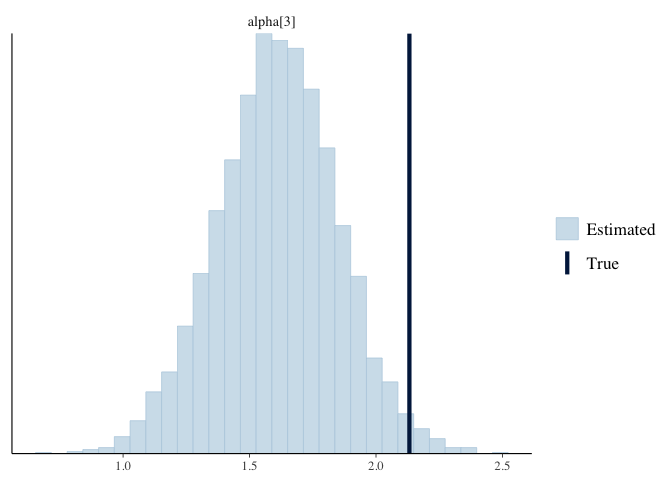<!-- -->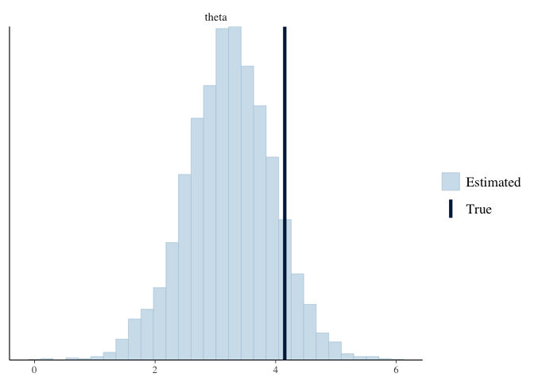<!-- --><!-- -->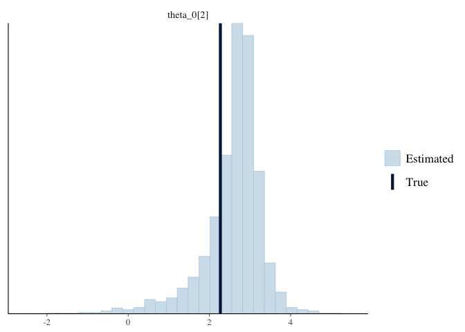<!-- --><!-- -->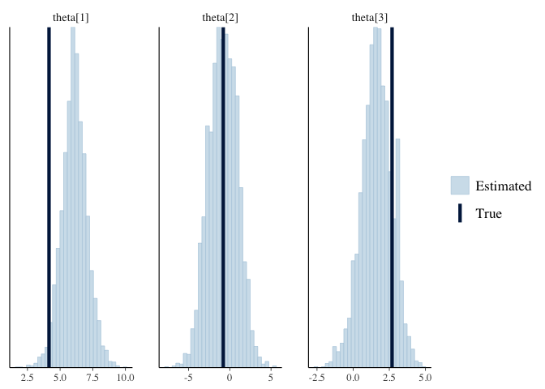<!-- -->

Predicted Y (yhat) v Y: yhat is created in the generated quantities
section of `bscm_hierarchy_testing.stan`  
<!-- --><!-- -->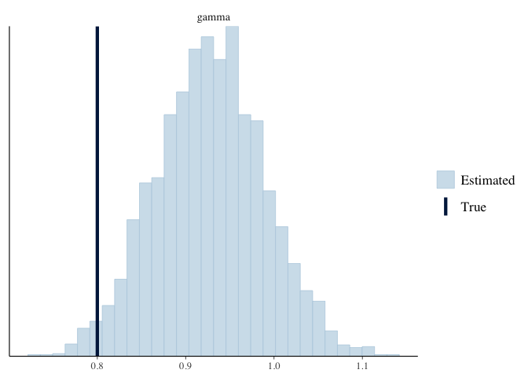<!-- -->

Synthetic control v Y: compare the synthetic control for selected
treated stores to the actual sales (Y) for those treated stores
<!-- --><!-- --><!-- -->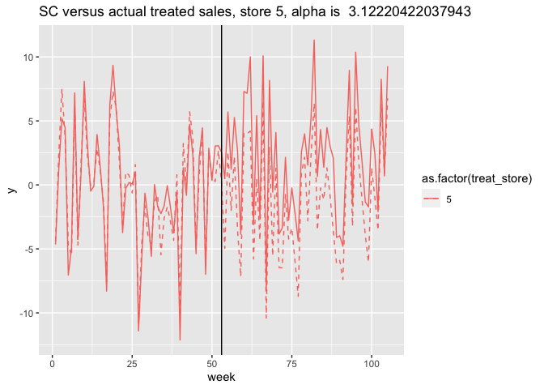<!-- --><!-- -->

Compare true alphas to estimated alphas:

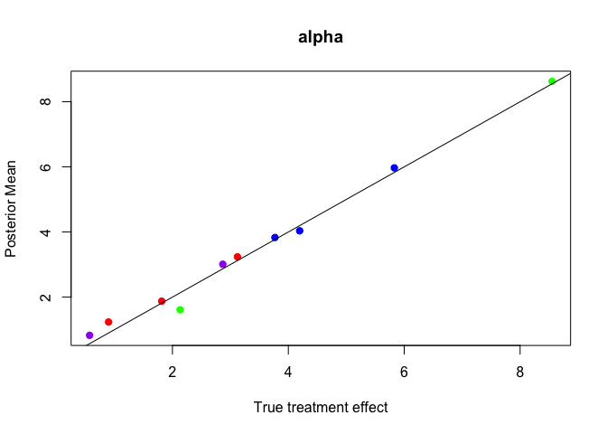<!-- --> Test selected:

Compare estimated average values for alpha to the true alpha in treated
store 1

``` r
sc_data <- sc_data %>% mutate(alpha=y-sc)

#this is the treatment effect (alpha) in store 1 in the PRE PERIOD. we expect this to be 0, anything above 0 is noise? 
store1_pre <- sc_data %>% filter(treat_store==1, week<(I[1]+1)) 
mean(store1_pre$alpha)
```

    ## [1] 0.08721678

``` r
#this is the treatment effect (alpha) in store 1 in the POST period. we expect this to be equal to the true alpha 
store1_post <- sc_data %>% filter(treat_store==1, week>I[1]) 
mean(store1_post$alpha)
```

    ## [1] -0.5437877

``` r
#compare to true alpha for store 1
sim_alpha[1]
```

    ## [1] -0.4449484

Compare estimated average values for alpha to the true alpha in treated
store 5

``` r
#this is the treatment effect (alpha) in store 5 in the PRE PERIOD. we expect this to be 0, anything above 0 is noise? 
store5_pre <- sc_data %>% filter(treat_store==5, week<(I[1]+1)) 
mean(store5_pre$alpha)
```

    ## [1] 0.001720653

``` r
#this is the treatment effect (alpha) in store 5 in the POST period. we expect this to be equal to the true alpha
store5_post <- sc_data %>% filter(treat_store==5, week>I[1]) 
mean(store5_post$alpha)
```

    ## [1] 0.3321947

``` r
#compare to true alpha for store 5
sim_alpha[5]
```

    ## [1] 0.4261901
