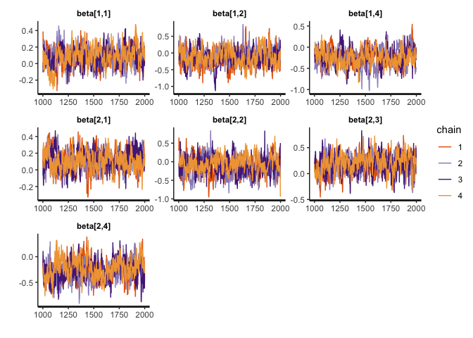
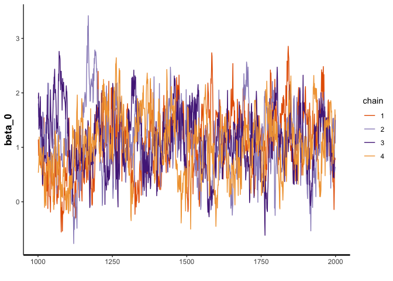
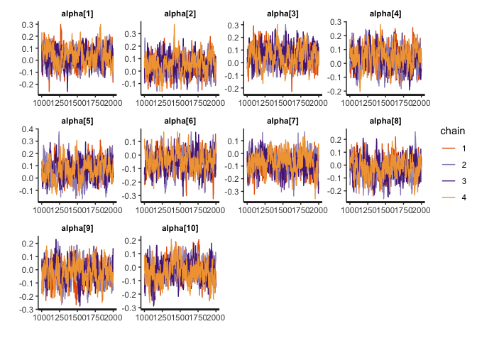
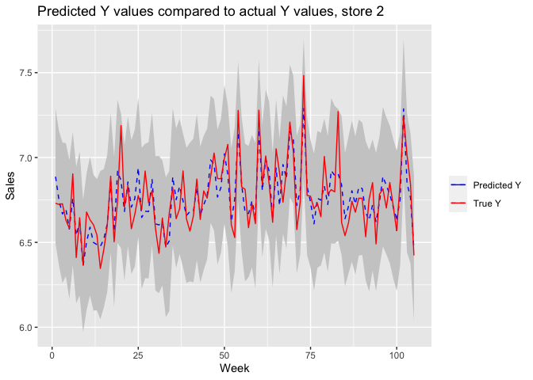
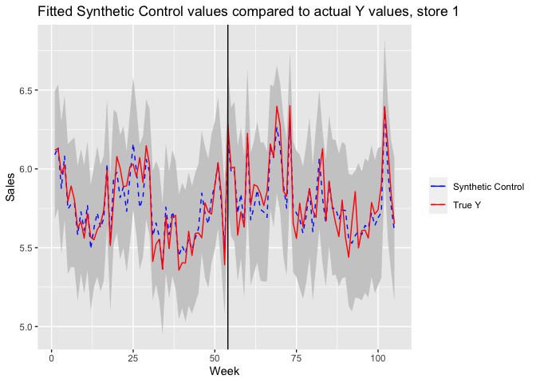
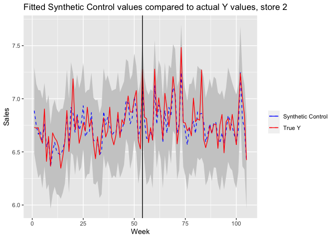

Synthetic Control Model Testing with Cereal
================
Morgan Bale
5/13/2022

The purpose of this file is to test how our hierarchical model works
with real data. The data was cleaned using the cereal cleaning file. We
use MN to test the model, since we are mostly sure which retailer was
treated in MN. The data comes from our Google Drive folder “cleaned data
sets” and the model description can be found in
`05_bscm-hierarchy-testing.Rmd`.

####### MINNESOTA

##### DATA

Target reset date: Jan 1st 2012, Data years: 2011-2012, CC: General
Mills, Validator: Kellogg, State: MN, Treated Retailer: 221

Load and clean data: there are 57 control stores and 43 treated stores.

``` r
load("../Data/mn_cereal_clean.RData")
#select columns we want
mn_cereal <- mn_cereal %>% dplyr::select(store_code_uc, upc, week_end, units, price, year, upc_ver_uc, parent_code, retailer_code, sales, manufacturer)
```

Create higher level store characteristics

``` r
#standardized number of UPCs --> num_UPC/max(num_UPC)
num_upc <- mn_cereal %>% dplyr::select(store_code_uc, upc) %>% distinct() %>% group_by(store_code_uc) %>% summarise(n=n()) %>% mutate(num_upcs=n/max(n)) #some variation, not a ton...

mn_cereal <- mn_cereal %>% left_join(num_upc, by="store_code_uc")

#variation in prices --> max(price) - min(price) for each store 
price_variation <- mn_cereal %>% dplyr::select(store_code_uc, price) %>% distinct() %>% group_by(store_code_uc) %>% summarise(max_price=max(price), min_price=min(price)) %>% mutate(price_diff=max_price-min_price)

mn_cereal <- mn_cereal %>% left_join(price_variation, by="store_code_uc")
```

There are 53 weeks in 2011 and 52 weeks in 2012. CC is implemented
around Jan 1st, 2012. We will use 2012-01-07 as the first post treatment
period. Find distinct weeks and order by date. Make treatment and post
variable.

``` r
weeks <- mn_cereal %>% dplyr::select(week_end) %>% distinct()

weeks <- weeks[order(as.Date(weeks$week_end, format="%d/%m/%Y")),]

weeks <- weeks %>% mutate(week_num=rep(1:nrow(weeks)))

mn_cereal <- mn_cereal %>% left_join(weeks, by="week_end")

mn_cereal <- mn_cereal %>% mutate(treat=if_else(retailer_code==221, 1, 0))

#separate data out by CC, validator, PL, other and treated versus control 
cc_treat <- mn_cereal %>% filter(manufacturer=="GM", treat==1)
cc_control <- mn_cereal %>% filter(manufacturer=="GM", treat==0)

pl_treat <- mn_cereal %>% filter(manufacturer=="PL", treat==1)
pl_control <- mn_cereal %>% filter(manufacturer=="PL", treat==0)

#aggregate sales to store level instead of UPC level 
pl_control_sales <- pl_control %>% group_by(store_code_uc, week_num) %>% summarise(total_sales=sum(sales)) #5985 obs, 105 weeks for each of 57 stores
```

    ## `summarise()` has grouped output by 'store_code_uc'. You can override using the `.groups` argument.

``` r
#add store numbers
treat_stores <- unique(pl_treat$store_code_uc)
pl_treat <- pl_treat %>% mutate(store_num=0)
k=1
for(i in treat_stores) {
  pl_treat <- pl_treat %>% mutate(store_num=if_else(store_code_uc==i, k, store_num))
  k=k+1
}

#aggregate sales to store level instead of UPC level 
pl_treat_sales <- pl_treat %>% group_by(store_num, week_num) %>% summarise(total_sales=sum(sales)) #4515 obs, 105 weeks for each of 43 stores
```

    ## `summarise()` has grouped output by 'store_num'. You can override using the `.groups` argument.

``` r
#try sample of treated stores so it will run faster 
pl_treat_sales <- pl_treat_sales %>% filter(store_num %in% c(1:10))
```

Collect data & test with PL first

``` r
TT <- nrow(weeks)  #num of time periods in total 
C <- length(unique(pl_control_sales$store_code_uc))  #num of control stores
N <- length(unique(pl_treat_sales$store_num))  #num of treated stores

#X is a TTxC matrix of control store sales 
X <- matrix(NA, nrow=C, ncol=TT)
control_stores <- unique(pl_control_sales$store_code_uc)
k=1
for(c in control_stores) {
    X[k,] <- pl_control_sales %>% filter(store_code_uc==c) %>% pull(total_sales)
    k=k+1
}

#try log sales
X=log(X)

#create Y NxTT matrix
Y <- matrix(NA, nrow=N, ncol=TT)
for(n in 1:N) {
  Y[n,] <- pl_treat_sales %>% filter(store_num==n) %>% pull(total_sales)
}

#try log sales
Y=log(Y)

#create Z KxN matrix 
tZ <- pl_treat %>% filter(store_num %in% c(1:10)) %>% dplyr::select(store_num, price_diff, num_upcs) %>% distinct() %>% dplyr::select(price_diff, num_upcs) %>% as.matrix()
Z <- t(tZ)
Z <- Z %>% rbind(rep(1, N))
K <- nrow(Z)

#just intercept model
Z <- t(as.matrix(Z[3,]))
K <- 1

#create D a NxTT matrix for which time periods a treated store is treated in
#week 54 starts post period 
D_prep <- pl_treat_sales %>% mutate(post=if_else(week_num %in% c(1:53), 0, 1)) %>% dplyr::select(store_num, post)
D <- matrix(NA, nrow=N, ncol=TT)
for(n in 1:N) {
  D[n,] <- D_prep %>% filter(store_num==n) %>% pull(post)
}

b1_data <- list(TT=TT, C=C, N=N, X=X, K=K, Z=Z, D=D, Y=Y) #data list for stan
```

##### MODEL

This model uses a synthetic control combined with heterogeneous
treatment effects to estimate sales for treated stores. The model is
restricted to meet the synthetic control requirements in the pre period,
so that the difference between the synthetic control and actual sales in
the post period can be attributed to alpha, our treatment effect. alpha
is described by store/category characteristics making theta our effect
of those characteristics on the average treatment effect alpha. Note:
alpha is an average treatment effect across all post period weeks. Each
treated store gets its own weights determined from the same sample of
control stores. In this example, we have 43 treated stores and 57
control stores. So each treated store gets its own synthetic control
from the 57 control stores. This form of the model would allow us to
still use horseshoe priors on beta, but those are not implemented here
yet.

    ## S4 class stanmodel 'bscm_hierarchy_testing' coded as follows:
    ## //
    ## // This model is adapted from Gupta's paper
    ## // Morgan Bale
    ## // May 2022
    ## 
    ## // Data
    ## data{
    ##   int TT; //Number of total time periods
    ##   int C; //Number of control stores
    ##   int N; //number of treated stores 
    ##   int K; //number of treated store covariates plus a column of ones for intercept
    ##   matrix[N,TT] D; //treatment indicator for every time period for every treated store 
    ##   matrix[C, TT] X; //Control unit store observations in every time period
    ##   matrix[K, N] Z;  //treated store covariates 
    ##   matrix[N, TT] Y; //Treated unit sales in every time period
    ## }
    ## 
    ## // The parameters accepted by the model. 
    ## parameters{
    ##   //real<lower=0> sigma2;      //variance for likelihood and beta prior
    ##   real<lower=0> sigma;   //variance for likelihood
    ##   real<lower=0> nu;        //variance for alpha equation
    ##   //real<lower=0> tau;      //globl shrinkage 
    ##   //vector<lower=0>[C] lambda;  //local shrinkage 
    ##   vector[N] alpha;     //treatment effect 
    ##   vector[K] theta;      //hierarchical effect
    ##   matrix[N,C] beta;          //vector of weights for control stores for each treated store
    ##   real beta_0;        //intercept for Y equation
    ## }
    ## 
    ## //transformed parameters {
    ##   //real<lower=0> sigma;  //error term sd 
    ##   //vector<lower=0>[C] lambda2;  //lambda^2 
    ##   //sigma=sqrt(sigma2); 
    ##   //lambda2=lambda .* lambda; 
    ## //}
    ## 
    ## // The model to be estimated. 
    ## model{
    ##   //Pre-treatment estimation
    ##   nu ~ inv_gamma(3,1);
    ##   sigma ~ inv_gamma(3,1); 
    ##   theta ~ normal(0, 3); 
    ##   beta_0 ~ cauchy(0,3);
    ##   //lambda ~ cauchy(0, tau); //horseshoe prior stuff 
    ##   //tau ~ cauchy(0, sigma); 
    ##   //sigma ~ cauchy(0, 3); 
    ##   for (n in 1:N) {
    ##     beta[n,] ~ normal(0, 1);
    ##     alpha[n] ~ normal(theta'*Z[,n], nu);
    ##     for(t in 1:TT) {
    ##     Y[n,t] ~ normal(beta_0 + beta[n,]*X[,t] + alpha[n]*D[n,t], sigma); //likelihood
    ##     }}
    ## }
    ## 
    ## generated quantities {
    ##   matrix[N,TT] Y_hat; //predicted values
    ##   matrix[N,TT] Y_fit; //predicted synthetic control
    ##   for (n in 1:N) {
    ##     for(t in 1:TT) {
    ##       Y_fit[n,t] = normal_rng(beta_0 + beta[n,]*X[,t], sigma); //synthetic control in all time periods
    ##       Y_hat[n,t] = normal_rng(beta_0 +  beta[n,]*X[,t] + alpha[n]*D[n,t], sigma); //create treated unit in all time periods
    ##     }}
    ## }
    ## 
    ## // generated quantities{
    ## //   //Post-treatment prediction & Log-likelihood
    ## //   vector[N_train] y_fit; //Fitted synthetic control unit in the pre-treatment
    ## //   vector[N_test] y_test; //Predicted synthetic control unit in the post-treatment
    ## //   vector[N_train] log_lik; //Log-likelihood
    ## //   vector[N_test] alpha;
    ## //   y_fit = beta_0 + X_train * beta;
    ## // 
    ## //   for(i in 1:N_test){
    ## //   y_test[i] = normal_rng(beta_0 + X_test[i,] * beta, sigma); //create predicted SC in post treatment period 
    ## //     }
    ## // 
    ## //   for (t in 1:N_train) {
    ## //   log_lik[t] = normal_lpdf(y_train[t] | y_fit[t], sigma); //how well does the SC match actual data pre treatment 
    ## //     }
    ## //     
    ## //   //find treatment effect: alpha for each post period unit (weeks)
    ## //   for (i in 1:N_test) {
    ## //     alpha[i] = y_post[i] - y_test[i]; 
    ## //   }
    ## //   
    ## // }

    ## Warning: There were 4000 transitions after warmup that exceeded the maximum treedepth. Increase max_treedepth above 10. See
    ## http://mc-stan.org/misc/warnings.html#maximum-treedepth-exceeded

    ## Warning: Examine the pairs() plot to diagnose sampling problems

    ## Warning: The largest R-hat is 1.08, indicating chains have not mixed.
    ## Running the chains for more iterations may help. See
    ## http://mc-stan.org/misc/warnings.html#r-hat

    ## Warning: Bulk Effective Samples Size (ESS) is too low, indicating posterior means and medians may be unreliable.
    ## Running the chains for more iterations may help. See
    ## http://mc-stan.org/misc/warnings.html#bulk-ess

    ## Warning: Tail Effective Samples Size (ESS) is too low, indicating posterior variances and tail quantiles may be unreliable.
    ## Running the chains for more iterations may help. See
    ## http://mc-stan.org/misc/warnings.html#tail-ess

###### RESULTS

Check results: theta is completely informed by the prior, we can see
based on the symmetric distribution. Also, when I turned off theta’s
prior, the traceplots did not converge.

theta1: price_diff = max(upc_price)-min(upc_price) theta2: num_upcs =
upc_count/max(upc_count) theta3: intercept (or if there is only one
theta it is the intercept)
<!-- --><!-- --><!-- --><!-- --><!-- --><!-- -->

    ## Inference for Stan model: bscm_hierarchy_testing.
    ## 4 chains, each with iter=2000; warmup=1000; thin=1; 
    ## post-warmup draws per chain=1000, total post-warmup draws=4000.
    ## 
    ##            mean se_mean   sd  2.5%   25%   50%   75% 97.5% n_eff Rhat
    ## alpha[1]   0.03    0.01 0.07 -0.12 -0.02  0.03  0.08  0.17   203 1.01
    ## alpha[2]   0.04    0.00 0.07 -0.09 -0.01  0.04  0.09  0.19   243 1.01
    ## alpha[3]   0.06    0.00 0.07 -0.09  0.01  0.06  0.11  0.20   215 1.02
    ## alpha[4]   0.04    0.01 0.07 -0.11 -0.01  0.04  0.09  0.19   223 1.02
    ## alpha[5]   0.07    0.01 0.08 -0.08  0.01  0.06  0.12  0.23   205 1.01
    ## alpha[6]  -0.05    0.00 0.07 -0.19 -0.10 -0.05  0.00  0.09   279 1.01
    ## alpha[7]  -0.08    0.00 0.07 -0.22 -0.12 -0.07 -0.03  0.06   246 1.01
    ## alpha[8]  -0.02    0.01 0.07 -0.18 -0.07 -0.02  0.03  0.12   217 1.02
    ## alpha[9]  -0.02    0.01 0.08 -0.18 -0.08 -0.02  0.03  0.13   172 1.02
    ## alpha[10] -0.03    0.01 0.07 -0.17 -0.08 -0.03  0.02  0.12   199 1.01
    ## theta[1]   0.00    0.00 0.06 -0.11 -0.03  0.00  0.04  0.12   171 1.03
    ## 
    ## Samples were drawn using NUTS(diag_e) at Mon Jun  6 11:14:36 2022.
    ## For each parameter, n_eff is a crude measure of effective sample size,
    ## and Rhat is the potential scale reduction factor on split chains (at 
    ## convergence, Rhat=1).

Synthetic control v Y: compare the synthetic control for selected
treated stores to the actual sales (Y) for those treated stores –> here
SC= beta_0 + beta\*X
<!-- --><!-- --><!-- --><!-- --><!-- -->

Check how well Y_hat matches actual y values

``` r
Y_hat <- summary(draws, pars="Y_hat")
yhat <- tibble(Y_hat[[1]][,1])

lower <- Y_hat[[1]][,4]
upper <- Y_hat[[1]][,8]

yhat <- yhat %>% bind_cols(lower, upper)
```

    ## New names:
    ## * NA -> ...2
    ## * NA -> ...3

``` r
yhat <- yhat %>% mutate(treat_store=rep(1:b1_data$N, each=b1_data$TT), week=rep(1:b1_data$TT, times=b1_data$N))

names(yhat) <- c("yhat","lower", "upper", "treat_store", "week")

trueY <- as.data.frame(t(b1_data$Y))
trueY <- stack(trueY)
trueY <- trueY %>% mutate(treat_store=rep(1:b1_data$N, each=b1_data$TT))

yhat <- bind_cols(yhat, trueY$values)
```

    ## New names:
    ## * NA -> ...6

``` r
names(yhat)[6] <- "trueY"

yhat %>% filter(treat_store==1) %>% ggplot(aes(x=week))+ geom_ribbon(aes(ymin=lower, ymax=upper), fill="gray80") + geom_line(aes(y=yhat, color="Predicted Y"), linetype="dashed") +geom_line(aes(y=trueY, color="True Y")) + ggtitle("Predicted Y values compared to actual Y values, store 1") + labs(x="Week", y="Sales") + scale_color_manual("", breaks=c("Predicted Y", "True Y"), values=c("blue", "red")) 
```

<!-- -->

``` r
yhat %>% filter(treat_store==2) %>% ggplot(aes(x=week))+ geom_ribbon(aes(ymin=lower, ymax=upper), fill="gray80") + geom_line(aes(y=yhat, color="Predicted Y"), linetype="dashed") +geom_line(aes(y=trueY, color="True Y")) + ggtitle("Predicted Y values compared to actual Y values, store 2") + labs(x="Week", y="Sales") + scale_color_manual("", breaks=c("Predicted Y", "True Y"), values=c("blue", "red")) 
```

<!-- -->

``` r
yhat %>% filter(treat_store==3) %>% ggplot(aes(x=week))+ geom_ribbon(aes(ymin=lower, ymax=upper), fill="gray80") + geom_line(aes(y=yhat, color="Predicted Y"), linetype="dashed") +geom_line(aes(y=trueY, color="True Y")) + ggtitle("Predicted Y values compared to actual Y values, store 3") + labs(x="Week", y="Sales") + scale_color_manual("", breaks=c("Predicted Y", "True Y"), values=c("blue", "red")) 
```

<!-- -->

Check yfit compared to y –> yfit is the “fitted” SC made in generated
quantities using SC=normal_rng(beta_0 + beta\*X)

``` r
Y_fit <- summary(draws, pars="Y_fit")
yfit <- tibble(Y_fit[[1]][,1])

lower <- Y_fit[[1]][,4]
upper <- Y_fit[[1]][,8]

yfit <- yfit %>% bind_cols(lower, upper)
```

    ## New names:
    ## * NA -> ...2
    ## * NA -> ...3

``` r
yfit <- yfit %>% mutate(treat_store=rep(1:b1_data$N, each=b1_data$TT), week=rep(1:b1_data$TT, times=b1_data$N))

names(yfit) <- c("yfit","lower", "upper", "treat_store", "week")

trueY <- as.data.frame(t(b1_data$Y))
trueY <- stack(trueY)
trueY <- trueY %>% mutate(treat_store=rep(1:b1_data$N, each=b1_data$TT))

yfit <- bind_cols(yfit, trueY$values)
```

    ## New names:
    ## * NA -> ...6

``` r
names(yfit)[6] <- "trueY"

yfit %>% filter(treat_store==1) %>% ggplot(aes(x=week))+ geom_ribbon(aes(ymin=lower, ymax=upper), fill="gray80") + geom_line(aes(y=yfit, color="Synthetic Control"), linetype="dashed") +geom_line(aes(y=trueY, color="True Y")) + ggtitle("Fitted Synthetic Control values compared to actual Y values, store 1") + labs(x="Week", y="Sales") + scale_color_manual("", breaks=c("Synthetic Control", "True Y"), values=c("blue", "red"))+ geom_vline(xintercept=I) 
```

<!-- -->

``` r
yfit %>% filter(treat_store==2) %>% ggplot(aes(x=week))+ geom_ribbon(aes(ymin=lower, ymax=upper), fill="gray80") + geom_line(aes(y=yfit, color="Synthetic Control"), linetype="dashed")  +geom_line(aes(y=trueY, color="True Y")) + ggtitle("Fitted Synthetic Control values compared to actual Y values, store 2") + labs(x="Week", y="Sales") + scale_color_manual("", breaks=c("Synthetic Control", "True Y"), values=c("blue", "red"))+ geom_vline(xintercept=I) 
```

<!-- -->

######## NORTH DAKOTA

##### DATA

Target reset date: Jan 1st 2012, Data years: 2011-2012, CC: General
Mills, Validator: Kellogg, State: ND, Treated Retailer: 903

Load and clean data: there are 4 control stores and 5 treated stores.

``` r
# load("../Data/nd_cereal_clean.RData")
# #select columns we want
# nd_cereal <- nd_cereal %>% dplyr::select(store_code_uc, upc, week_end, units, price, year, upc_ver_uc, parent_code, retailer_code, sales, manufacturer)
```

Create higher level store characteristics

``` r
#standardized number of UPCs --> num_UPC/max(num_UPC)
# num_upc <- nd_cereal %>% dplyr::select(store_code_uc, upc) %>% distinct() %>% group_by(store_code_uc) %>% summarise(n=n()) %>% mutate(num_upcs=n/max(n)) #some variation, not a ton...
# 
# nd_cereal <- nd_cereal %>% left_join(num_upc, by="store_code_uc")
# 
# #variation in prices --> max(price) - min(price) for each store 
# price_variation <- nd_cereal %>% dplyr::select(store_code_uc, price) %>% distinct() %>% group_by(store_code_uc) %>% summarise(max_price=max(price), min_price=min(price)) %>% mutate(price_diff=max_price-min_price)
# 
# nd_cereal <- nd_cereal %>% left_join(price_variation, by="store_code_uc")
```

There are 53 weeks in 2011 and 52 weeks in 2012. CC is implemented
around Jan 1st, 2012. We will use 2012-01-07 as the first post treatment
period. Find distinct weeks and order by date. Make treatment and post
variable.

``` r
# weeks <- nd_cereal %>% dplyr::select(week_end) %>% distinct()
# 
# weeks <- weeks[order(as.Date(weeks$week_end, format="%d/%m/%Y")),]
# 
# weeks <- weeks %>% mutate(week_num=rep(1:nrow(weeks)))
# 
# nd_cereal <- nd_cereal %>% left_join(weeks, by="week_end")
# 
# nd_cereal <- nd_cereal %>% mutate(treat=if_else(retailer_code==903, 1, 0))
# 
# #separate data out by CC, validator, PL, other and treated versus control 
# cc_treat <- nd_cereal %>% filter(manufacturer=="GM", treat==1)
# cc_control <- nd_cereal %>% filter(manufacturer=="GM", treat==0)
# 
# pl_treat <- nd_cereal %>% filter(manufacturer=="PL", treat==1)
# pl_control <- nd_cereal %>% filter(manufacturer=="PL", treat==0)
# 
# #aggregate sales to store level instead of UPC level 
# pl_control_sales <- pl_control %>% group_by(store_code_uc, week_num) %>% summarise(total_sales=sum(sales)) #420 obs, 105 weeks for each of 4 stores
# 
# #add store numbers
# treat_stores <- unique(pl_treat$store_code_uc)
# pl_treat <- pl_treat %>% mutate(store_num=if_else(store_code_uc==790659, 1, if_else(store_code_uc==791868, 2,
#                                                                         if_else(store_code_uc==7326857, 3, 
#                                                                                 if_else(store_code_uc==7329996, 4, 5)))))
# 
# #aggregate sales to store level instead of UPC level 
# pl_treat_sales <- pl_treat %>% group_by(store_num, week_num) %>% summarise(total_sales=sum(sales)) #525 obs, 105 weeks for each of 5 stores
# ```
# 
# Collect data & test with PL first 
# ```{r}
# TT <- nrow(weeks)  #num of time periods in total 
# C <- length(unique(pl_control$store_code_uc))  #num of control stores
# N <- length(unique(pl_treat$store_code_uc))  #num of treated stores
# 
# #X is a TTxC matrix of control store sales 
# X <- matrix(NA, nrow=TT, ncol=C)
# control_stores <- unique(pl_control_sales$store_code_uc)
# k=1
# for(c in control_stores) {
#     X[,k] <- pl_control_sales %>% filter(store_code_uc==c) %>% pull(total_sales)
#     k=k+1
# }
# 
# #create Y NxTT matrix
# Y <- matrix(NA, nrow=N, ncol=TT)
# for(n in 1:N) {
#   Y[n,] <- pl_treat_sales %>% filter(store_num==n) %>% pull(total_sales)
# }
# 
# #create Z KxN matrix 
# tZ <- pl_treat %>% dplyr::select(store_num, price_diff, num_upcs) %>% distinct() %>% dplyr::select(price_diff, num_upcs) %>% as.matrix()
# Z <- t(tZ)
# K <- nrow(Z)
# 
# #create D a NxTT matrix for which time periods a treated store is treated in
# #week 54 starts post period 
# D_prep <- pl_treat_sales %>% mutate(post=if_else(week_num %in% c(1:53), 0, 1)) %>% dplyr::select(store_num, post)
# D <- matrix(NA, nrow=N, ncol=TT)
# for(n in 1:N) {
#   D[n,] <- D_prep %>% filter(store_num==n) %>% pull(post)
# }
# 
# b1_data <- list(TT=TT, C=C, N=N, X=X, K=K, Z=Z, D=D, Y=Y) #data list for stan
```

##### MODEL

This model uses a synthetic control combined with heterogeneous
treatment effects to estimate sales for treated stores. The model is
restricted to meet the synthetic control requirements in the pre period,
so that the difference between the synthetic control and actual sales in
the post period can be attributed to alpha, our treatment effect. alpha
is described by store/category characteristics making theta our effect
of those characteristics on the average treatment effect alpha. Note:
alpha is an average treatment effect across all post period weeks. Each
treated store gets its own weights determined from the same sample of
control stores. In this example, we have 5 treated stores and 4 control
stores. So each treated store gets its own synthetic control from the 4
control stores. This form of the model would allow us to still use
horseshoe priors on beta, but those are not implemented here yet.

###### RESULTS

Check results: theta is completely informed by the prior, we can see
based on the symmetric distribution. Also, when I turned off theta’s
prior, the traceplots did not converge anymore.

Synthetic control v Y: compare the synthetic control for selected
treated stores to the actual sales (Y) for those treated stores

The synthetic controls are not matching Y in the pre period so results
are unreliable.
