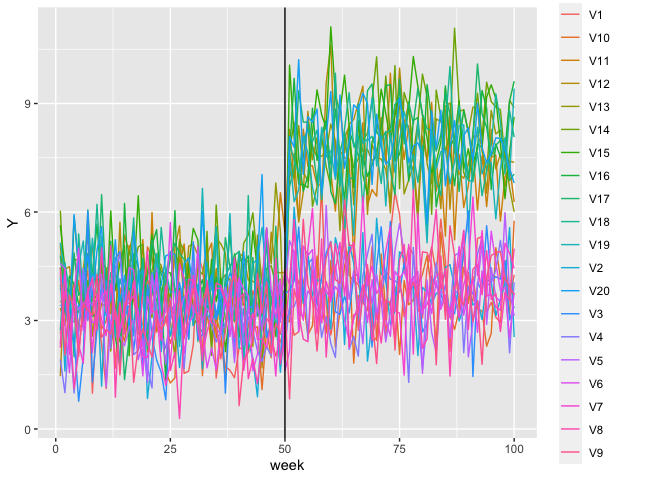
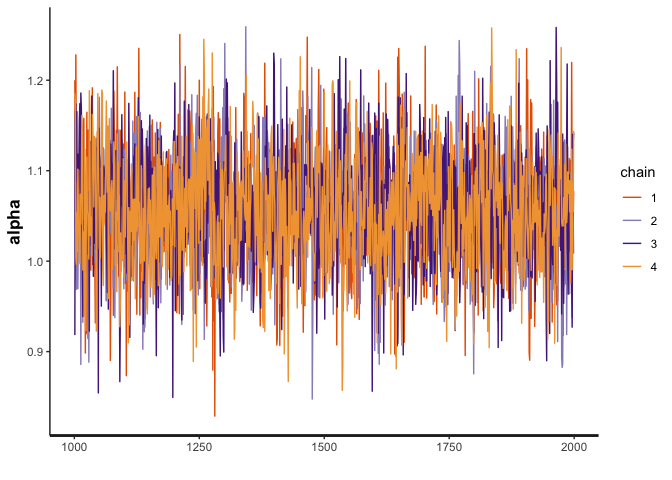
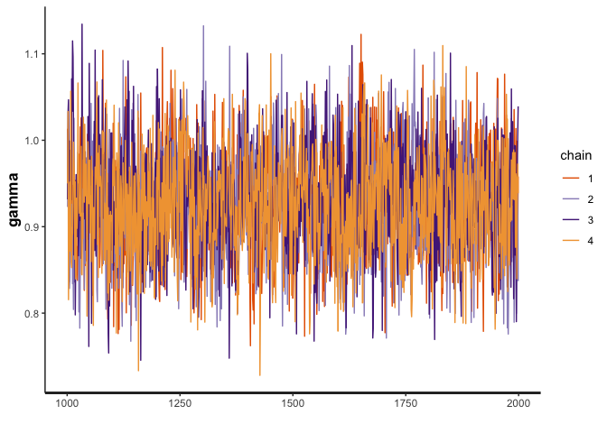
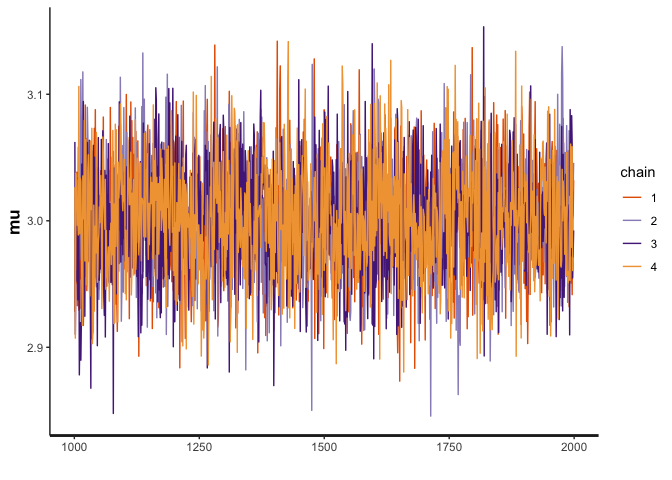
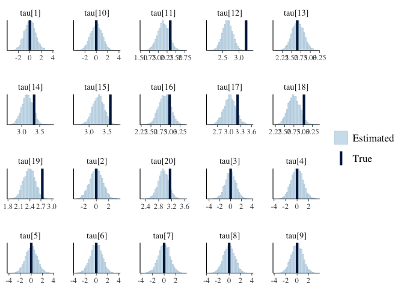
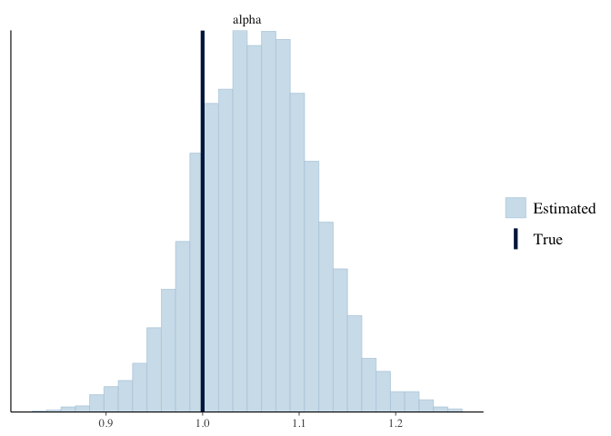
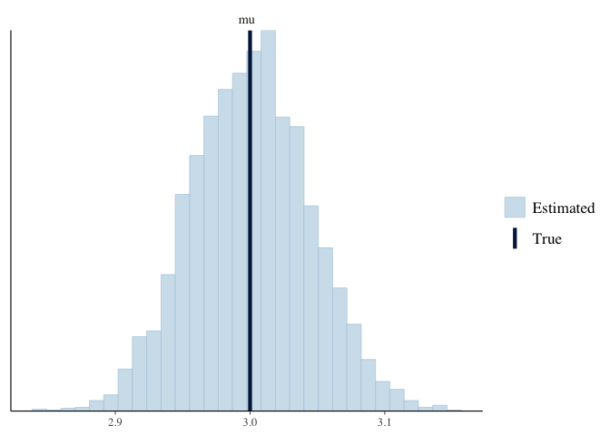

Testing Synthetic DiD Version 1
================
Morgan Bale
8/24/2022

-   [Data](#data)
-   [Model](#model)
-   [Results](#results)
    -   [Traceplots](#traceplots)
    -   [Histograms](#histograms)

# Data

Create synthetic data to test model.

``` r
N <- 20 #total num stores
C <- 10 #num control stores 
TT <- 100 # pre period ends at t=50 
I <- 50 #intervention time 

#create parameters 
alpha <- 1
gamma <- .8
mu <- 3
tau_cont <- rep(0, times=C)
tau_treat <- rnorm(N-C, mean=3, sd=.5)
tau <- c(tau_cont, tau_treat)

#create treat and post
treat <- rep(0:1, each=C)
post <- rep(0:1, each=I)

#create indicator D
D <- matrix(NA, nrow=N, ncol=TT) 

for(n in 1:N) {
  for(t in 1:TT) {
    if(n > C & t > I) {D[n,t]=1}
    else {D[n,t]=0}
  }
}

#make error 
epsilon <- matrix(rnorm(N*TT), nrow=N, ncol=TT)

#make Y 
Y <- matrix(NA, nrow=N, ncol=TT) 
for(n in 1:N) {
  for(t in 1:TT) {
    Y[n,t] = mu + alpha*treat[n] + gamma*post[t] + tau[n]*D[n,t] + epsilon[n,t]
  }
}

#check Y plot
as_tibble(t(Y)) %>% gather(key="store", value="Y") %>% mutate(week=rep(1:TT, times=N)) %>% ggplot(aes(x=week, y=Y, col=as.factor(store))) + geom_line() + geom_vline(xintercept=I)
```

    ## Warning: The `x` argument of `as_tibble.matrix()` must have unique column names if `.name_repair` is omitted as of tibble 2.0.0.
    ## Using compatibility `.name_repair`.
    ## This warning is displayed once every 8 hours.
    ## Call `lifecycle::last_lifecycle_warnings()` to see where this warning was generated.

<!-- -->

``` r
#put in list for stan
d <- list(N=N, TT=TT, I=I, C=C, D=D, Y=Y, alpha=alpha, gamma=gamma, tau=tau, treat=treat, post=post, mu=mu, epsilon=epsilon)
```

# Model

``` r
model <- stan_model(file="../Code/Model/sdid_v1.stan")
```

    ## recompiling to avoid crashing R session

    ## Trying to compile a simple C file

    ## Running /Library/Frameworks/R.framework/Resources/bin/R CMD SHLIB foo.c
    ## clang -mmacosx-version-min=10.13 -I"/Library/Frameworks/R.framework/Resources/include" -DNDEBUG   -I"/Library/Frameworks/R.framework/Versions/4.1/Resources/library/Rcpp/include/"  -I"/Library/Frameworks/R.framework/Versions/4.1/Resources/library/RcppEigen/include/"  -I"/Library/Frameworks/R.framework/Versions/4.1/Resources/library/RcppEigen/include/unsupported"  -I"/Library/Frameworks/R.framework/Versions/4.1/Resources/library/BH/include" -I"/Library/Frameworks/R.framework/Versions/4.1/Resources/library/StanHeaders/include/src/"  -I"/Library/Frameworks/R.framework/Versions/4.1/Resources/library/StanHeaders/include/"  -I"/Library/Frameworks/R.framework/Versions/4.1/Resources/library/RcppParallel/include/"  -I"/Library/Frameworks/R.framework/Versions/4.1/Resources/library/rstan/include" -DEIGEN_NO_DEBUG  -DBOOST_DISABLE_ASSERTS  -DBOOST_PENDING_INTEGER_LOG2_HPP  -DSTAN_THREADS  -DBOOST_NO_AUTO_PTR  -include '/Library/Frameworks/R.framework/Versions/4.1/Resources/library/StanHeaders/include/stan/math/prim/mat/fun/Eigen.hpp'  -D_REENTRANT -DRCPP_PARALLEL_USE_TBB=1   -I/usr/local/include   -fPIC  -Wall -g -O2  -c foo.c -o foo.o
    ## In file included from <built-in>:1:
    ## In file included from /Library/Frameworks/R.framework/Versions/4.1/Resources/library/StanHeaders/include/stan/math/prim/mat/fun/Eigen.hpp:13:
    ## In file included from /Library/Frameworks/R.framework/Versions/4.1/Resources/library/RcppEigen/include/Eigen/Dense:1:
    ## In file included from /Library/Frameworks/R.framework/Versions/4.1/Resources/library/RcppEigen/include/Eigen/Core:88:
    ## /Library/Frameworks/R.framework/Versions/4.1/Resources/library/RcppEigen/include/Eigen/src/Core/util/Macros.h:628:1: error: unknown type name 'namespace'
    ## namespace Eigen {
    ## ^
    ## /Library/Frameworks/R.framework/Versions/4.1/Resources/library/RcppEigen/include/Eigen/src/Core/util/Macros.h:628:16: error: expected ';' after top level declarator
    ## namespace Eigen {
    ##                ^
    ##                ;
    ## In file included from <built-in>:1:
    ## In file included from /Library/Frameworks/R.framework/Versions/4.1/Resources/library/StanHeaders/include/stan/math/prim/mat/fun/Eigen.hpp:13:
    ## In file included from /Library/Frameworks/R.framework/Versions/4.1/Resources/library/RcppEigen/include/Eigen/Dense:1:
    ## /Library/Frameworks/R.framework/Versions/4.1/Resources/library/RcppEigen/include/Eigen/Core:96:10: fatal error: 'complex' file not found
    ## #include <complex>
    ##          ^~~~~~~~~
    ## 3 errors generated.
    ## make: *** [foo.o] Error 1

``` r
print(model)
```

    ## S4 class stanmodel 'sdid_v1' coded as follows:
    ## // Morgan Bale 
    ## // Testing a version of SDiD 
    ## 
    ## data {
    ##   int<lower=0> N; //num stores
    ##   int<lower=0> TT; //num time periods 
    ##   vector[N] treat; //which stores are treated
    ##   vector[TT] post; //which time periods are post 
    ##   matrix[N,TT] Y; //control and treatment unit sales over time 
    ##   matrix[N,TT] D; //treatment indicator 
    ## }
    ## 
    ## 
    ## parameters {
    ##   real<lower=0> sigma; //standard deviation of Y?
    ##   real mu; //treatment effect 
    ##   real alpha; //individual fe
    ##   real gamma; //time fe 
    ##   vector[N] tau; //treatment effect
    ## }
    ## 
    ## // there needs to be a model for the weights and the DiD
    ## model {
    ##   // priors 
    ##   alpha ~ normal(0,1);
    ##   gamma ~ normal(0,1);
    ##   tau ~ normal(0,1); 
    ##   sigma ~ cauchy(0, .01);
    ##   //DiD equation 
    ##   for(n in 1:N) {
    ##     for(t in 1:TT) {
    ##     Y[n, t] ~ normal(mu + alpha*treat[n] + gamma*post[t] + tau[n]*D[n,t], sigma);
    ##     }
    ##   }
    ## }
    ## 

``` r
draws <- sampling(model, data=d, seed=2020)
```

# Results

## Traceplots

``` r
traceplot(draws, pars="lp__")
```

<!-- -->

``` r
traceplot(draws, pars="alpha")
```

<!-- -->

``` r
traceplot(draws, pars="tau")
```

<!-- -->

``` r
traceplot(draws, pars="sigma")
```

<!-- -->

``` r
traceplot(draws, pars="gamma")
```

<!-- -->

``` r
traceplot(draws, pars="mu")
```

<!-- -->

## Histograms

``` r
mcmc_recover_hist(As.mcmc.list(draws, pars="tau"), true=d$tau)
```

    ## `stat_bin()` using `bins = 30`. Pick better value with `binwidth`.

<!-- -->

``` r
mcmc_recover_hist(As.mcmc.list(draws, pars="alpha"), true=d$alpha)
```

    ## `stat_bin()` using `bins = 30`. Pick better value with `binwidth`.

<!-- -->

``` r
mcmc_recover_hist(As.mcmc.list(draws, pars="gamma"), true=d$gamma)
```

    ## `stat_bin()` using `bins = 30`. Pick better value with `binwidth`.

<!-- -->

``` r
mcmc_recover_hist(As.mcmc.list(draws, pars="mu"), true=d$mu)
```

    ## `stat_bin()` using `bins = 30`. Pick better value with `binwidth`.

<!-- -->
